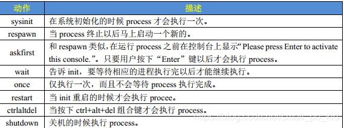

# 构建busybox
下载源码[https://busybox.net/downloads/](https://busybox.net/downloads/)

然后进入目录使用默认初始配置`make defconfig`

然后使用`make menuconfig`来进行图像化的配制,在1.37遇到了`ncurses`的问题，解决方法如下
```sh
diff --git a/tools/kconfig/lxdialog/check-lxdialog.sh b/tools/kconfig/lxdialog/check-lxdialog.sh
index e9daa627..6408baae 100755
--- a/tools/kconfig/lxdialog/check-lxdialog.sh
+++ b/tools/kconfig/lxdialog/check-lxdialog.sh
@@ -63,7 +63,7 @@ trap "rm -f $tmp ${tmp%.tmp}.d" 0 1 2 3 15
 check() {
         $cc -x c - -o $tmp 2>/dev/null <<'EOF'
 #include CURSES_LOC
-main() {}
+int main() {}
 EOF
 	if [ $? != 0 ]; then
 	    echo " *** Unable to find the ncurses libraries or the"       1>&2
```


这里注意需要选择`Settings->Build static binary(no shared libs)
`其他几乎默认即可

然后编译

`make && make install`
这里默认`prefix = './_install'`
期间可能会遇到`tc.c`报错，此时只需要将其移出`networking`文件夹即可,这是一个[bug](https://lists.busybox.net/pipermail/busybox-cvs/2024-January/041752.html)


# 构建文件目录
```sh
mkdir dev etc lib usr var proc tmp home root mnt sys
```
然后将`busybox/_install`目录下的`usr/ bin/ sbin/ linuxrc`都拷贝到文件目录当中,注意拷贝期间记得带上`-a`参数

# 构建etc
主要需要带有`etc/inittab, etc/init.d/rcS, etc/fstab`
同样拷贝busybox下的`examples/bootfloopy/etc/*`

# 修改rcS
```bash
#! /bin/sh
PATH=/sbin:/bin:/usr/sbin:/usr/bin:$PATH
LD_LIBRARY_PATH=$LD_LIBRARY_PATH:/lib:/usr/lib
export PATH LD_LIBRARY_PATH

mount -a
mkdir /dev/pts
mount -t devpts devpts /dev/pts

echo -e "\nBoot took $(cut -d' ' -f1 /proc/uptime) seconds\n"

setsid cttyhack setuidgid 1000 sh

poweroff -d 0 -f
```
头三行是设置环境变量
`mount -a`表示挂载所有文件系统，这里的挂载的文件系统是由`etc/fstab`所决定的
然后是挂载devpts文件系统 最后两行使用 mdev 来管理热插拔设备，通过这两行， Linux 内核就可以在/dev 目录下自动创建设备节点

# 修改fstab
这里列出了要加载的filesystem
```fstab
proc		/proc	proc	defaults    0	0
tmpfs       /tmp    tmpfs   defaults    0   0
sysfs       /sys    sysfs   defaults    0   0
```
每列的含义如下：
+ filesystem: 文件系统名称，也可以是具体设备`/dev/**`
+ mount point: 该文件系统的挂载点
+ type：文件系统类型，ext4, tmpfs, sysfs等等
+ options: 挂载选项，可以使用man mount 查看，一般为defaults
+ dump: 1表示允许备份，一般为0
+ pass: 磁盘检查，为0表示不检查

# 修改inittab
linux内核开启init进程后会执行该文件所列出的任务
`<id>:<runlevels>:<action>:<process>`

其中`action`可选的范围如下:


# passwd/group
最后填一下passwd和group即可

```
# etc/passwd
root:x:0:0::/root:/bin/bash
pwh:x:1000:1000::/home/peiwithhao:/bin/bash
# etc/group
root:x:0:
pwh:x:1000:
```
至此属于我们自己的一个mini rootfs就已经构建结束


