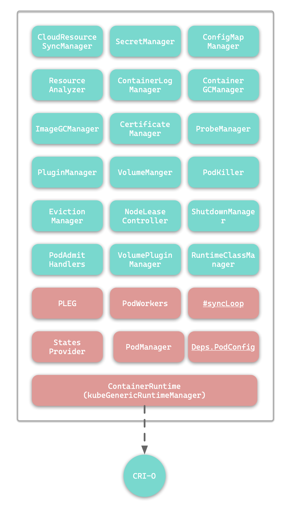
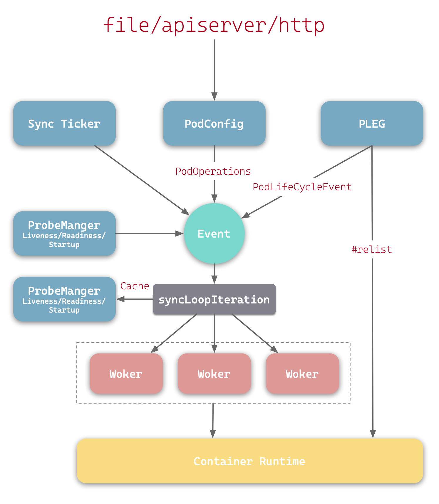

# kubelet简介
他最底层实际上是集群中每个node节点(包括work node 和 control node)所拥有的一个服务进程,
其主要职责是接收api server对于节点中pod的管控,还有对集群内部pod状况的检查并且将报告呈现给api server

# kubelet
其基于PodSpec来工作，PodSpec是使用YAML或者JSON对象来描述Pod的。kubelet主要是通过接受api server发来的PodSpec来对该集群内部的pod进行管控

除开api server提供的PodSpec,还可以通过以下方式提供:
+ 文件
+ HTTP 端点
+ HTTP 服务器

# kubelet组成
kubelet由以下内容组成

根据参考文章内容，这里也写下对于某些组件的个人理解
## PLEG
全名`Pod Lifecycle Event Generator`, Pod生命周期事件生成器
这些事件包括`ContainerStarted、ContainerDied、ContainerRemoved、 ContainerChanged`

其定期通过`ContainerRuntime`获取Pod信息，与缓存中的信息比较

## PodWorkers
处理事件中Pod的同步。核心方法`managePodLoop()`间接调用`kubelet.syncPod()`完成Pod的同步

## PodManager
存储Pod的期望状态

## ContainerRuntime
与遵循CRI规范的高级容器运行时进行交互

## PodConfig
将各种Pod配置源合并成一个单一的一致结构，然后按照顺序向监听器传递增量变更通知

## #syncLoop
接受来自PodConfig的Pod变更通知、定时人物、PLEG事件以及ProbeManager的事件

# kubelet进程
可以通过grep和systemctl来进行查看

# kubelet工作原理

# 参考
[https://xie.infoq.cn/article/15f32abba2f2c86b50e004cb5](https://xie.infoq.cn/article/15f32abba2f2c86b50e004cb5)
[https://isekiro.com/kubernetes%E6%BA%90%E7%A0%81-kubelet-%E5%8E%9F%E7%90%86%E5%92%8C%E6%BA%90%E7%A0%81%E5%88%86%E6%9E%90%E4%B8%80/](https://isekiro.com/kubernetes%E6%BA%90%E7%A0%81-kubelet-%E5%8E%9F%E7%90%86%E5%92%8C%E6%BA%90%E7%A0%81%E5%88%86%E6%9E%90%E4%B8%80/)

