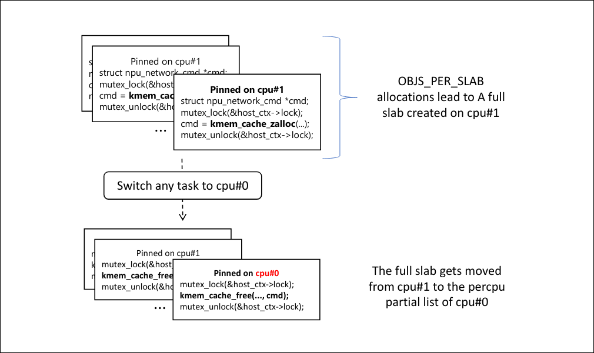
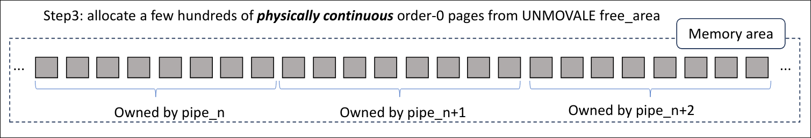
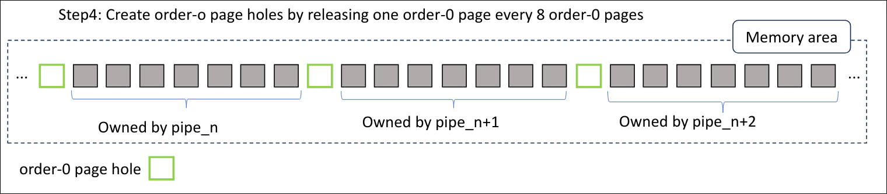
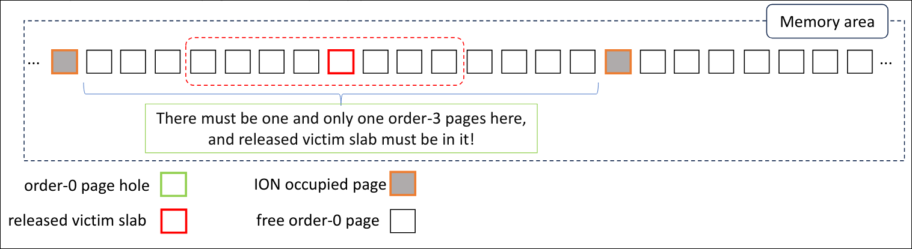

# Advancing Cross cache attack
首先讲解普通的`cross cache attack`, 该攻击主要是针对于专有`kmem_cache`的利用

在Black hat 2024 asia会议中提到在传统cross cache attack中可能会遇到两种挑战：
1. 在限制分配原语的情况下，如何将victim object所在的slab置入`free_page`
2. `high-order`的slab如何复用`low-order`的slab

然后该研究员提出了一种`Advancing Cross-Cache Attack`,旨在解决上述的两种问题


## 挑战一
为了让我们的`victim object`所在的slab成功置入`free_page`,在传统的`cross cache attack`中需要分配大量的object,
并且分配完毕后还需要我们将他们保持一段时间为了之后统一收回`partial_page`当中

而对于两种需要满足的point都分别会面临一定的困难：
+ 分配大量object：
    + 专有`kmem_cache`,缓解措施有例如`CONFIG_RANDOM_KMALLOC_CACHES,AUTUSLAB`
    + 有限的系统资源
    + 内核组建的约束
+ 保持大量的object处于分配状态一段时间：
    + 临时内核对象，很快分配然后释放

拿`CVE-2023-21400`来进行举例,发现存在Double free漏洞
其中漏洞结构体为`struct npu_network_cmd`,他来自于一个专有结构体，同时在分配的过程中他也是一个临时结构体

其中提到的解决办法为使用条件竞争来将该`victim slab`释放到`free_page`
这里利用到了一种Linux的`slab`移动机制，这种原语可以将例如`cpu1`的`slab page`移动到另一个`cpu0`的`partial_page`当中
这里作为例子讲解一下其中步骤：
1. 首先一个任务需要将自己固定在cpu1上;
2. 将现在处于的slab分配满object
3. 将该任务此时固定在cpu0上
4. 此时释放刚刚分配的所有object
在我们释放第一个object的时候，这种偏离就会发生，使得之前充满的slab迁移到cpu0的`partial_page`链条当中

然后我们就可以重复上述步骤，这样就可以填满`partial_page`,然后触发链条刷新，然后将`victim slab`置入`free_page`当中
然而这个方法仍有不足，那就是我们实际上只能分配一次`victim object`然后只能维持很短的一段时间

为了解决这个问题，研究员使用一种条件竞争的方式：
1. 创建大于`OBJS_PER_SLAB`个人物TASK,这些TASK都将自己绑定在cpu1上，并且不断尝试分配`victim object`,当然分配完毕后过一小段时间就会释放
2. 然后当某一个时间点，例如满足了`OBJS_PER_SLAB`个进程都同时申请完毕,但还都没有释放，此时我们都知道cpu1上肯定存在一个slab被充满
3. 之后这些进程都会尝试释放`victim object`,但我们突然将某个进程绑定在`cpu0`,当这个进程绑定在cpu0时，由于他的释放导致这样一个slab就会链接到`cpu0`的`partial_page`当中，此时其他进程的释放也无济于事了，他们的释放也都将会在`cpu0->partial_page`当中体现

4. 重复上述步骤我们就可以分配任意的`slab`到`partial_page`链条上

## 挑战二
由于在例子中`struct npu_network_cmd`是从order-0开始分配的，为了使用`file_array`复用该结构体， 而`file_array` 则是从order-3开始分配
为了解决这个问题需要先了解一下page分配的基本过程：
对于单个zone来说，他一般分为几个区域`unmovable, movable, reclaimable,CMA, HighAtomic, Isolate`,一般内核当中使用`alloc_pages`分配的页面位于`Unmovable`当中，
而用户空间使用`mmap`来分配的页面位于`Movable`当中

而仅仅拿`Unmovable`区域来说的话，他又被分为`per_cpu_pages/pcplist`和`free_area`部分，在我们分配`order-0`的slab的时候，一般是首先从`pcplist`当中获取,
然后后者则存放`order-0到order-10`的slab链条

那么低order如何能被高order所使用呢，唯一的可能就是当低order的slab和其物理相邻的slab均被释放时（这里实际上一个slab都通过算法对应另一个slab,所以不存在3个物理相邻则合并3个的情况）, 低order则可以合并为高order


因此想要达成这种效果，需要我们进行堆风水进行修改
1. 首先将进程绑定到cpu0
2. 分配足够的`order-0`页面，数量需要满足能够将其全部释放时能出发pcplist的刷新,而选择的结构体需要满足下面几点：
    1. 在分配的时候，需要该结构体能够被大量分配并且是从`free_area`开始分配,
    2. 在释放的时候，需要是同步的释放，这里选择到了Pipe
3. 从UNMOVABLE分配物理连续的`order-0 pages`,分配的object除了满足上述条件，还需要能够部分释放并且分配过程中少量噪音
4. 由与是物理连续，且需要`order-3 pages`复用`order-0 pages`,因此我们可以分配多个pipe,而每个pipe占有2^3个page,如下:

5. 然后我们就可以在每个pipe所占有的pages中释放第一个pages,这样这些pages,或者说`order-0 slab`就将会置入`pcplist/per_cpu_pages`链表当中

6. 使用之前的条件竞争用`victim_object`占据其中一个`page_hole`,然后将其他的`page_hole`占满，此时一定时间后该`victim_object`所占领的slab将会被清空,而这里占领其他的`page_hole`中选取结构体为`ION`
7. 之后释放掉其他所有的pipe页面，这样就会造成一定存在`order-3`的页面包含住`victim object`,这样就可以使得我们的`order-3`复用`order-0`



这里还存在一些基础的知识,在我们分配/释放`order-0`slab的时候，首先会从`pcplist/per_cpu_pages`当中分配/释放,这个链表是`FIFO`的，且当他flusshing是从栈底开始刷新
最后还有一个问题，那就是如何分配大量物理连续的页面,这里使用的方法是首先大量分配page页面，同时从内核分配(`alloc_pages()`)和从用户分配(`mmap()`),这样能使得其能使得内存空间处于高水位线下，然后出发`kswapd`线程来回收页面，我们可以从`cat /proc/meminfo`中轮询探测是否满足我们需要的条件，那就是下次分配order-0必定会从较高order的slab中分配，这样以来就能保证我们所分配的slab都是物理连续的

# PageJack: Page-Level UAF

在往后面看的时候我发现这个技术实际上已经出来较久了，经过搜索证明确实有师傅已经在题目中适用了，所以下面的部分仅当巩固一遍知识

这篇议题所讨论的动机是近年来由于CFI(Control-Flow Intergrity, 控制流完整性)的出现导致劫持程序控制流越来越困难
相反`data-only attack`近年来则水涨船高，利用方式层出不穷
一般来说`data-only attack`所瞄准的资源有两种，一种为内核全局变量(`modeprobe_path`)，另一种则为内核堆变量(`cred`)

对于全局变量来说一般需要下面的利用条件：
1. 绕过KASLR
2. 任意地址写
3. 启用`CONFIG_STATIC_USERMODEHELPER`

而对于内核堆变量则需要下面的利用条件：
1. 堆空间的相对写
2. 不需要任意地址写

而现在所面临的问题就是在以前堆空间的变量基本都从普通cache中分配,但现在很多变量都来自于专有的cache
这样当我们面临一个OOB漏洞的时候就面临了两个挑战：
1. 如何将UAF对象和关键对象串联起来，也就是说利用OOB来覆盖
2. 如何在不造成副作用的情况下破坏victim object

## 挑战一
可以利用Cross cache attack 加上堆风水来进行利用,这里研究员所采取的方案即为传统的cross cache attack,这里就不再细说

## 挑战二
这个挑战需要我们满足在覆盖指定字段,但不能破坏其他内容
当然这一点在以往也有解决方案,那就是需要在我们的利用过程中添加额外的信息泄漏步骤,有可能还需要泄漏KASLR偏移

而在`io_uring`开始支持创建的`ring_buffer`可以由用户使用`mmap`访问的时候，可能会导致一种情况，那就是当使用内核提供的接口`io_uring_register`注册了一个ringbuffer, 且之后用户使用mmap映射，然后再次调用`io_uring_register`的其他选项来解除该`ringbuffer`,这就导致用户可能通过mmap访问到已经被释放的`free pages`

而在演讲ppt里面介绍了一个例子那就是如果存在OOB,则在`victim object`周围分配大量`page_buffer`,知道dirty pipe的老铁们对这个结构体比较熟悉，他的每一个buffer都会指向一个`struct page`指针，也就对应一个page,因此我们可以通过OOB复写`pipe_buffer`的开头指针来将struct page *指针来劫持成别的指针，这里由于`struct page`大小为0x40,所以本身不会有太多可能性,所以我们只需要复写其中低8字节即可


# vDSO 的利用
他的发明主要是为了解决内核给用户提供的系统调用API由于涉及到上写文的切换导致太过缓慢的问题，
他将部分频繁调用且简单的API直接暴露给用户使用,而他暴露的方法就是采用了动态链接库的思想
将这部分会频繁使用的系统调用作为vDSO(virtual Dynamic shared object)链接到用户程序，我们可以使用ldd来查看

```sh
❯ ldd pwn
	linux-vdso.so.1 (0x0000749f0eeaa000)
	libgcc_s.so.1 => /usr/lib/libgcc_s.so.1 (0x0000749f0edd7000)
	libc.so.6 => /usr/lib/libc.so.6 (0x0000749f0ebe5000)
	/lib64/ld-linux-x86-64.so.2 => /usr/lib64/ld-linux-x86-64.so.2 (0x0000749f0eeac000)
```
我们也可以通过proc文件系统来查看当前进程的动态库详情

```sh
❯ cat /proc/self/maps
5888c2233000-5888c2235000 r--p 00000000 103:09 2636176                   /usr/bin/cat
5888c2235000-5888c223a000 r-xp 00002000 103:09 2636176                   /usr/bin/cat
5888c223a000-5888c223c000 r--p 00007000 103:09 2636176                   /usr/bin/cat
5888c223c000-5888c223d000 r--p 00008000 103:09 2636176                   /usr/bin/cat
5888c223d000-5888c223e000 rw-p 00009000 103:09 2636176                   /usr/bin/cat
5888f73f5000-5888f7416000 rw-p 00000000 00:00 0                          [heap]
7ae4cf800000-7ae4cfdf3000 r--p 00000000 103:09 2677262                   /usr/lib/locale/locale-archive
7ae4cff8c000-7ae4cffd1000 rw-p 00000000 00:00 0 
7ae4cffd1000-7ae4cfff5000 r--p 00000000 103:09 2624878                   /usr/lib/libc.so.6
7ae4cfff5000-7ae4d0166000 r-xp 00024000 103:09 2624878                   /usr/lib/libc.so.6
7ae4d0166000-7ae4d01b5000 r--p 00195000 103:09 2624878                   /usr/lib/libc.so.6
7ae4d01b5000-7ae4d01b9000 r--p 001e3000 103:09 2624878                   /usr/lib/libc.so.6
7ae4d01b9000-7ae4d01bb000 rw-p 001e7000 103:09 2624878                   /usr/lib/libc.so.6
7ae4d01bb000-7ae4d01c5000 rw-p 00000000 00:00 0 
7ae4d0200000-7ae4d0202000 r--p 00000000 00:00 0                          [vvar]
7ae4d0202000-7ae4d0204000 r--p 00000000 00:00 0                          [vvar_vclock]
7ae4d0204000-7ae4d0206000 r-xp 00000000 00:00 0                          [vdso]
7ae4d0206000-7ae4d0207000 r--p 00000000 103:09 2624828                   /usr/lib/ld-linux-x86-64.so.2
7ae4d0207000-7ae4d0230000 r-xp 00001000 103:09 2624828                   /usr/lib/ld-linux-x86-64.so.2
7ae4d0230000-7ae4d023b000 r--p 0002a000 103:09 2624828                   /usr/lib/ld-linux-x86-64.so.2
7ae4d023b000-7ae4d023d000 r--p 00035000 103:09 2624828                   /usr/lib/ld-linux-x86-64.so.2
7ae4d023d000-7ae4d023e000 rw-p 00037000 103:09 2624828                   /usr/lib/ld-linux-x86-64.so.2
7ae4d023e000-7ae4d023f000 rw-p 00000000 00:00 0 
7fffd682d000-7fffd684e000 rw-p 00000000 00:00 0                          [stack]
ffffffffff600000-ffffffffff601000 --xp 00000000 00:00 0                  [vsyscall]
```

而vDSO是由内核给用户提供的一个内存文件，所以按理来讲只要我们将内存中的vDSO修改，
那么就能够影响到主机上所有的进程执行非预期的行为


# 相关Paper
+ [Constructing arbitrary write via puppet objects and delivering gadgets in Linux kernel](https://www.sciencedirect.com/science/article/abs/pii/S0167404824004942#preview-section-snippets)
+ 


# 调试slab
可使用`slabtop`命令

# 配置释义
+ `CONFIG_RANDOM_KMALLOC_CACHES`:从4.14.327开始，对于正常的kmalloc的分配创建多个`slab cache`的副本，kmalloc会根据代码在其中随机选择一个,现在副本数量默认设置为16
+ `CONFIG_STATIC_USERMODEHELPER`:默认情况下内核可以通过`Usermode helper`来调用许多不同的用户空间二进制程序，设置此项目即为禁用所有USERMODE HELPER程序,同时需要将`STATIC_USERMODEHELPER_PATH`设置为空字符串
+ `CONFIG_SLAB_VIRTUAL`:Google所提出的使用内核虚拟地址来分配slab，且需要确保分配的该slab不会复用其他的slab
+ `CONFIG_INIT_ON_FREE_DEFAULT_ON`:效果等同于`init_on_free = 1`,可以使用`init_on_free =0 `来禁用，释放page后将会清空其内容,但可能造成较高负载


[config释义](https://www.kernelconfig.io/index.html)
[sysctl参数解析](https://sysctl-explorer.net/) 


