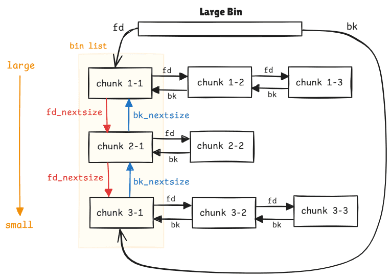

1. calloc不会从tcachebin取
2. fastbin大小堆块即使相邻top chunk也不会立即合并
# decrypt_safe_linking
+ 范围`>2.26`
+ 条件：arbitrary read
函数`tcache_put()`

```c
static __always_inline void
tcache_put (mchunkptr chunk, size_t tc_idx)
{
  tcache_entry *e = (tcache_entry *) chunk2mem (chunk);

  /* Mark this chunk as "in the tcache" so the test in _int_free will
     detect a double free.  */
  e->key = tcache_key;

  e->next = PROTECT_PTR (&e->next, tcache->entries[tc_idx]);
  tcache->entries[tc_idx] = e;
  ++(tcache->counts[tc_idx]);
}

#define PROTECT_PTR(pos, ptr) \
  ((__typeof (ptr)) ((((size_t) pos) >> 12) ^ ((size_t) ptr)))
#define REVEAL_PTR(ptr)  PROTECT_PTR (&ptr, ptr)

static void
tcache_key_initialize (void)
{
  if (__getrandom (&tcache_key, sizeof(tcache_key), GRND_NONBLOCK)
      != sizeof (tcache_key))
    {
      tcache_key = random_bits ();
#if __WORDSIZE == 64
      tcache_key = (tcache_key << 32) | random_bits ();
#endif
    }
}
```
加密操作为：
1. 当前freechunk地址右移12位
2. 然后和tcache之前的首个chunk地址进行异或得到next指针

`cipher = next_ptr ^ (plain >> 12)`


# fastbin_dup
利用fastbin, 可以构造freelist为`a->b->a`

+ 范围`2.35`
+ 条件：Double Free

# fastbin_dup_consolidate

分配0x40 大小的chunk,编号1-8

1. 首先填满`tcache_bin`, 使用1-7
2. 释放8, 进入fastbin

```sh
pwndbg> bins
tcachebins
0x50 [  7]: 0x55555555b890 —▸ 0x55555555b840 —▸ 0x55555555b7f0 —▸ 0x55555555b7a0 —▸ 0x55555555b750 —▸ 0x55555555b700 —▸ 0x55555555b6b0 ◂— 0
fastbins
0x50: 0x55555555b8d0 ◂— 0
unsortedbin
empty
smallbins
empty
largebins
empty
```
3. 此时分配一个0x400大小的堆块，会首先触发`malloc_consolidate`，将fastbin和top chunk合并，然后分配largebin
4. 此时如果触发double free 8, 那么就会导致这个分配的largebin被释放到tcachebin, 大小为0x400

触发`malloc_consolidate`的时机有：
1. `__int_malloc`: 分配一个large size的块
2. `_int_malloc`: 没有为当前chunk找到的bins,并且top chunk很小
3. `_int_free`: 如果chunk_size > FASTBIN_CONSOLIDATION_THRESHOLD (65536)
4. mtrim: Always 
5. `_libc_mallopt`: Always


# fastbin_dup_into_stack
+ 范围`2.35`
+ 条件：Double Free
实际上类似于`fastbin_dup`, 然后修改fd指针到栈上构造的chunk头部，这里需要注意进行safelink构造


# fastbin_reverse_into_tcache
+ 范围`2.35`
+ 条件: UAF

利用方式：
1. 填满tcachebins , t7->t6->...t2->t1
2. 填满fastbins, f7->f6->...f2->f1
3. 修改f1的fd指针, 导致f7->f6->...f2->f1->fake
4. 申请堆块,排空tcachebins
5. 继续申请堆块，会导致从fastbins中申请，也就是拿到f7
6. 但此后fastbin的内容会填充到tcachebin, 变成fake->f1->f2->...->f6
7. 这里没检查fake的fd指针是因为fastbin个数为7个已经满了，如果不满的话会检查fd指针，如果是非规范值或者空则会崩溃


# large_bin_attack
+ 范围`2.35`


在2.30之后存在两个新的检查
子链检查
```c
if (__glibc_unlikely (fwd->bk_nextsize->fd_nextsize != fwd))\n");
    malloc_printerr (\"malloc(): largebin double linked list corrupted (nextsize)\");\n");
```
主链检查
```c
if (bck->fd != fwd)\n");
    malloc_printerr (\"malloc(): largebin double linked list corrupted (bk)\");\n\n");
```


利用方式：
1. 分配0x428大小堆块p1， 分配0x18小堆块(防止合并)
2. 分配0x418大小堆块p2(要注意这里分配的p2需要与p1在同一largebin内)， 分配0x18小堆块(防止合并)
3. 释放p1, 放入unsortedbin, 此时分配0x438, 触发堆块调整，p1放入largebin
4. 释放p2, 此时p2放入unsortedbin
5. 修改p1->bk_nextsize为target-0x20
6. 分配0x438,触发p2放入largebin,变成p1->p2->target(glibc不检查bk_nextsize)
7. p1->bk_nextsize->fd_nextsize(也就是target) 将被修改为p2

利用代码

```c

    // so we can exploit under easier condition in the else branch
      if (fwd != bck)
        {
          /* Or with inuse bit to speed comparisons */
          size |= PREV_INUSE;
          /* if smaller than smallest, bypass loop below */
          assert (chunk_main_arena (bck->bk));
          if ((unsigned long) (size) < (unsigned long) chunksize_nomask (bck->bk))
            {
              fwd = bck;
              bck = bck->bk;
				
              victim->fd_nextsize = fwd->fd;
              victim->bk_nextsize = fwd->fd->bk_nextsize;
              fwd->fd->bk_nextsize = victim->bk_nextsize->fd_nextsize = victim;
            }
          else
....
```
在释放堆块到largebin的途中，如果释放堆块是最小的则会走上面的路径



