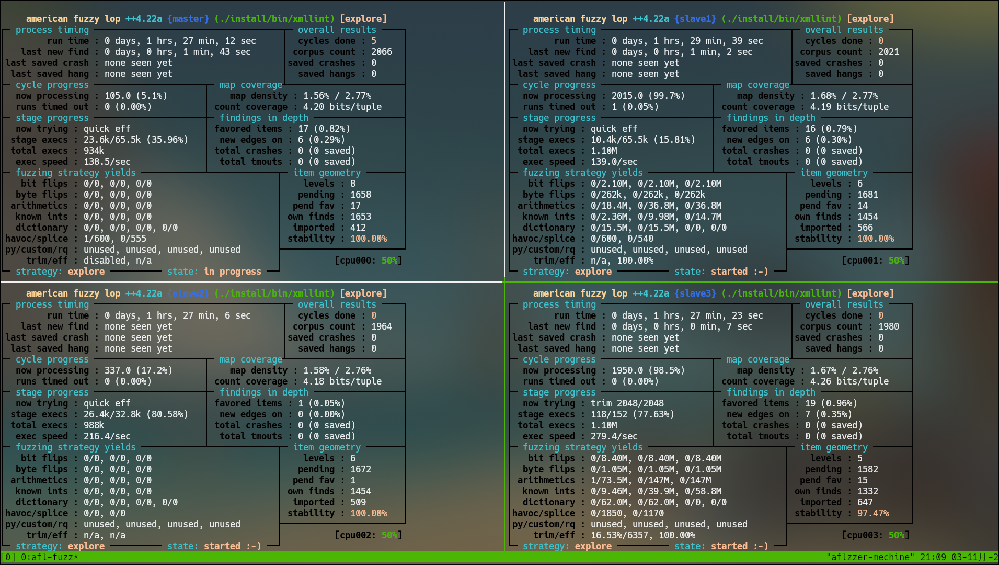

## environment
OS: ubuntu20.04LTS
afl++: latest  
libxml2: 9.2.4

## 字典的使用
在之前阅读AFL++的源码得知，其中有一个变异阶段那就是替换`out_buf`为token,那么这些token的一部分来源可以是我们在fuzz初期指定的字典
而其他部分有在我们变异之时通过变异所得的token

那么这个字典的格式如何，我们可以从`fuzzing101`的[网站](https://github.com/AFLplusplus/AFLplusplus/tree/stable/dictionaries)得到
例如`mysqld`的就如下：
```text
user="root"
```

我们只需要在`afl-fuzz`阶段使用到`-x dictionaries.dict`即可

## 多核的使用
在之前的fuzz过程中我们发现每次fuzz都只会在单一个cpu上面运作，这样来进行fuzz的话是十分缓慢的，因此如果需要使用多核
有一个很直白的方法，那就是多开几个`afl-fuzz`，那么单纯的多开并没有效果，我们还需要使得他们的信息能够互通，
因此我们可以使用主从模式来达到此目的,用下面的方式达到此目的
```sh
afl-fuzz -i in -o out -M <master_name> -- <target> @@
afl-fuzz -i in -o out -S <slave1_name> -- <target> @@
afl-fuzz -i in -o out -S <slave2_name> -- <target> @@
....
afl-fuzz -i in -o out -S <slaven_name> -- <target> @@
```
这里需要注意我们只有一个主模式进程，单可以有多个从模式进程



