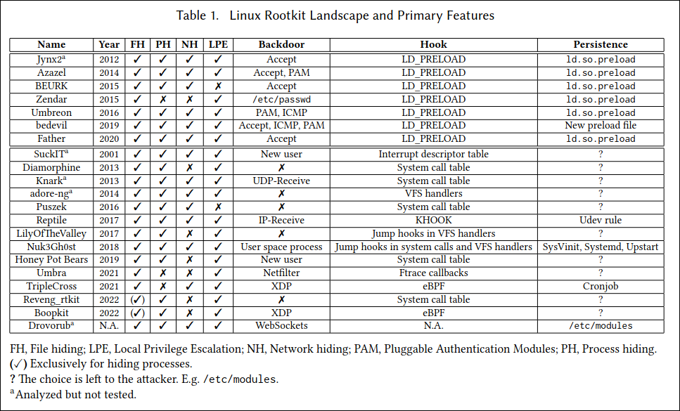
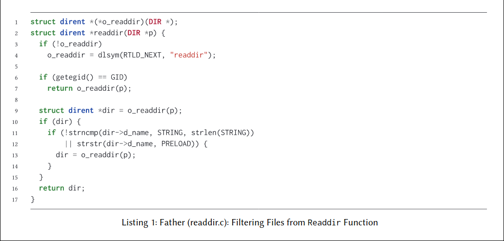
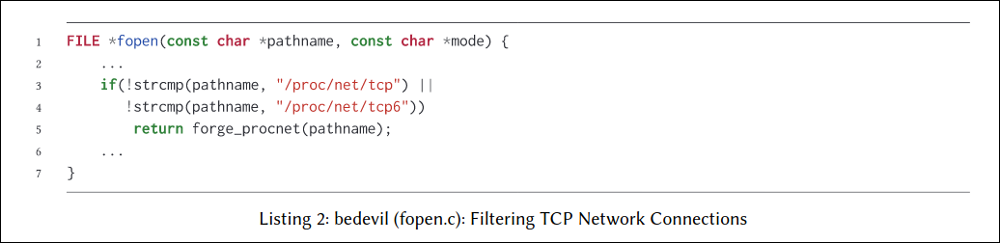

# The Hidden Threat: Analysis of Linux Rootkit Techniques and Limitations of Current Detection Tools

该论文主要是介绍了几种rootkit手法和其检测工具

下面针对Linux上rootkit所存在的主要两个区域来进行分析
# 用户空间
指仅仅在ring3领域活动的rootkit
## 应用程序级别rootkit
此类rootkit是指修改单个应用程序的内容，例如修改`ls,ps`等二进制程序的输出来伪造向用户传递的信息，
但由于此类rootkit仅对单一某个程序,
且十分难以通过完整性检查，从而导致这一类rootkit日益减少

## 动态链接器rootkit
就如同标题来讲,该rootkit就是劫持了用户程序即将加载的动态库例如glibc等等，经常通过调用原件，
然后根据攻击者的需求更改输出
这个劫持过程最常见的方法就是恶意修改环境变量`LD_PRELOAD`,如果此类rootkit没有其他隐藏，可以考虑使用ldd来发现恶意库

# 内核空间
指在内核空间活动的rootkit

## LKM和eBP rootkit
此类rootkit被实现为一段内核的代码,大部分的rootkit都以LKM的形式存在于内核当中，
然而由于用户可以自行禁止LKM,所以较旧的rootkit比如说suckIT直接使用内存接口`/dev/kmem`来将自己直接注入内核,
但是这个设备接口已经不再当前内核版本中导出
现代rootkit正在尝试从LKMs到ebpf的转变，
某些模块还会通过删除内核链表来隐藏自身.

## 系统调用和中断rootkit
系统调用是用户空间和内核空间进行交流的主要手段，内核中存在系统调用表，里面的表项就是每个系统调用处理函数的地址，
用户使用系统调用可以拆分为下面几个步骤
1. 用户定义系统调用调用函数的wrapper,然后按照规定传递参数
2. 用户态代码使用`syscall/sysenter`或者`int 0x80`来触发系统调用，触发中断导致cpu切换到内核模式
3. 通过rax的值来寻找到内核系统调用表中对应的处理函数地址，然后调用它
4. 执行完对应的系统调用函数，返回到用户态

一般有下面几种利用法方法
1. 改变系统调用表对应表项的函数指针
2. 通过修改中断处理函数来修改整个系统调用表
3. 在系统调用函数执行前插入无条件跳转指令
4. 使用ftrace框架
5. 使用预构建的ebpf hook

## VFS rootkit
VFS为虚拟文件系统，他是一个位于用户态和底层文件系统实现中的一个中间层，让用户能使用统一的函数接口来调用不同的文件系统
VFS同样实现了伪文件，这类伪文件仅仅存在于内存当中，并不涉及磁盘的读取，而其中对于此类文件实现的接口函数可能仅仅只返回内核的信息
一个例子就比如`/proc/modules`,用户想要尝试读取该伪文件时，内核将会读取模块链表来输出所有内核模块。
而该类型的rootkit就可以修改此这类执行函数的输出来达成隐藏自身

# rootkit持久化
攻击者通过一些方法来让rootkit能够更加持久的存在于目标的主机之中：
+ 用户级rootkit由于其的方法是直接替换了二进制程序，所以已经达成了此目标
+ 动态链接器rootkit主要使用了文件`/etc/ld.so.preload`,他的效果与设置环境变量一致，区别就是更加持久
+ 内核空间rootkit必须找到一种方法能让LKM能够在系统启动过程中加载到内核当中，一个可选项就是将条目添加到`/etc/moduless`或`/etc/modules-load.d/`当中,
这样就可以在内核启动过程中加载该LKM,同样还存在其他持久化方法，包括`cron, systemd, SysVinit, Upstar或udev`

# rootkit的功能

下面的子章节主要描述这些rootkit自身所实现的主要功能

## 数据隐藏
主要是为了防止用户识别恶意程序,应用程序级rootkit主要是通过修改用户所调用的工具程序来达成伪装效果
而库rootkit或内核rootkit主要是通过定位函数或系统调用，来篡改这些内容的输出，其中可以包括`__x64_sys_getdents64, readdir, fopen`等等
例如`Father`rootkit就是采用修改`readdir.c`来过滤掉文件名中带有特定rootkit魔数的文件

## 进程隐藏
诸如ps这种命令行工具获取进程主要是通过遍历`/proc`伪文件系统来得到，因此可以通过上面数据隐藏的方法来达成进程隐藏的效果，
有的rootkit还更进一步，操作例如`sys_kill, find_task_by_vpid`这类功能

## 连接隐藏
netstat这类工具通过读取`/proc/net`下的文件接口来获取当前网络活动信息
由于大部分的rootkit都聚焦于TCP协议，所以一般的目标就集中在`/proc/net/tcp`或者`tcp_seq_show`处理函数数,
在这些函数中将会过滤掉rootkit所使用的连接

## 后门
大多数rootkit会实现一个后门来给用户使用，这样能够在下次让攻击者能够更方便的获取控制权,他又可以细分为下面的几种类别

### 触发后门
此类后门可以hook到linux接受网络数据包的系统调用(`sys_accept`)，从而为远程提供一个反向shell，在用户空间rookit Father中便找到这样一个例子,
它采用基于accept的后门,当触发到后门例程，将会创建一个新的子进程，然后链接远程的IO流并启动bash

### 命令和控制后门
不等待外部命令，而是试图建立定期与外部服务器的连接,然后从这些服务器当中获取指令，用来在感染系统上面执行

### 身份验证后门
通过hook PAM(可插入身份验证模块)来添加额外的伪装用户,然后通过ssh来远程连接感染系统

## 本地提权
用户空间级别的rootkit将尝试从目标过程中调用`setuid,setgid`函数，他们将hook此类命令使用到的libc函数
内核空间级别的rootkit将把自己hook到任意系统调用中，通常是`sys_kill`

