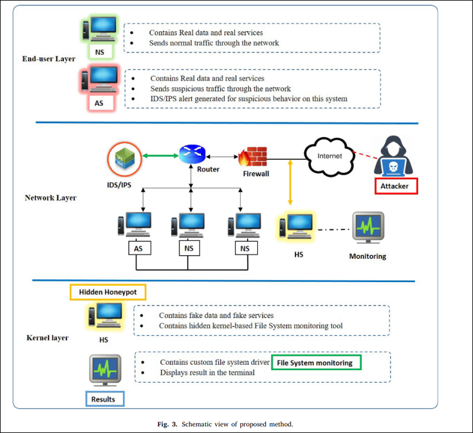
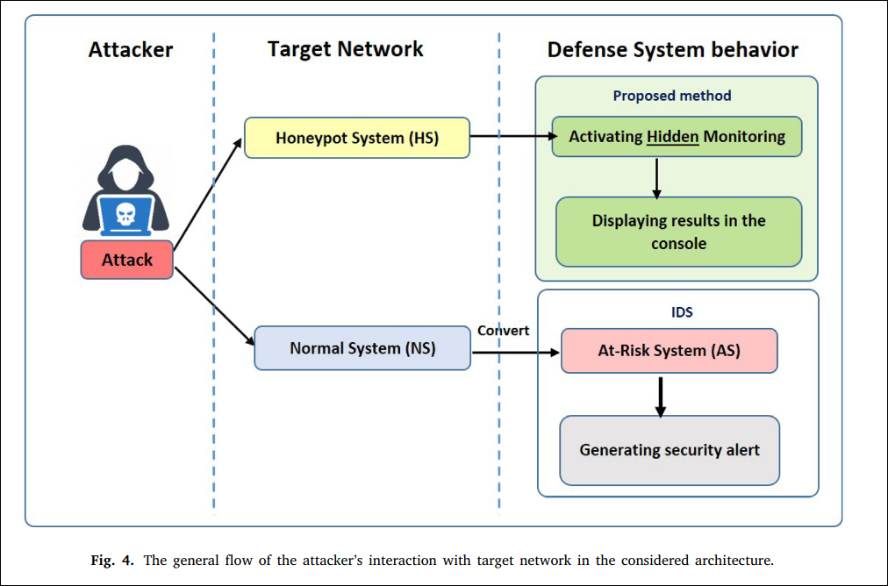

# Using rootkits hiding techniques to conceal honeypot functionality

首先论文介绍了蜜罐的定义以及其带来的好处，比如说可以让攻击者聚焦于蜜罐而不是真正的系统，
同样也可以通过收集攻击者的数据来建立更良好的防御体系

该论文的贡献如下:
1. 提出了隐藏在主机上的内核级别数据捕获工具，该工具能够接触到所有的系统事件包括加密数据
2. 不再使用VMM作为蜜罐的执行平台，就响应速度来说使得蜜罐系统和普通网络没有任何区别
3. 实现内核级别的HoneyPot系统数据监视
4. 该方法将不会修改内核函数，因为这一操作将会使得攻击者能轻松的检测到蜜罐的存在

# rootkit
roorkit的发展分为四个阶段:
1. rootkit只需要更改Unix的日志文件来隐藏用户
2. rootkit额外取代一些重要程序来隐藏用户活动，但其无法绕过完整性的判断
3. 拦截用户的函数调用并且将所需信息隐藏在内存当中
4. 更加着重于隐藏技术，并且从UNIX系统迁移到Windows

论文将基于内核并且修改内核数据结构的rootkit称为DKOM(Direct Kernel Object Manipulation),

并且将他作文论文的技术支撑，主要用来攻克以下两个问题：
1. 访问攻击者的加密数据
2. 使得基于内核的蜜罐无法被检测到

本文仅关注WindowsOS

# 相关工作
## Sebek
Honeynet在2003年引入了Sebek,他被称为第一个基于内核的数据捕获工具,
为了能够更加安全的捕获蜜罐的数据，所以决定使用基于内核的rootkits技术
Sebek的目的是绕过加密，然后使用已经加载的内核模块来记录所有攻击者的活动
该工具提供以下功能：
1. 记录加密会话中的keystroke
2. 恢复SCP协议的文件复制进程
3. 捕获远程登陆密码
4. 恢复受到burneye保护的二进制文件的密码

该工具对于将攻击者的行为集合发送到远程服务器的行为也将进行隐藏,但由于他将修改内核

## VMscope
VMscope,他拥有Sebek的所有功能，并且比他更加稳定,Sebek在截获系统调用并不完全，
例如`sys_sendfile`也能达到`sys_open, sys_read, sys_write`的功能,所以攻击者可能使用`sys_sendfile`来达成攻击效果，
VMscope也考虑到了这一点，所以他的设计思想就是监控所有的系统调用
VMscope与Sebek相似的点在于他也是高度可交互的,而不同点就是其并不修改内核，因为他被实现在基于QEMU的hyprvisor上

## Qebek
Sebek的继任者，他由五个组成部分：拦截模块，断点系统，SVR例程，自检模块和输出模块
一旦入侵者登入，该系统将直接执行系统调用并且创建新的系统调用，断点系统将直接连接到系统调用的实现
而SVR例程则直接从寄存器提取虚拟内存地址读取数据，而自检模块将会监控所有事件

# 提出的方法
在所提出的方法论中，现存的系统将会分为以下三种：NS(Normal System), AS(At_risk System), HS(Honeypot System)
NS是允许授权用户的使用和拥有权限的网络操作的系统
AS是指从网络中已经收到可疑流量的系统，可能已经收到一系列初始攻击
HS是具有漏洞并被故意放置在网络的系统用来吸引渗透者进行攻击，并监视他们所使用的工具和方法

而有经验的攻击者可以快速识别这种网络陷阱,因此论文作者提出了隐藏Honeypot的方案

图中所显示的架构由下面几个板块组成：
1. Attacker
2. Hidden Honeypot
3. Filesystem Monitoring
4. Results

## Attacker
可以是恶意的人或机器，试图获得对系统的未经授权访问

如果攻击者攻击的是NS,则NS将变成AS,并且IDS将发出警报
如果攻击者攻击的是HS,则触发被隐藏的监控程序

## Hidden Honeypot
隐藏过程是所提出方法的主要的部分,其中便涉及到对于驱动模块、监控进程的隐藏

## Filesystem Monitoring
仅限于监视蜜罐文件系统，并且可以扩展到honeypot的其他功能,例如IRP(IO request Packet)

## Results
在设计中HoneyPot系统由以下几个部分组成:
1. 隐藏的文件系统过滤器驱动:监视攻击者行为
2. 终端:实时反应攻击者的行为
3. 其他样例:用来伪装自己是真实在用的系统

