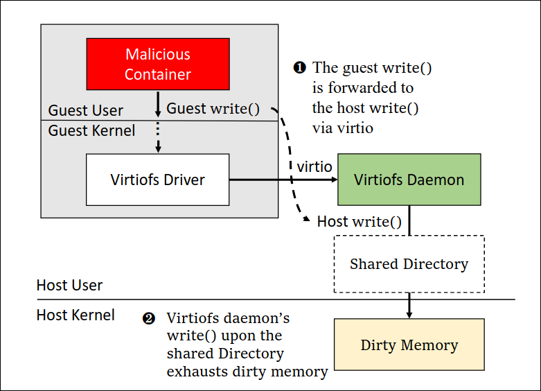

<!--toc:start-->
- [Attacks are Forwarded: Breaking the Isolation of MicroVM-based Containers  Through Operation Forwarding](#attacks-are-forwarded-breaking-the-isolation-of-microvm-based-containers-through-operation-forwarding)
- [摘要](#摘要)
- [基础介绍](#基础介绍)
- [背景](#背景)
- [攻击策略和动机](#攻击策略和动机)
  - [威胁模型和假设](#威胁模型和假设)
  - [启发案例](#启发案例)
  - [策略设计](#策略设计)
- [实验](#实验)
  - [kata container](#kata-container)
    - [dirty memory attack](#dirty-memory-attack)
    - [nf_conntrack table attack](#nfconntrack-table-attack)
    - [vhost-net attack](#vhost-net-attack)
  - [firecracker-containerd](#firecracker-containerd)
<!--toc:end-->

# Attacks are Forwarded: Breaking the Isolation of MicroVM-based Containers  Through Operation Forwarding
# 摘要
现有容器共享内核导致了较多的安全性问题，因此有人提出基于虚拟化技术来加强容器之间的隔离，
在这个方法当中每个容器都运行在独立的虚拟机当中，而论文作者团队发现一个该方法的新的攻击面
攻击者可以利用操作转发来利用主机内核的漏洞并耗尽主机资源，
他们将基于Micro VM的容器分为三层来对每一层设计对应的操作转发

# 基础介绍
容器由于共享内核导致单一容器出现漏洞很有可能影响整个主机内核从而影响到其他容器正常运行，因此提出基于MicroVM保护的容器
MicroVM则提供专门用于容器的Guest 内核，使用硬件虚拟化来为容器之间提供隔离,因此他被视为共享内核容器的安全替代品


容器的大多数系统调用需求由 microVM 的来宾内核提供。
基于 microVM 的容器和主机环境可以看作是两个孤立的世界。
但是作者观察到，由于性能和功能要求，基于 microVM 的容器的某些作会转发到主机内核（称为作转发）。


为了能够系统的探索攻击面，作者根据功能将基于MicroVM的容器分为三个层面： + 容器runtime 组件
+ 设备模拟组件
+ 主机内核组件

作者根据这三个层面设计了八种针对于Firecracker和kata container容器进行攻击
这些工作的贡献如下:
1. 新的攻击面
2. 攻击策略
3. 现实攻击
# 背景


MicroVM主要利用virtio来进行虚拟化，而virtIO则是内核用来模拟一些硬件设备给虚拟机使用，
MicroVM的内核框架在guest内核当中采用前端驱动，前端驱动程序通过virtqueues将IO请求从容器运行时组件和设备仿真器的后端

# 攻击策略和动机

## 威胁模型和假设
1. 攻击者可以通过web页面或者命令行来创建一个基于microVM的container，并且允许在这之上创建/运行任意的程序
2. 主机使用最先进的硬件虚拟化来隔离MicroVM(例如支持Intel CPU VT-x的 KVM)，同时主机使用seccomp来阻止microVM引发的敏感系统调用,并且利用cgroup来控制microVM的资源利用率
3. 假设host和guest没有已知的漏洞

## 启发案例
论文中举出的例子是kata container的微内核容器，
他所使用的virtfs在主机系统和容器当中共享目录和文件(例如根文件系统镜像，容器卷等等)
为了使得microVM和主机之间共享目录，virtiofs将客户系统调用转发到主机的用户空间程序(virtiofs daemon)
而guest OS的open系统调用将会转发到主机， 而主机的virtiofs daemon又拥有不正确的权限，因此恶意容器可以利用virtfs守护进程的权限绕过主机内核的检查
并使用主机的root SGID来创建文件


## 策略设计
作者从三个角度设计了攻击手法
如图


1. 由于客户OS容器的转发到主机的系统调用并没有限制,因此可以通过高频率的系统调用转发攻击来耗尽主机资源,
如上图的策略1,存在两条路径，一个是guest系统调用然后转发到host系统调用,
还一个是攻击者可以通过管理平台来直接向容器runtime发送请求

2. 第二种策略是利用设备仿真机器,通过高频率调用客户机器系统调用来进行DDOS攻击耗尽主机资源,如上图的策略2,
这里的中间过度是host的设备仿真用户程序,主要用来转发guest OS的物理请求从而模拟实际的物理设备访问

3. 利用主机内核组件，容器通过转发操作来消耗主机上的工作负载

# 实验
在容器当中使用LTP来获取测试用例，然后使用strace分别监控容器runtime和device模拟器来获取测试用例
之后建立容器测试操作和容器runtime和device emulator的所转发到主机的系统调用映射
这里的实验主要是基于 `kata container` 和 `firecracker-containerd`,每一个基于microVM的容器平台均给出了几种攻击方法 

## kata container
基于kata container有如下几个攻击设计手法:
1. `dirty memory attack`: 攻击者利用virtfs daemon(位于container runtime中)转发的write系统调用耗尽主机上的dirty memory,降低目标主机的IO性能(策略1)
2. `nf_conntrack table attack`: 恶意kata容器让connect()触发`vhost-net`内核模块调用`tap_sendmsg()`来填充主机的`nf_conntrack table`,导致受害者丢包,无法与典型应用(例如Nginx服务器)建立连接(策略3)
3. `vhost-net attack`: 客户机调用 `sendmsg(), recvmsg()`被`vhost-net` 转发到主机`handle_tx(), handle_rx()`中，可以消耗受害者1倍以上的资源(策略3)

### dirty memory attack
```sh
❯ _ sysctl -a | grep dirty_background_ratio
vm.dirty_background_ratio = 10
```
该资源作为整个kernel中dirty memory的阈值，每当达到这个ratio之后，
内核就会唤醒flusher线程来将脏内存同步到磁盘，此外如何脏内存的大小不断增加的ratio,则所有进程的写入模式都将从写回变为直写，这就将导致写入性能显著降低

[sysctl](https://sysctl-explorer.net/)的解释如下
> [!NOTE]
> Contains, as a percentage of total available memory that contains free pages and reclaimable pages, the number of pages at which the background kernel flusher 
> threads will start writing out dirty data.
> The total available memory is not equal to total system memory.

那么恶意Kata容器可能会影响到内核dirty memory的大小，如图所示
 
当容器调用 `write`系统调用后，会出发guest OS的VFS处理，然后virtiofs驱动程序拦截到请求并通过virtio将此写入请求的元数据传输到host用户空间的virtiofs守护进程，一旦主机中的virtiofs守护进程受到请求就会出发host的 `write`系统调用，以此来不断增加主机内核的`dirty_ratio`阈值 

---
实验方法:
1. 在恶意容器中，使用`dd if=/dev/zero of-/mnt/test bs=1M count=4096 oflag=direct`命令来创建和写入文件
2. 在受害者容器中运行相同的命令来测量攻击前后的IO性能
3. 增加攻击容器并且评估攻击消耗

### nf_conntrack table attack
恶意容器调用`connect()`系统调用，他被转发到主机的vhost-net内核模块，
该模块会触发主机内核的`tap_sendmsg()`函数,该函数将frame发送到主机内核网络堆栈
该堆栈将在host的`nf_conntrack table`中添加一项,
因此攻击者可以利用这个方法来填充nf——主机内核的`nf_conntrack table`

而host的`nf_conntrack table`是有一定数量限制的，可以通过`sysctl`来查看
```sh
❯ sysctl net.nf_conntrack_max
net.nf_conntrack_max = 262144
```
一旦条目数达到这个阈值，那么收到的新数据包将被`netfilter`模块丢弃，无法成功建立新的连接

恶意容器通过`connect()`系统调用来和其他容器建立TCP连接来激活 `nf_conntrack table`，如下图
 
首先恶意容器通过`connect()`发送网络包，然后这个网络包被封装到Ethernet的frame当中，然后派发到guest OS的`virtio-net`驱动当中，然后主机内核的`vhost-net`模块将从驱动程序接受frame,并且调用`tun_sendmsg`将frame发送到`tap`设备，最后frame由主机容器的网络接口虚拟桥转发到其他容器，这个过程当中会触发主机内核的`nf_conntrack`表中添加一个项目

---
实验方法:
1. 10个恶意kata容器在彼此之间建立多个TCP短链接，因此`vhost-net`主机内核模块会填满`nf_conntrack table`
2. 在受害容器执行ping命令来测量由于攻击导致的丢包率
3. 在受害者容器中运行一个Nginx服务器，并在另一个容器中使用ab测试工具来测量Nginx服务器的性能降级

### vhost-net attack
恶意容器的`sendmsg()和recvmsg()`被转发到`vhost-net`内核模块,该模块会触发`handle_tx(), handle_rx()`内核函数。
因此 `vhost-net`将会唤醒一个vhost work thread来处理上面的内核函数，
这些内核函数就是用来负责发送和接受数据包，此过程会生成计入主机root的cgroup的超额工作负载，
通过生成大型网络吞吐量使得kata container能够强制主机内核的vhost workload转发网络数据包,从而消耗1倍以上的资源

具体来说，每个虚拟机都会创建一个vhost-<owner-device-emulator-process-pid>的工作线程
work线程主要负责运行`handle_rx()`和`handle_tx()`内核函数
而且vhost work thread是绑定到主机root cgroup的，所以消耗的是主机的资源

---
实验方法:
1. 创建两个恶意Kata容器，使用iperf工具生成大量的网络吞吐量
2. 在他们之间传输大量数据包
3. 测试主机内核线程负载


## firecracker-containerd
基于 `firecracker-containerd`有如下四种攻击手法:
1. `firecracker-containerd escalation`: 攻击者向`firecracker-containerd`发送精心设计的CreateVM()请求(策略1),然后`firecracker-containerd`调用主机的chmod()和creat(),他们能够更改任何主机目录的所有者或清空主机上的任何文件。
2. `Firecracker-container dirty memory attack`: 恶意容器利用`virtio-blk`后端设备(策略2)将客户机write()转发到主机write()以占用主机脏内存,从而降低IO性能
3. `Firecracker-based Container Nf_conntrack Table Attack`: 恶意容器发送connect()强制`virtio-net`后端设备(策略2)调用`sendmsg()`填满主机的`nf_conntrack`表，从而导致丢包
4. `KVM PIT timer attack`: 恶意容器使用`outb`来使得kvm调用`pit_do_work()`来注入大量计时器中断,从而使得CPU负载增加


### firecracker-containerd escalation
恶意用户发起的容器管理请求可以出发`firecracker-containerd`进行主机`chown(), creat()`系统调用,
攻击者可以通过对传入参数的精心控制来构造卷路径,
使得`firecracker-containerd`使用不正确的参数调用这些系统调用,而该进程又以root权限运行,这将导致两个结果:
1. 攻击者更改任何主机目录的所有者
2. 文件可以被0截断,可以通过清空主机目录的基本系统文件例如`ld.so`来使得任何应用程序无法运行

由于runc jailer的引入，firecracker需要一些特别的系统调用来准备microVM的启动。
具体来讲,runc jailer在host的用户空间运行的容器中启动了firecracker进程,该容器使用容器隔离和限制机制来jail Firecracker 进程

在启用了runc jailer之后，`firecracker-containerd`将先在host主机上创建目录作为runc jail的根目录
然后该守护进程就复制microVM rootfsimg等等到这个根目录当中
最后他将启动一个`runc jailer`,并在这个jailer中启动`firecracker`二进制文件

此外用户可以制定volume的配置，如下图,`prepaerBindMounts`函数将文件和父目录复制到`runc jail`的根目录下,该目录由主机卷指定

 

### Firecracker-based Container Dirty Memory Attack
恶意容器可以利用`virtio-blk`将write()系统调用转发到host,
这里类似于kata container的runtime,firecracker可以利用`virtio-blk`的帮助下增加主机dirty memory的大小

当容器调用大量的`write()`系统调用之后，这个操作将会被guestOS的`virtio-blk`驱动接收到，然后传递给hostOS的firecracker的`virtio-blk`
之后firecracker将调用大量的主机write()系统调用来消耗主机脏内存量
[firecracker_dirty_memory](./img/firecracker_dirty_memory.png) 

### Firecracker-based Container Nf_conntrack Table Attack
和kata container类似

### KVM PIT Timer Attack
KVM 创建的内核线程消耗 CPU 将 PIT 定时器中断注入客户机。
当写入IO端口(0x40-0x43)的时候可以创建定期PIT计时器并且设定周期.为了在基于MicroVM的容器中模拟PIT计时器，
KVM利用host内核的高分辨率计时器(hrtimers)作为虚拟计时器，
此外他还为每个虚拟机创建了名为`kvm-pit/<owner-device-emulator-process-pid>`的内核线程,每当hrtimer达到编程计数的时候，
为hrtimer注册的回调函数就会调用`pit_do_work`并唤醒内核线程
而内核线程是被绑定在root cgroup,这就造成内核的额外消耗

---
实验方案:
1. 在恶意容器中使用outb()函数写入0x43端口触发VM exit并让内核唤醒线程注入定时中断
2. 恶意容器通过生成许多写入请求来将PIT计时器设置为tick，强制kvm-pit内核线程在host生成额外负载

## 实用性讨论
### 传统VM
同样会遭受到转发攻击，因为VM依赖于主机内核来提供功能，
作者实验结果表明，`dirty memory attack`和 `nf_conntrack attack` 可以成功导致DoS攻击
如果为VM网络启用`vhost-net`,并且利用virtiofs在guest和host之间共享目录
那么vhost-net攻击和virtiofs daemon的升级攻击都可以达到基于microVM的container的攻击效果

下面统计各类攻击的修复情况


| Case | Confirm Status | Fix Status |
| --------------- | --------------- | --------------- |
| Virtiofs daemon escalation | Confirmed | Patched |
| Firecracker-containerd escalation |Confirmed  | Patched|
| Dirty memory attack(K) | Confirmed | Patch pending|
| Dirty memory attack(F) | Confirmed | Patch pending|
| Nf_conntranck table attack(K) |Confirmed  |Patch pending |
| Nf_conntranck table attack(F) |Confirmed  | Patched |
| Vhost-net attack |Confirmed  |Patch pending |
| KVM PIT timer attack |Confirmed |Patch pending |

# 防护措施
## 虚拟机自检
VMI 可用于监控基于 microVM 的容器引发的敏感客户机系统调用，并防御由客户机系统调用通过不同规则配置触发的攻击。
然而消耗过大，在某些情况来看是不可接受的。


## 保护容器运行时组件
对于容器运行时组件使用命名空间和控制组划分的隔离，以防止类似`firecracker-containerd escalation`这类攻击
同时作者认为需要禁用virtiofs共享文件系统

## 保护设备模拟器
1. 使用单根IO虚拟化,每个VM的IO请求都由物理设备直接处理，并且绕过主机内核，但是这会增加成本
2. 增加阈值上限

## 保护Host内核组件
1. 给worker线程附加到适当的cgroup
2. 禁用Host内核组件的功能,比如禁用vhost-net和KVM PIT模拟来防止内核线程产生额外工作负载

[https://blog.csdn.net/ZCShouCSDN/article/details/132361829](https://blog.csdn.net/ZCShouCSDN/article/details/132361829)
[https://luohao-brian.gitbooks.io/interrupt-virtualization/content/qemuzhi-network-device-quan-xu-ni-fang-an-4e003a-qian-duan-wang-luo-liu-de-jian-li.html](https://luohao-brian.gitbooks.io/interrupt-virtualization/content/qemuzhi-network-device-quan-xu-ni-fang-an-4e003a-qian-duan-wang-luo-liu-de-jian-li.html)
[sysctl参数解析](https://sysctl-explorer.net/) 
[virtio-net](https://nxw.name/2022/virtio-networking-virtio-net-vhost-net) 
[runc jail](https://github.com/firecracker-microvm/firecracker-containerd/pull/249) 
