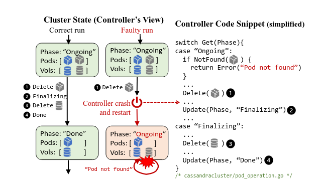
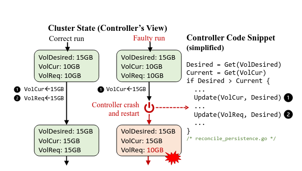
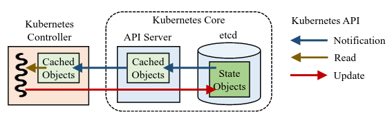
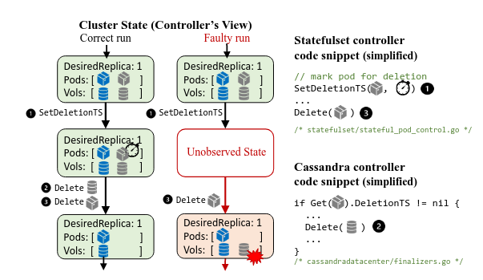

# Automatic Reliability Testing For Cluster Management Controllers
本文讲解了集群控制器稳定性检测

 

在这个图片中讲解了文中涉及到的测试方案:
在控制器平面视图下，正确的集群状态应该是:`[Delete, Finalizing, Delete, Done]`
但如果这里controller在第一个Delete结束后就遭遇不可控的崩溃后，此时phase没改变，依旧走ongoing,
那么就会进入if判断， 此时判断pods已经被删除，因此就不会进入之后删除volume, 这样就造成了资源泄露

控制器对于当前状态和预期状态之间的不同采取的步骤存在漏洞导致了控制器的问题

# sieve的设计
提供三种测试模式：
1. 中间状态
2. 陈旧状态
3. 未观察到的状态

其工作原理分步骤为:
1. Sieve手机控制器没有故障的情况下的行为方式, 并在引用跟组中记录状态的转换
2. Sieve分析引用追踪来生成测试计划，测试计划指定注入哪些故障以及何时注入
3. 修建冗余计划
4. 使用测试协调器来执行测试计划
5. 通过比较参考运行和测试运行之间集群状态的演变来检测有缺陷的控制器行为

Sieve 想要通过在可能遭受到的影响背景下扰乱控制器试图下与真实状态的不一致性来检测控制器设计的问题

接下来分别叙述这几类

## intermidiate state
当控制器完成本应该发出的所有状态更新之前失败时，会出现中间状态(例如k8s自动启动崩溃控制器的新实例),控制器需要从留下的中间状态恢复对账
 
当工作负载尝试将volume的大小从10GB调整到15GB, 但是加入在更新完`VolCur`后出现崩溃
那么后面的`VolReq`就不会继续进行修改

## Stale state
由于异步性和缓存的使用来提高性能和可伸缩性，控制器往往会在陈旧状态下运行
控制器总是与API server进行对话，存在访问的延后性

控制器应该需要具有处理延迟状态的功能，且这一部分需要能达到的最后状态保持一致

 
当控制器在从API server1 获取的状态信息来做出判定之后， 此时扰动控制器让他接入到API server2,
而API server2 如果是状态延迟的,此时如果控制器不进行额外判断，那么就会导致控制器认为延迟状态是实时的，
那么继续执行延迟状态就会造成混乱

## Unobserved state
根据设计，控制器可能不会观察系统中的每个集群状态变化，控制器的决策需要基于当前可观察的集群状态，而不是看到集群状态的每一个变化

当触发缩容的时候，需要通知statefulset 控制器， 该控制器标记该pod被删除，然后删除pods, 
此时如果cassandra 控制器接受到statefus更新的状态， 那么将会删除volume,此时如果存在一些错误因素，
导致cassandra没收到statefulset的更新，那么就将不会造成volume的删除，从而导致资源泄露

解决方案: 允许Cassandra在删除pods之前删除volume

