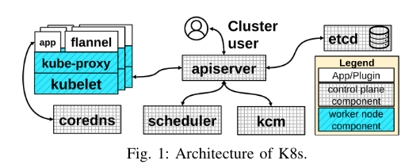
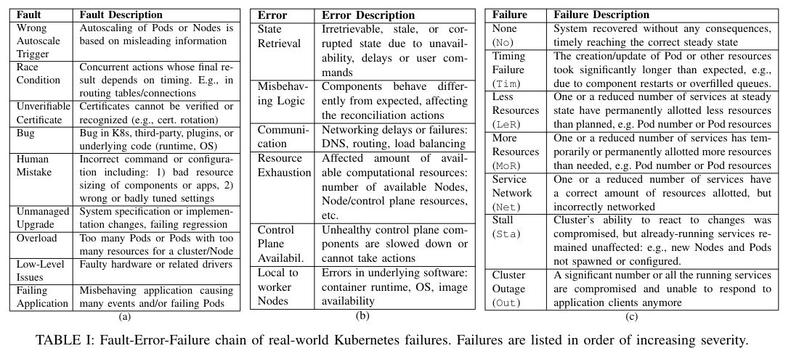
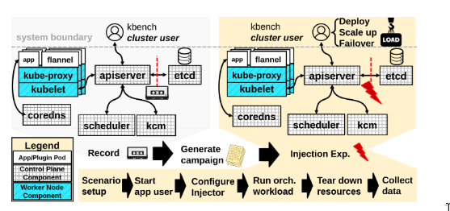

# Mutiny! How does Kubernetes fail,  and what can we do about it?
1. 对kubernetes的实际故障进行分类， 分为(fault, error failure)
2. 开发一个框架用来针对集群状态执行数据存储的故障/错误注入的活动
3. 将故障/错误注入实验结果与显示世界的故障进行比较

故障/错误注入遵循三种模式:
1. 位翻转
2. 数据类型损坏
3. 消息删除

贡献包括:
1. 对在线资源报告中真实世界k8s事件进行现场故障数据分析(FFDA),推导出k8s的故障模型
2. Mutiny的设计和实现，这是一个k8s的注入框架
3. 比较FFDA的结果与故障注入的结果

主要发现:
1. 3%的注入导致了系统范围故障, 这些故障包括停滞(集群对更改做出反应的能力受到损害，但已经运行的服务仍然可用)、中断(服务在系统范围内的可用性受到影响).24%的注入导致服务配置不足/过度配置. 4% 导致服务网络问题。

2. 跟踪对象之间的以来关系的字段中的错误导致51%的严重故障(停滞，中断，服务无法访问).对象是表示集群状态的一部分的实体。他们之间的依赖关系可以通过标签进行动态管理，但会牺牲弹性
3. 错误配置很容易导致系统过载，当检测到危险用户命令，会使得系统过载，并使所有计算资源饱和
4. 错误可以逃脱监控并在用户不知情的情况下在系统内部传播

# 背景

k8s组件:
1. Etcd: 一个键值存储，保证集群状态数据的顺序一致性
2. kube-apiserver: 公开API,允许用户与集群交互
3. kube-scheduler: 根据资源请求、可用性和约束将Pod分配给节点
4. kube-controller-manager: 将当前集群状态与所需集群状态进行协调

apiserver与部署在每个节点上的两个组件进行通讯: 
1. kube-proxy: 维护虚拟网络，连接Pod和Service
2. kubelet, 发送节点心跳并管理分配的Pod生命周期

# FFDA
分析收集有关现实世界k8s故障的数据

 

## 编排器级别失效(Orchestrator-level failures)
可能会也可能不会对应用程序产生影响, 分为以下几类:
1. 时序故障
2. 资源减少
3. 资源增加
4. 服务网络
5. 停顿
6. 集群中断

## 编排器级别故障和错误(Orchestrator-level faults and errors)
表项中一共有15个
最严重的故障/错误有以下原因
1. 影响整个汲取你的网络管理器故障
2. 大量不正常或删除的节点(资源耗尽)
3. 删除命名空间、集群或etcd的错误命令
4. 无限生成(资源耗尽)引起的抢占

# 实验方法
Multiny注入位置
+ 注入点
    1. apiserver -> etcd
    2. 其他组件 -> apiserver
这会模拟源自 Apiserver 或其他组件但在未检测到的情况下传播到 Etcd 的故障/错误。

+ 注入方式:
    1. 位反转: 在不了解语义的情况下更改正确值的简单方法
    2. 数据类型集合: 通过设置极端值、无效值或者错误值来触发验证和完整性检查
    3. 消息丢弃: 由于某种原因而未发生的状态更新, 例如请求失败， 软件错误， 更新系统规范或者数据丢失

+ 注入时间点
    根据相关资源发生的变化序列来进行注入

