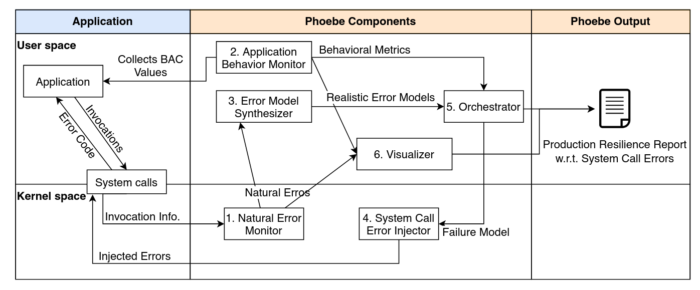
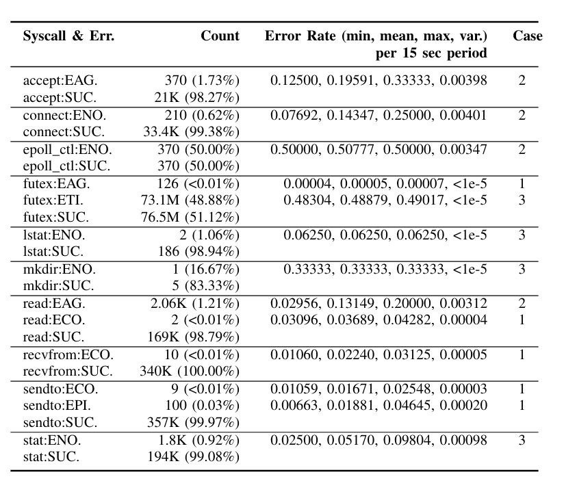
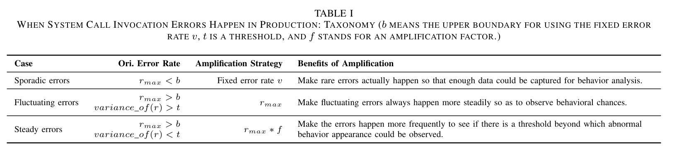
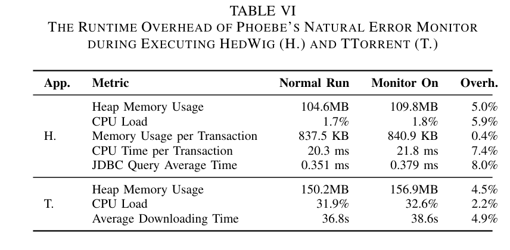

# Maximizing Error Injection Realism for Chaos  Engineering with System Calls

<!--toc:start-->
- [Maximizing Error Injection Realism for Chaos  Engineering with System Calls](#maximizing-error-injection-realism-for-chaos-engineering-with-system-calls)
- [概述](#概述)
- [PHOEBE 六大组件:](#phoebe-六大组件)
<!--toc:end-->

# 概述

核心思路: 通过劫持系统调用来执行故障注入, 这里需要满足后面的三个挑战

一种用于系统调用错误的新型故障注入框架，称之为PHOEBE, 特点如下:
1. 观察系统调用
2. 错误模型真实
3. 自动化进行实验

# 贡献
1. 基于在生产中自然观察到的错误放大, 为系统调用合成真实错误注入模型概念
2. PHOEBE, 故障注入框架,其监控生产系统，生成真实的错误模型
3. 以较低开销注入显示错误从而检测与系统调用错误相关的错误处理弱点

# 挑战
1. 如何评估不同的弹性
2. 如何自动进行混沌工程实验
3. 如何改善混沌工程实验的效率

挑战3
为混沌工程同步现实错误模型, 这里仅讨论操作系统层面, 聚焦于系统调用 
因为系统调用在linux上有300多种，其中错误码也会有100多种，因此组合起来范围太大，在有限的时间和资源里不可能全部测试一遍
可以通过长时间监控进程来获取真正可能出现的一系列系统调用错误并进行记录

错误模型建立:
首先获取系统调用错误返回，统计错误率
然后在测试用例中放大这一比例

# PHOEBE 六大组件

1. Natural Error Monitor: 负责检查正常系统调用错误比例， 给定间隔时间，捕获一组指标，其中包括
    + t期间不同系统调用的名称和数量
    + 系统调用返回代码
    + 每个系统调用执行时间
    + 特定系统调用失败时的错误率r

    

2. Application Behavior Mnoitor: 收集一组评估指标来对应用程序行为进行建模
    + 一般指标: PHOEBE捕获的OS-level 指标例如CPU负载
    + 特定运行时指标: PHOEBE对java有专门的支持，可以捕获堆内存使用情况
    + 特定运行时指标: PHOEBE可以捕获某些java库的HTTP请求,例如每秒成功数据库请求的比率
3. Realistic Error Model Synthesis: 使用错误率放大算法来生成测试用例
    扩展策略如下

    

    1. 收集系统调用集合, 集合值是收集到的所有时间窗口内的错误比例集合
    2. 统计其中的比例最大值`r_max`和比例方差`r_varince`
    3. 判断范围，
        + 如果`r_max` < b 则归类为Sporadic Errors(偶发错误), 扩张策略为常数比例v
        + 如果`r_max > b && r_varince > t`, 归类为Fluctuating Errors(浮动错误), 扩张策略修改为`r_max`
        + 如果`r_max > b && r_varince < t`, 归类为Steady Errors(稳定错误), 扩张策略为`r_max * f`

    + Sporadic Errors: 意味着观察到这类错误需要很长时间， 因此可以将其概率改为一个稍大的固定值来进行模拟
    + Fluctuating Errors: 表示最大错误率和最小错误率之间存在较大差异，也就是说他可能是不定期频率差异大， 因此将他的比例均设置为高比例
    + Steady Errors: 连续监控间隔序列比例接近并且高于阈值，这意味着错误经常发生，将其曾以固定的放大因子
4. Syscall Call Invocation Error Injection: PHOEBE 通过将注入器注册到目标系统调用的返回事件来覆盖返回值, 通过错误比例
5. Orchestration: PHOEBE 旨在以全自动方式进行故障注入实验, 通过持续时间和错误注入模型来制定每个实验,然后通过应用行为监视器来捕获行为
6. Visualization: 专用于监控信息可视化

# 实现方式

使用eBPF注册`raw_syscalls/sys_enter, sys_exit`, 通过bpf-helpers `bpf_override_return`来拦截系统调用并将返回值更改为错误代码
Q: 为什么选择eBPF
A: 
1. 可以不用修改目标程序, 零入侵
2. 开销相对较低
    
3. eBPF已经发展成熟, 有许多前端支持，例如BCC cilium libbpf等
