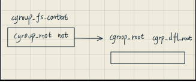
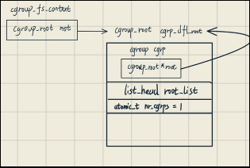
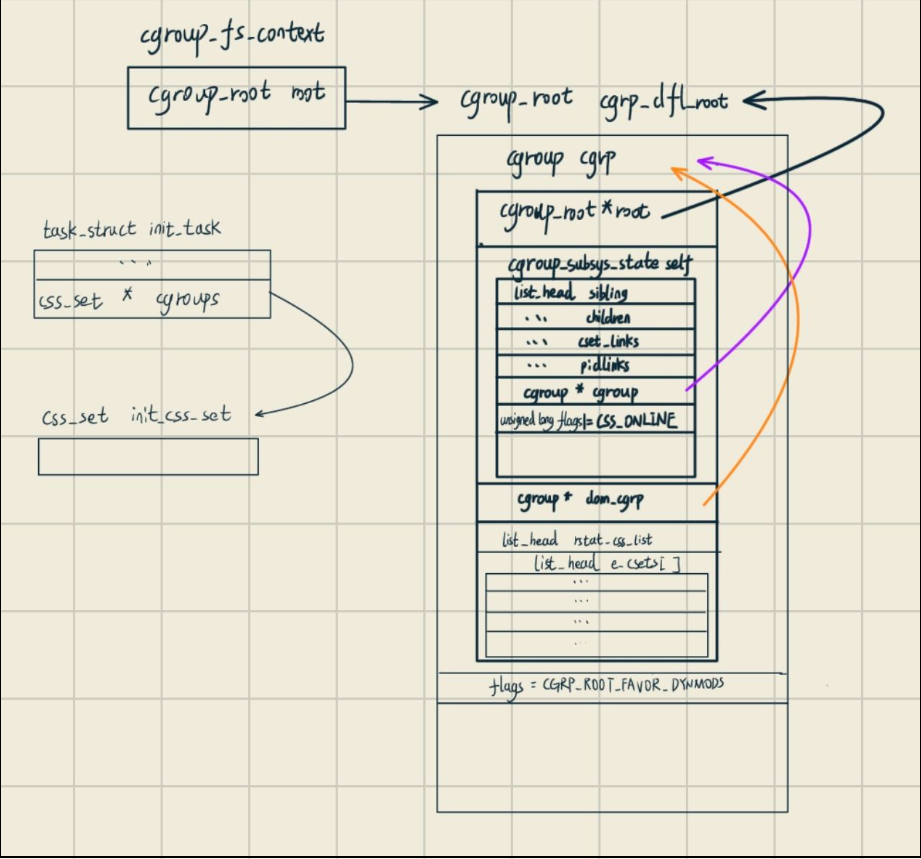
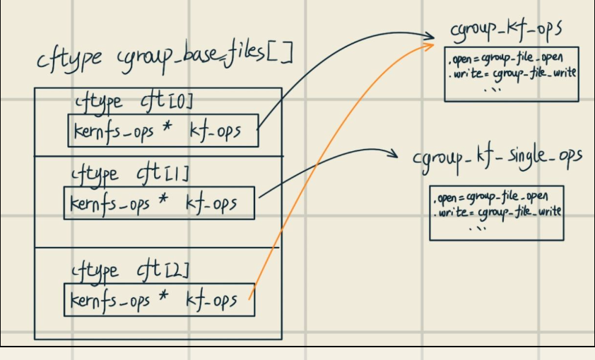
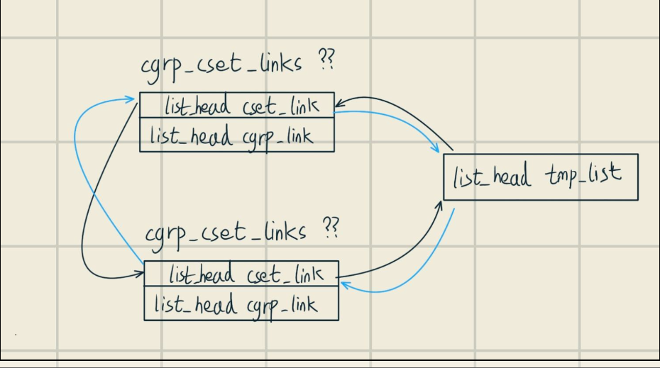
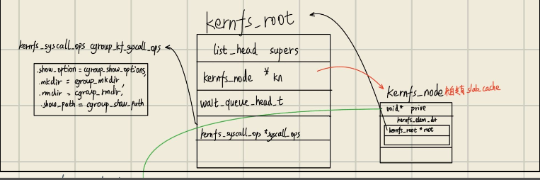
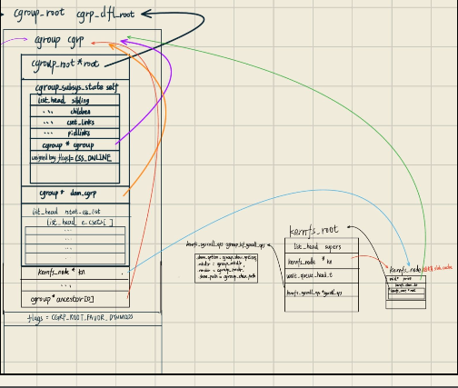

# Preview: 环境介绍以及任务分配
此次是为了分析最新版本的cgroup/v2,采用linux内核源码是最新的版本,为v6.9-rc5
任务如下:

+ 介绍cgroup/v2的相关结构体以及其同cgroup/v1的区别
+ 分析cgroup/v2初始化的过程,同时搭配源码
+ 比较cgroup/v1 or v2架构之间的区别
+ 在撰写过程当中遇到锁相关或者说是namespace的知识同时需要进行学习和记录,形成树状的学习记录


# Volume I: 结构体们
这一板块在本文撰写过程中动态更新,其中涉及到一切文中值得探讨和记录的数据结构,我将其细分板块
## rcu相关
### rcu_head
```c
/*
 * The rcu_head data structure is placed in the structure to be freed
 * via call_rcu().
 */

struct rcu_head {
	struct cds_wfcq_node next;
	void (*func)(struct rcu_head *head);
};
```

### cds_wfcq_node
```c
struct cds_wfcq_node {
	struct cds_wfcq_node *next;
};
```

## 文件系统相关

### kernfs_root
```c
struct kernfs_root {
	/* 公共字段 */
	struct kernfs_node	*kn;
	unsigned int		flags;	/* KERNFS_ROOT_* flags */

	/* 私有字段 */
	struct idr		ino_idr;
	u32			last_id_lowbits;
	u32			id_highbits;
	struct kernfs_syscall_ops *syscall_ops;

	/* 该root的kernfs_super_info 列表, 受到kernfs_rwsem保护 */
	struct list_head	supers;

	wait_queue_head_t	deactivate_waitq;
	struct rw_semaphore	kernfs_rwsem;
	struct rw_semaphore	kernfs_iattr_rwsem;
	struct rw_semaphore	kernfs_supers_rwsem;

	struct rcu_head		rcu;
};
```
### kernfs_node
```c
/*
 * kernfs_node - kernfs hierarchy的构建块. 
 * 每一个kernfs的node都被一个唯一的kernfs_node所映射
 * 大多数字段都是kernfs私有的并且不能被kernfs用户直接访问
 * 只要持有 count 引用，
 * kernfs_node 本身就可以访问取消引用 elem 或任何其他外部实体需要主动引用。
 */
struct kernfs_node {
	atomic_t		count;
	atomic_t		active;
#ifdef CONFIG_DEBUG_LOCK_ALLOC
	struct lockdep_map	dep_map;
#endif
	/*
     * 使用 kernfs_get_parent() 和 kernfs_name/path() 而不是直接访问以下两个字段
     * 如果节点从未移动到不同的父节点，则直接访问父节点是安全的。
	 */
	struct kernfs_node	*parent;
	const char		*name;

	struct rb_node		rb;

	const void		*ns;	/* namespace tag */
	unsigned int		hash;	/* ns + name hash */
	unsigned short		flags;
	umode_t			mode;

	union {
		struct kernfs_elem_dir		dir;
		struct kernfs_elem_symlink	symlink;
		struct kernfs_elem_attr		attr;
	};

	/*
	 * 64bit 的唯一ID.  在64bit ino 建立时, id 就是ino. 
	 */
	u64			id;

	void			*priv;
	struct kernfs_iattrs	*iattr;

	struct rcu_head		rcu;
};
```
### kernfs_elem_dir

```c
/* kernfs_node union 成员的特殊类型结构体 */
struct kernfs_elem_dir {
	unsigned long		subdirs;
	/* children rbtree starts here and goes through kn->rb */
	struct rb_root		children;

	/*
	 * 该目录属于的kernfs层级,
     * 这更适合直接放在 kernfs_node 中，但这样做是为了节省空间
	 */
	struct kernfs_root	*root;
	/*
	 * Monotonic revision counter, used to identify if a directory
	 * node has changed during negative dentry revalidation.
	 */
	unsigned long		rev;
};
```

## task相关

每个进程会有自身对应的cgroup,如下为关键字段
### task_struct
```c
struct task_struct {
    ...
#ifdef CONFIG_CGROUPS
	/* Control Group info protected by css_set_lock: */
	struct css_set __rcu		*cgroups;
	/* cg_list protected by css_set_lock and tsk->alloc_lock: */
	struct list_head		cg_list;
#endif
    ...
}

```


## cgroup相关

### cgroup_fs_context

```c
/* kernel/cgroup/cgroup-internal.h */
/*
 * cgroup 文件系统超级快的构建/挂载的上下文
 */
struct cgroup_fs_context {
	struct kernfs_fs_context kfc;
	struct cgroup_root	*root;
	struct cgroup_namespace	*ns;
	unsigned int	flags;			/* CGRP_ROOT_* flags */

	/* cgroup1 bits */
	bool		cpuset_clone_children;
	bool		none;			/* User explicitly requested empty subsystem */
	bool		all_ss;			/* Seen 'all' option */
	u16		subsys_mask;		/* Selected subsystems */
	char		*name;			/* Hierarchy name */
	char		*release_agent;		/* Path for release notifications */
};

```

### cgroup_subsys

```c
/*
 * cgroup子系统类型
 * See Documentation/admin-guide/cgroup-v1/cgroups.rst for details
 */
struct cgroup_subsys {
	struct cgroup_subsys_state *(*css_alloc)(struct cgroup_subsys_state *parent_css);
	int (*css_online)(struct cgroup_subsys_state *css);
	void (*css_offline)(struct cgroup_subsys_state *css);
	void (*css_released)(struct cgroup_subsys_state *css);
	void (*css_free)(struct cgroup_subsys_state *css);
	void (*css_reset)(struct cgroup_subsys_state *css);
	void (*css_rstat_flush)(struct cgroup_subsys_state *css, int cpu);
	int (*css_extra_stat_show)(struct seq_file *seq,
				   struct cgroup_subsys_state *css);
	int (*css_local_stat_show)(struct seq_file *seq,
				   struct cgroup_subsys_state *css);

	int (*can_attach)(struct cgroup_taskset *tset);
	void (*cancel_attach)(struct cgroup_taskset *tset);
	void (*attach)(struct cgroup_taskset *tset);
	void (*post_attach)(void);
	int (*can_fork)(struct task_struct *task,
			struct css_set *cset);
	void (*cancel_fork)(struct task_struct *task, struct css_set *cset);
	void (*fork)(struct task_struct *task);
	void (*exit)(struct task_struct *task);
	void (*release)(struct task_struct *task);
	void (*bind)(struct cgroup_subsys_state *root_css);

	bool early_init:1;

	/*
	 * If %true, the controller, on the default hierarchy, doesn't show
	 * up in "cgroup.controllers" or "cgroup.subtree_control", is
	 * implicitly enabled on all cgroups on the default hierarchy, and
	 * bypasses the "no internal process" constraint.  This is for
	 * utility type controllers which is transparent to userland.
	 *
	 * An implicit controller can be stolen from the default hierarchy
	 * anytime and thus must be okay with offline csses from previous
	 * hierarchies coexisting with csses for the current one.
	 */
	bool implicit_on_dfl:1;

	/*
	 * If %true, the controller, supports threaded mode on the default
	 * hierarchy.  In a threaded subtree, both process granularity and
	 * no-internal-process constraint are ignored and a threaded
	 * controllers should be able to handle that.
	 *
	 * Note that as an implicit controller is automatically enabled on
	 * all cgroups on the default hierarchy, it should also be
	 * threaded.  implicit && !threaded is not supported.
	 */
	bool threaded:1;

	/* the following two fields are initialized automatically during boot */
	int id;
	const char *name;

	/* optional, initialized automatically during boot if not set */
	const char *legacy_name;

	/* 连接指向父亲, 受到cgroup_lock()保护 */
	struct cgroup_root *root;

	/* idr for css->id */
	struct idr css_idr;

	/*
	 * List of cftypes.  Each entry is the first entry of an array
	 * terminated by zero length name.
	 */
	struct list_head cfts;

	/*
	 * Base cftypes which are automatically registered.  The two can
	 * point to the same array.
	 */
	struct cftype *dfl_cftypes;	/* for the default hierarchy */
	struct cftype *legacy_cftypes;	/* for the legacy hierarchies */

	/*
	 * A subsystem may depend on other subsystems.  When such subsystem
	 * is enabled on a cgroup, the depended-upon subsystems are enabled
	 * together if available.  Subsystems enabled due to dependency are
	 * not visible to userland until explicitly enabled.  The following
	 * specifies the mask of subsystems that this one depends on.
	 */
	unsigned int depends_on;
};
```

### cgroup_subsys_state

```c

/*
 * 整个系统所维持的每个子系统/cgroup的身份特征.这是controllers所交互的基础结构体
 * 标记为PI的字段是公共且不可变的,并且可能在未同步的情况下直接被访问
 */
struct cgroup_subsys_state {
	/* PI: css被附加到的cgroup */
	struct cgroup *cgroup;

	/* PI: css被附加到的cgroup 子系统 */
	struct cgroup_subsys *ss;

	/* 引用计数 - 通过 css_[try]get()和css_put()进行交互 */
	struct percpu_ref refcnt;

	/* siblings list anchored at the parent's ->children */
	struct list_head sibling;
	struct list_head children;

	/* flush target list anchored at cgrp->rstat_css_list */
    /* 刷新与cgrp->rstat_css_list绑定的目标列表 */
	struct list_head rstat_css_node;

	/*
	 * PI: 子系统唯一ID.  0 表示未使用,根永远为1
	 * 匹配的css 能够通过使用 css_from_id()来查看
	 */
	int id;

	unsigned int flags;

	/*
	 * Monotonically increasing unique serial number which defines a
	 * uniform order among all csses.  It's guaranteed that all
	 * ->children lists are in the ascending order of ->serial_nr and
	 * used to allow interrupting and resuming iterations.
	 */
	u64 serial_nr;

	/*
	 * 通过自身和子的在线来进行增加,他被用来保证父亲不会比子节点先下线
	 */
	atomic_t online_cnt;

	/* percpu_ref 引用的killing RCU 的释放 */
	struct work_struct destroy_work;
	struct rcu_work destroy_rwork;

	/*
	 * PI: 父亲css.	放置在这里是为了缓存邻近包含结构的以下字段。
	 */
	struct cgroup_subsys_state *parent;
};


```


### cgroup_root

```c
/*
 * 一个cgroup_root代表了一个cgroup层级的根root,并且或许会联系kernfs_root去
 * 形成一个活跃的层级.这是 cgroup 核心内部。不要直接从控制器访问。
 */
struct cgroup_root {
	struct kernfs_root *kf_root;    //kernfs的根节点, 由kernfs_create_root获得

    /* 子系统连接到这个层级的位图掩码 */
	unsigned int subsys_mask;

	/* 该层级的唯一id */
	int hierarchy_id;

    /* 活跃层级们所互联的双链条表 */
	struct list_head root_list;
	struct rcu_head rcu;	/* Must be near the top */

	/*
	 * 根cgroup.其中所包含的cgroup_root将在其被释放时摧毁 
     * cgrp->ancestors[0] 将被 将溢出到以下字段中使用。 
     * cgrp_ancestor_storage 必须紧随其后。
	 */
	struct cgroup cgrp;

	/* 必须紧随于cgroup字段,原因如上 */
	struct cgroup *cgrp_ancestor_storage;

	/* 当前层级中cgroup的数量,仅仅被/proc/cgroups使用 */
	atomic_t nr_cgrps;

	/* 层级特定的flags */
	unsigned int flags;

	/* 备用来释放时通知的路径 */
	char release_agent_path[PATH_MAX];

	/* 该层级的名字,可能为空 */
	char name[MAX_CGROUP_ROOT_NAMELEN];
};
```

### cgroup

```c
struct cgroup {
    /* 自身的css为NULL,会回指向该cgroup */
	struct cgroup_subsys_state self;

	unsigned long flags;		/* "unsigned long" so bitops work */

	/*
	 * The depth this cgroup is at.  The root is at depth zero and each
	 * step down the hierarchy increments the level.  This along with
	 * ancestors[] can determine whether a given cgroup is a
	 * descendant of another without traversing the hierarchy.
	 */
	int level;

	/* Maximum allowed descent tree depth */
    /* 继承树的最大允许深度 */
	int max_depth;

	/*
	 * Keep track of total numbers of visible and dying descent cgroups.
	 * Dying cgroups are cgroups which were deleted by a user,
	 * but are still existing because someone else is holding a reference.
	 * max_descendants 是被允许作为子孙cgroup的最大数量	 
     * nr_descendants and nr_dying_descendants are protected
	 * by cgroup_mutex and css_set_lock. It's fine to read them holding
	 * any of cgroup_mutex and css_set_lock; for writing both locks
	 * should be held.
	 */
	int nr_descendants;
	int nr_dying_descendants;
	int max_descendants;

	/*
	 * Each non-empty css_set associated with this cgroup contributes
	 * one to nr_populated_csets.  The counter is zero iff this cgroup
	 * doesn't have any tasks.
	 *
	 * All children which have non-zero nr_populated_csets and/or
	 * nr_populated_children of their own contribute one to either
	 * nr_populated_domain_children or nr_populated_threaded_children
	 * depending on their type.  Each counter is zero iff all cgroups
	 * of the type in the subtree proper don't have any tasks.
	 */
	int nr_populated_csets;
	int nr_populated_domain_children;
	int nr_populated_threaded_children;

	int nr_threaded_children;	/* # of live threaded child cgroups */

	struct kernfs_node *kn;		/* 该cgroup 的 kernfs node条目 */
	struct cgroup_file procs_file;	/* handle for "cgroup.procs" */
	struct cgroup_file events_file;	/* handle for "cgroup.events" */

	/* handles for "{cpu,memory,io,irq}.pressure" */
	struct cgroup_file psi_files[NR_PSI_RESOURCES];

	/*
	 * The bitmask of subsystems enabled on the child cgroups.
	 * ->subtree_control is the one configured through
	 * "cgroup.subtree_control" while ->subtree_ss_mask is the effective
	 * one which may have more subsystems enabled.  Controller knobs
	 * are made available iff it's enabled in ->subtree_control.
	 */
	u16 subtree_control;
	u16 subtree_ss_mask;
	u16 old_subtree_control;
	u16 old_subtree_ss_mask;

	/* 每个注册子系统的私有指针列表 */
	struct cgroup_subsys_state __rcu *subsys[CGROUP_SUBSYS_COUNT];

	struct cgroup_root *root;

	/*
     * 指向 css_sets 的 cgrp_cset_links 列表，其中包含此 cgroup 中的任务。
     * 受 css_set_lock 保护。
	 */
	struct list_head cset_links;

	/*
     * 在默认层次结构中，禁用某些 susbsys 的 cgroup 的 css_set ,
     * 这将指向与启用了子系统的最近祖先关联的 css
     * 下面列出了指向给定子系统的该 cgroup 的 css 的所有 css_sets。
	 */
	struct list_head e_csets[CGROUP_SUBSYS_COUNT];

	/*
     * 如果不是线程,则指向自身,如果是线程,则其指向最临近的domain ancestor
     * 在线程子树内部，cgroup 不受进程粒度和无内部任务约束的约束。
     * 与特定任务无关的域级资源消耗由 dom_cgrp 负责。
	 */
	struct cgroup *dom_cgrp;
	struct cgroup *old_dom_cgrp;		/* 允许线程化后才被使用 */

	/* 每个cpu递归资源统计信息 */
	struct cgroup_rstat_cpu __percpu *rstat_cpu;
	struct list_head rstat_css_list;

	/*
	 * Add padding to separate the read mostly rstat_cpu and
	 * rstat_css_list into a different cacheline from the following
	 * rstat_flush_next and *bstat fields which can have frequent updates.
	 */
	CACHELINE_PADDING(_pad_);

	/*
	 * A singly-linked list of cgroup structures to be rstat flushed.
	 * This is a scratch field to be used exclusively by
	 * cgroup_rstat_flush_locked() and protected by cgroup_rstat_lock.
	 */
	struct cgroup	*rstat_flush_next;

	/* cgroup 基础资源统计 */
	struct cgroup_base_stat last_bstat;
	struct cgroup_base_stat bstat;
	struct prev_cputime prev_cputime;	/* 记录用户和system使用的cputime */

	/*
     *pidlists 列表，每个命名空间最多两个（一个用于 procs，一个用于对于任务）
     * 按需创建。
	 */
	struct list_head pidlists;
	struct mutex pidlist_mutex;

	/* 被用来等待下线的css */
	wait_queue_head_t offline_waitq;

	/* 被用作调度释放代理 */
	struct work_struct release_agent_work;

	/* used to track pressure stalls */
	struct psi_group *psi;

	/* 用来存储eBPF程序 */
	struct cgroup_bpf bpf;

	/* If there is block congestion on this cgroup. */
	atomic_t congestion_count;

	/* Used to store internal freezer state */
	struct cgroup_freezer_state freezer;

#ifdef CONFIG_BPF_SYSCALL
	struct bpf_local_storage __rcu  *bpf_cgrp_storage;
#endif

	/* All ancestors including self */
	struct cgroup *ancestors[];
};

```


### css_set

```c
/*
 * css_set维持一个css数组对象的指针.这为task_struct节省了空间并且加快fork/exit函数
 * since a single inc/dec and a
 * list_add()/del() can bump the reference count on the entire cgroup
 * set for a task.
 */
struct css_set {
	/*
     * 子系统对应css的集合,每个子系统拥有一个,
     * 除了子系统注册期间（启动时）的 init_css_set 之外，该数组在创建后是不可变的。
	 */
	struct cgroup_subsys_state *subsys[CGROUP_SUBSYS_COUNT];

	/* 引用计数 */
	refcount_t refcount;

	/*
	 * For a domain cgroup, the following points to self.  If threaded,
	 * to the matching cset of the nearest domain ancestor.  The
	 * dom_cset provides access to the domain cgroup and its csses to
	 * which domain level resource consumptions should be charged.
	 */
	struct css_set *dom_cset;

	/* 与该css_set关联的默认cgroup */
	struct cgroup *dfl_cgrp;

	/* internal task count, protected by css_set_lock */
	int nr_tasks;

	/*
	 * Lists running through all tasks using this cgroup group.
	 * mg_tasks lists tasks which belong to this cset but are in the
	 * process of being migrated out or in.  Protected by
	 * css_set_lock, but, during migration, once tasks are moved to
	 * mg_tasks, it can be read safely while holding cgroup_mutex.
	 */
	struct list_head tasks;
	struct list_head mg_tasks;
	struct list_head dying_tasks;

	/* all css_task_iters currently walking this cset */
	struct list_head task_iters;

	/*
	 * On the default hierarchy, ->subsys[ssid] may point to a css
	 * attached to an ancestor instead of the cgroup this css_set is
	 * associated with.  The following node is anchored at
	 * ->subsys[ssid]->cgroup->e_csets[ssid] and provides a way to
	 * iterate through all css's attached to a given cgroup.
	 */
	struct list_head e_cset_node[CGROUP_SUBSYS_COUNT];

	/* all threaded csets whose ->dom_cset points to this cset */
	struct list_head threaded_csets;
	struct list_head threaded_csets_node;

	/*
	 * 所有相同hash值的cgroup groups都链接一起,受css_set_lock保护
	 * slot. Protected by css_set_lock
	 */
	struct hlist_node hlist;

	/*
     * cgrp_cset_links链表,这里包含了该cgrp_cset_links中关联的其他cgroups
	 * 受css_set_lock保护
	 */
	struct list_head cgrp_links;

	/*
	 * List of csets participating in the on-going migration either as
	 * source or destination.  Protected by cgroup_mutex.
	 */
	struct list_head mg_src_preload_node;
	struct list_head mg_dst_preload_node;
	struct list_head mg_node;

	/*
	 * If this cset is acting as the source of migration the following
	 * two fields are set.  mg_src_cgrp and mg_dst_cgrp are
	 * respectively the source and destination cgroups of the on-going
	 * migration.  mg_dst_cset is the destination cset the target tasks
	 * on this cset should be migrated to.  Protected by cgroup_mutex.
	 */
	struct cgroup *mg_src_cgrp;
	struct cgroup *mg_dst_cgrp;
	struct css_set *mg_dst_cset;

	/* dead and being drained, ignore for migration */
	bool dead;

	/* For RCU-protected deletion */
	struct rcu_head rcu_head;
};
```

### cftype
```c
/*
 * struct cftype: cgroup 控制器的处理函数定义
 *
 * 当读/写一个文件:
 *  - cgroup将使用file->f_path.dentry->d_parent->d_fsdata
 *	- 而文件的'cftype'则是file->f_path.dentry->d_fsdata
 */
struct cftype {
	/*
	 * 名字应由子系统的名字开头
	 */
	char name[MAX_CFTYPE_NAME];
	unsigned long private;

	/*
	 * 排除末尾NULL字符的字符串最大允许写的长度
	 * If < PAGE_SIZE-1, PAGE_SIZE-1 is assumed.
	 */
	size_t max_write_len;

	/* CFTYPE_* flags */
	unsigned int flags;

	/*
	 * If non-zero, should contain the offset from the start of css to
	 * a struct cgroup_file field.  cgroup will record the handle of
	 * the created file into it.  The recorded handle can be used as
	 * long as the containing css remains accessible.
	 */
	unsigned int file_offset;

	/*
	 * Fields used for internal bookkeeping.  Initialized automatically
	 * during registration.
	 */
	struct cgroup_subsys *ss;	/* NULL for cgroup core files */
	struct list_head node;		/* anchored at ss->cfts */
	struct kernfs_ops *kf_ops;

	int (*open)(struct kernfs_open_file *of);
	void (*release)(struct kernfs_open_file *of);

	/*
	 * read_u64() is a shortcut for the common case of returning a
	 * single integer. Use it in place of read()
	 */
	u64 (*read_u64)(struct cgroup_subsys_state *css, struct cftype *cft);
	/*
	 * read_s64() is a signed version of read_u64()
	 */
	s64 (*read_s64)(struct cgroup_subsys_state *css, struct cftype *cft);

	/* generic seq_file read interface */
	int (*seq_show)(struct seq_file *sf, void *v);

	/* optional ops, implement all or none */
	void *(*seq_start)(struct seq_file *sf, loff_t *ppos);
	void *(*seq_next)(struct seq_file *sf, void *v, loff_t *ppos);
	void (*seq_stop)(struct seq_file *sf, void *v);

	/*
	 * write_u64() is a shortcut for the common case of accepting
	 * a single integer (as parsed by simple_strtoull) from
	 * userspace. Use in place of write(); return 0 or error.
	 */
	int (*write_u64)(struct cgroup_subsys_state *css, struct cftype *cft,
			 u64 val);
	/*
	 * write_s64() is a signed version of write_u64()
	 */
	int (*write_s64)(struct cgroup_subsys_state *css, struct cftype *cft,
			 s64 val);

	/*
	 * write() is the generic write callback which maps directly to
	 * kernfs write operation and overrides all other operations.
	 * Maximum write size is determined by ->max_write_len.  Use
	 * of_css/cft() to access the associated css and cft.
	 */
	ssize_t (*write)(struct kernfs_open_file *of,
			 char *buf, size_t nbytes, loff_t off);

	__poll_t (*poll)(struct kernfs_open_file *of,
			 struct poll_table_struct *pt);

#ifdef CONFIG_DEBUG_LOCK_ALLOC
	struct lock_class_key	lockdep_key;
#endif
};


```

### cgrp_cset_link
```c
/*
 * 一个 cgroup 可以与多个 css_set 关联，
 * 因为不同的任务可能属于不同层次结构上的不同 cgroup。
 * 在另一个方向上，一个 css_set 自然与多个 cgroup 关联。
 * 这种 M:N 关系由以下链接结构表示，每个关联都存在该链接结构，并允许从两侧遍历关联。
 */
struct cgrp_cset_link {
	/* cgroup 和 css_set 的链接关联 */
	struct cgroup		*cgrp;
	struct css_set		*cset;

	/* cgrp_cset_links对于cgrp->cset_links的列表
	struct list_head	cset_link;

	/* cgrp_cset_links对于css_set->cgrp_links的列表
	struct list_head	cgrp_link;
};
```

### cgroup_rstat_cpu
```c
/*
 * rstat - cgroup 可扩展的递归统计信息是在 cgroup_rstat_cpu 中按 CPU 进行的，
 * 然后在读取时延迟地向上传播。* 
 *
 * 当统计数据更新时，cgroup_rstat_cpu 及其祖先会链接到更新的树中，
 * 在接下来的读取中，传播仅考虑并消耗更新的树，
 * 这使得读取为O（自上次读取以来处于活动状态的后代的数量)而不是O(后代总数）。
 *
 * 这很重要，因为可能有很多不活跃的（耗尽）cgroup，
 * 但是他的stat 可能会被频繁读取，通过有选择地传播，增加读取频率会降低每次读取的成本。
 * 
 * 该结构包含实现上述内容的字段（updated_children 和 Updated_next）
 * 以及在其之上跟踪基本资源统计信息的字段（bsync、bstat 和 last_bstat）。
 */
struct cgroup_rstat_cpu {
	/*
	 * ->bsync 保护 ->bstat.  这些是在热路径中唯一更新的字段。	
     */
	struct u64_stats_sync bsync;
	struct cgroup_base_stat bstat;

	/*
	 * 最后所读取的快照.这些用于计算传播到全局计数器的增量。
     */
	struct cgroup_base_stat last_bstat;

	/*
     * 该字段用于记录 cgroup 及其后代的累积每个 cpu 时间。
     * 目前可以通过 eBPF/drgn 等读取它，
     * 我们仍在尝试确定如何在 cgroupfs 接口中公开它。
	 */
	struct cgroup_base_stat subtree_bstat;

	/*
	 * 最后读取的快照,这些用于计算传播到每个 cpu subtree_bstat 的增量	
     */
	struct cgroup_base_stat last_subtree_bstat;

	/*
     * 自上次读取以来，
     * 在该 cpu 上进行统计更新的子 cgroup 
     * 通过 ->updated_next 链接到父级的 ->updated_children 上。
	 * 
     * 除了更加紧凑之外，指向 cgroup 的单链表
     * 使得每个 CPU 结构体无需再指向关联的 cgroup。
	 *
	 * 受到每个cpu的cgroup_rstat_cpu_lock保护
	 */
	struct cgroup *updated_children;	/* terminated by self cgroup */
	struct cgroup *updated_next;		/* NULL iff not on the list */
};
```

### cgroup_base_stat
```c
struct cgroup_base_stat {
	struct task_cputime cputime;

#ifdef CONFIG_SCHED_CORE
	u64 forceidle_sum;
#endif
}
```


# Volume II: 全局变量们

## cgrp_dfl_root

```c
/* the default hierarchy */
struct cgroup_root cgrp_dfl_root = { .cgrp.rstat_cpu = &cgrp_dfl_root_rstat_cpu };
EXPORT_SYMBOL_GPL(cgrp_dfl_root);
```

## init_css_set
```c
/*
 * 默认的 css_set - 初始化时使用,其子孙
 * 在挂载任何层次结构之前由 init 及其子级使用。
 * 它包含指向每个subsystem的root state的指针。
 * 也用于锚定 css_sets 列表，
 * 以在尚未创建子级 cgroup 时提高性能
 */
struct css_set init_css_set = {
	.refcount		= REFCOUNT_INIT(1),
	.dom_cset		= &init_css_set,
	.tasks			= LIST_HEAD_INIT(init_css_set.tasks),
	.mg_tasks		= LIST_HEAD_INIT(init_css_set.mg_tasks),
	.dying_tasks		= LIST_HEAD_INIT(init_css_set.dying_tasks),
	.task_iters		= LIST_HEAD_INIT(init_css_set.task_iters),
	.threaded_csets		= LIST_HEAD_INIT(init_css_set.threaded_csets),
	.cgrp_links		= LIST_HEAD_INIT(init_css_set.cgrp_links),
	.mg_src_preload_node	= LIST_HEAD_INIT(init_css_set.mg_src_preload_node),
	.mg_dst_preload_node	= LIST_HEAD_INIT(init_css_set.mg_dst_preload_node),
	.mg_node		= LIST_HEAD_INIT(init_css_set.mg_node),

	/* 当此 cset 在 cgroup_init() 中链接时，以下字段将重新初始化。
     * 但是，我们也静态初始化该字段，以便可以在启动过程中尽早安全地访问默认 cgroup。
	 */
	.dfl_cgrp		= &cgrp_dfl_root.cgrp,
};
```

## cgroup_subsys_name

```c
/* array of cgroup subsystem names */
#define SUBSYS(_x) [_x ## _cgrp_id] = #_x,
static const char *cgroup_subsys_name[] = {
#include <linux/cgroup_subsys.h>
};
#undef SUBSYS
```

这里我们的头文件实际上就是一个个子系统数据结构的全局变量

```c
/* linux/cgroup_subsys.h */
#if IS_ENABLED(CONFIG_CPUSETS)
SUBSYS(cpuset)
#endif

#if IS_ENABLED(CONFIG_CGROUP_SCHED)
SUBSYS(cpu)
#endif

#if IS_ENABLED(CONFIG_CGROUP_CPUACCT)
SUBSYS(cpuacct)
#endif

#if IS_ENABLED(CONFIG_BLK_CGROUP)
SUBSYS(io)
#endif

#if IS_ENABLED(CONFIG_MEMCG)
SUBSYS(memory)
#endif
.......

```

## cgroup_base_files

```c
/* cgroup默认层级的核心接口文件 */
static struct cftype cgroup_base_files[] = {
	{
		.name = "cgroup.type",
		.flags = CFTYPE_NOT_ON_ROOT,
		.seq_show = cgroup_type_show,
		.write = cgroup_type_write,
	},
	{
		.name = "cgroup.procs",
		.flags = CFTYPE_NS_DELEGATABLE,
		.file_offset = offsetof(struct cgroup, procs_file),
		.release = cgroup_procs_release,
		.seq_start = cgroup_procs_start,
		.seq_next = cgroup_procs_next,
		.seq_show = cgroup_procs_show,
		.write = cgroup_procs_write,
	},
	{
		.name = "cgroup.threads",
		.flags = CFTYPE_NS_DELEGATABLE,
		.release = cgroup_procs_release,
		.seq_start = cgroup_threads_start,
		.seq_next = cgroup_procs_next,
		.seq_show = cgroup_procs_show,
		.write = cgroup_threads_write,
	},
	{
		.name = "cgroup.controllers",
		.seq_show = cgroup_controllers_show,
	},
	{
		.name = "cgroup.subtree_control",
		.flags = CFTYPE_NS_DELEGATABLE,
		.seq_show = cgroup_subtree_control_show,
		.write = cgroup_subtree_control_write,
	},
	{
		.name = "cgroup.events",
		.flags = CFTYPE_NOT_ON_ROOT,
		.file_offset = offsetof(struct cgroup, events_file),
		.seq_show = cgroup_events_show,
	},
	{
		.name = "cgroup.max.descendants",
		.seq_show = cgroup_max_descendants_show,
		.write = cgroup_max_descendants_write,
	},
	{
		.name = "cgroup.max.depth",
		.seq_show = cgroup_max_depth_show,
		.write = cgroup_max_depth_write,
	},
	{
		.name = "cgroup.stat",
		.seq_show = cgroup_stat_show,
	},
	{
		.name = "cgroup.freeze",
		.flags = CFTYPE_NOT_ON_ROOT,
		.seq_show = cgroup_freeze_show,
		.write = cgroup_freeze_write,
	},
	{
		.name = "cgroup.kill",
		.flags = CFTYPE_NOT_ON_ROOT,
		.write = cgroup_kill_write,
	},
	{
		.name = "cpu.stat",
		.seq_show = cpu_stat_show,
	},
	{
		.name = "cpu.stat.local",
		.seq_show = cpu_local_stat_show,
	},
	{ }	/* terminate */
};


```

## cgroup_kf_single_ops和cgroup_kf_ops
```c
static struct kernfs_ops cgroup_kf_single_ops = {
	.atomic_write_len	= PAGE_SIZE,
	.open			= cgroup_file_open,
	.release		= cgroup_file_release,
	.write			= cgroup_file_write,
	.poll			= cgroup_file_poll,
	.seq_show		= cgroup_seqfile_show,
};

static struct kernfs_ops cgroup_kf_ops = {
	.atomic_write_len	= PAGE_SIZE,
	.open			= cgroup_file_open,
	.release		= cgroup_file_release,
	.write			= cgroup_file_write,
	.poll			= cgroup_file_poll,
	.seq_start		= cgroup_seqfile_start,
	.seq_next		= cgroup_seqfile_next,
	.seq_stop		= cgroup_seqfile_stop,
	.seq_show		= cgroup_seqfile_show,
};
```

## init_cgroup_ns
```c
/* init进程的cgroup 命名空间*/
struct cgroup_namespace init_cgroup_ns = {
	.ns.count	= REFCOUNT_INIT(2),     //初始化引用默认为2
	.user_ns	= &init_user_ns,
	.ns.ops		= &cgroupns_operations,
	.ns.inum	= PROC_CGROUP_INIT_INO,
	.root_cset	= &init_css_set,
};
```

## init_user_ns

```c
/*
 * userns count is 1 for root user, 1 for init_uts_ns,
 * and 1 for... ?
 */
struct user_namespace init_user_ns = {
	.uid_map = {
		.nr_extents = 1,
		{
			.extent[0] = {
				.first = 0,
				.lower_first = 0,
				.count = 4294967295U,
			},
		},
	},
	.gid_map = {
		.nr_extents = 1,
		{
			.extent[0] = {
				.first = 0,
				.lower_first = 0,
				.count = 4294967295U,
			},
		},
	},
	.projid_map = {
		.nr_extents = 1,
		{
			.extent[0] = {
				.first = 0,
				.lower_first = 0,
				.count = 4294967295U,
			},
		},
	},
	.ns.count = REFCOUNT_INIT(3),
	.owner = GLOBAL_ROOT_UID,
	.group = GLOBAL_ROOT_GID,
	.ns.inum = PROC_USER_INIT_INO,
#ifdef CONFIG_USER_NS
	.ns.ops = &userns_operations,
#endif
	.flags = USERNS_INIT_FLAGS,
#ifdef CONFIG_KEYS
	.keyring_name_list = LIST_HEAD_INIT(init_user_ns.keyring_name_list),
	.keyring_sem = __RWSEM_INITIALIZER(init_user_ns.keyring_sem),
#endif
#if IS_ENABLED(CONFIG_BINFMT_MISC)
	.binfmt_misc = &init_binfmt_misc,
#endif
};
```

## css_set_table
```c
/*
 * cgroups的hash表. 提升了寻找一个已知css_set的执行效率,
 * 这个hash表目前未将空层级列入计算
 */
#define CSS_SET_HASH_BITS	7
static DEFINE_HASHTABLE(css_set_table, CSS_SET_HASH_BITS);
```
## css_set_count
```c
static int css_set_count	= 1;	/* 1 for init_css_set */
```

## cgroup_hierarchy_idr
```c
/* 层级 ID 分配和映射, 受cgroup_mutex保护 */
static DEFINE_IDR(cgroup_hierarchy_idr);
```
## cgroup_kf_syscall_ops
默认层级所用到的ops,包含cgroup的一些函数
```c
static struct kernfs_syscall_ops cgroup_kf_syscall_ops = {
	.show_options		= cgroup_show_options,
	.mkdir			= cgroup_mkdir,
	.rmdir			= cgroup_rmdir,
	.show_path		= cgroup_show_path,
};
```

## cgroup_subsys
存放所有全局子系统结构体指针的数组
```c
/* generate an array of cgroup subsystem pointers */
#define SUBSYS(_x) [_x ## _cgrp_id] = &_x ## _cgrp_subsys,
struct cgroup_subsys *cgroup_subsys[] = {
#include <linux/cgroup_subsys.h>
};
#undef SUBSYS
```
## cgroup_roots && cgroup_root_count 
```c
/* 层级根所链接的列表 */
LIST_HEAD(cgroup_roots);
static int cgroup_root_count;
```

# Volume III: flags相关

## css->flags
```c
/* cgroup_subsys_state当中的flags字段 */
enum {
	CSS_NO_REF	= (1 << 0), /* 该css没有引计数 */
	CSS_ONLINE	= (1 << 1), /*  ->css_online() ->css_offline() */
	CSS_RELEASED	= (1 << 2), /* ref_cnt如果为0,则释放 */
	CSS_VISIBLE	= (1 << 3), /* css 对用户态可见 */
	CSS_DYING	= (1 << 4), /* css 正在凋零 */
};
```


# Volume IV: 从`start_kernel`开始

```c
/* init/main.c */
void start_kernel(void)
{
	char *command_line;
	char *after_dashes;

	set_task_stack_end_magic(&init_task);
	smp_setup_processor_id();
	debug_objects_early_init();
	init_vmlinux_build_id();

	cgroup_init_early();

	local_irq_disable();
	early_boot_irqs_disabled = true;

	/*
	 * Interrupts are still disabled. Do necessary setups, then
	 * enable them.
	 */
	boot_cpu_init();
	page_address_init();
	pr_notice("%s", linux_banner);
	early_security_init();
	setup_arch(&command_line);
    .....
}
```

这里是我们操作系统内核的一个初始化函数,其中包括所有内核所必须提前构建的子系统相关功能,
因此我们对于cgroup的分析也从这里开始,在函数当中可以明显的看到一个初始化调用函数`cgroup_init_early();`

## Chapter I: `cgroup_init_early`
所以我们紧接着查看`cgroup_init_early`

```c
/* kernel/cgroup/cgroup.c */
/*
 * 
 * cgroup_init_early - cgroup 在系统启动时期的初始化
 * 在系统启动时期初始化cgroups,并且初始化任何要求early init的子系统
 * 
 */
int __init cgroup_init_early(void)
{
	static struct cgroup_fs_context __initdata ctx;
	struct cgroup_subsys *ss;
	int i;

	ctx.root = &cgrp_dfl_root;
	init_cgroup_root(&ctx);
	cgrp_dfl_root.cgrp.self.flags |= CSS_NO_REF; //将全局根cgroup_root->cgroup->css.flags设置为没有人引用

	RCU_INIT_POINTER(init_task.cgroups, &init_css_set); //将init进程的cgroups设置为全局变量init_css_set

	for_each_subsys(ss, i) {
		WARN(!ss->css_alloc || !ss->css_free || ss->name || ss->id,
		     "invalid cgroup_subsys %d:%s css_alloc=%p css_free=%p id:name=%d:%s\n",
		     i, cgroup_subsys_name[i], ss->css_alloc, ss->css_free,
		     ss->id, ss->name);
		WARN(strlen(cgroup_subsys_name[i]) > MAX_CGROUP_TYPE_NAMELEN,
		     "cgroup_subsys_name %s too long\n", cgroup_subsys_name[i]);

		ss->id = i;
		ss->name = cgroup_subsys_name[i];
		if (!ss->legacy_name)
			ss->legacy_name = cgroup_subsys_name[i];

		if (ss->early_init)
			cgroup_init_subsys(ss, true);

	return 0;
}
```

这里的`cgrp_dfl_root`为一个默认的层级,他是一个全局变量
然后这里是一个宏定义,主要是在`.data..percpu`(如果是smp的话)段上面定义变量,而这个变量是每个cpu都独占的




```c

static DEFINE_PER_CPU(struct cgroup_rstat_cpu, cgrp_dfl_root_rstat_cpu);
/* 默认的层级 */
struct cgroup_root cgrp_dfl_root = { .cgrp.rstat_cpu = &cgrp_dfl_root_rstat_cpu };
EXPORT_SYMBOL_GPL(cgrp_dfl_root);
```


### Section I: `init_cgroup_root`

我们进行逐行注释

```c
void init_cgroup_root(struct cgroup_fs_context *ctx)
{
	struct cgroup_root *root = ctx->root; //获取默认层级的cgroup_root
	struct cgroup *cgrp = &root->cgrp;  //获取默认层级的cgroup_root指向的cgroup指针地址

    /* 初始化RCU读者可见的list_head列表 */
	INIT_LIST_HEAD_RCU(&root->root_list); //对于双链表的初始化
	atomic_set(&root->nr_cgrps, 1);
	cgrp->root = root;  //使得将首领cgroup->root指向自身
	init_cgroup_housekeeping(cgrp);     //初始化root中内嵌的cgroup
	
	/* DYNMODS必须通过cgroup_favor_dynmods() */
	root->flags = ctx->flags & ~CGRP_ROOT_FAVOR_DYNMODS;
	if (ctx->release_agent)
		strscpy(root->release_agent_path, ctx->release_agent, PATH_MAX);
	if (ctx->name)
		strscpy(root->name, ctx->name, MAX_CGROUP_ROOT_NAMELEN);
	if (ctx->cpuset_clone_children)
		set_bit(CGRP_CPUSET_CLONE_CHILDREN, &root->cgrp.flags);
}
```





#### subsection I: `init_cgroup_housekeeping`

```c
static void init_cgroup_housekeeping(struct cgroup *cgrp)
{
	struct cgroup_subsys *ss;
	int ssid;

	INIT_LIST_HEAD(&cgrp->self.sibling);  //初始化cgroup->self也就是css的链条
	INIT_LIST_HEAD(&cgrp->self.children);
	INIT_LIST_HEAD(&cgrp->cset_links);
	INIT_LIST_HEAD(&cgrp->pidlists);
	mutex_init(&cgrp->pidlist_mutex); //初始化cgrp->pidlist字段的互斥锁
	cgrp->self.cgroup = cgrp;   //由于是默认的层级,因此其cgrp->css->cgroup指向其自己
	cgrp->self.flags |= CSS_ONLINE;         //设置flags值,表示该css上线
	cgrp->dom_cgrp = cgrp;              //主要被用于线程化,这里由于是初始化不可能为线程,因此指向自身
	cgrp->max_descendants = INT_MAX;    //INT_MAX 宏定义为int (~0U)>>1, 实际上也就是int能表示的最大整数
	cgrp->max_depth = INT_MAX;
	INIT_LIST_HEAD(&cgrp->rstat_css_list);
	prev_cputime_init(&cgrp->prev_cputime);

	for_each_subsys(ss, ssid)           //对于该cgroup所拥有的每个子系统对应的css列表进行初始化
		INIT_LIST_HEAD(&cgrp->e_csets[ssid]);

	init_waitqueue_head(&cgrp->offline_waitq);
	INIT_WORK(&cgrp->release_agent_work, cgroup1_release_agent); //指定了cgroup释放的时候所进行的操作
}
```

---
---

回到`init_cgroup_root`
当我们初始化完cgroup_root的cgroup之后,我们来设置一下cgroup_root
首先是设置自身的flags,这里由于是初始化,因此root->flags仍是全0,后面也是对于root进行初始化,但现在由于cft基本没有,
这里就掠过l

---
---





回到`cgroup_init_early`
现在的步骤我们回想一下:

1. 我们首先将将全局定义的一个默认cgroup_root作为我们的根,
2. 然后我们调用`init_cgroup_root`来初始化我们全局cgroup_root中嵌入的cgroup和构造我们传入的`struct cgroup_fs_context`参数
3. 之后我们再来设置初始进程所附属的cgroups为另外一个全局变量`struct css_set init_css_set`
4. 最后我们来逐个子系统进行初始化,而这个子系统根据自身的字段`early_init`来判断是否提前进行初始化,这里我选择在start_kernel第二次执行cgroup初始化操作进行讲解

---
---
回到`start_kernel`,这里即将进行第二次的cgroup_init,这次的初始化已经接近了内核开始运行的尾声

## Chapter II: `cgroup_init` PART I

```c
/**
 * cgroup_init - cgroup 初始化二阶段
 * 注册cgroup文件系统和/proc文件,并且初始化所有在第一次没被初始化的子系统
 */
int __init cgroup_init(void)
{
	struct cgroup_subsys *ss;
	int ssid;

	BUILD_BUG_ON(CGROUP_SUBSYS_COUNT > 16);         //查看子系统数量是否大于16
	BUG_ON(cgroup_init_cftypes(NULL, cgroup_base_files));   //这里对于cgroup_base_files数组里面的所有cftypes进行一个简单初始化,定义不同文件的一个操作函数
	BUG_ON(cgroup_init_cftypes(NULL, cgroup_psi_files));    //下面省略
	BUG_ON(cgroup_init_cftypes(NULL, cgroup1_base_files));

    cgroup_rstat_boot();                //初始化每个cpu独享的cgroup_rstat_cpu_lock自旋锁

	get_user_ns(init_cgroup_ns.user_ns);    //获取用户的命名空间


    ......

```

下面对上面引用到的函数进行详解

### Section I: `cgroup_init_cftypes`

```c
static int cgroup_init_cftypes(struct cgroup_subsys *ss, struct cftype *cfts)
{
	struct cftype *cft;
	int ret = 0;

	for (cft = cfts; cft->name[0] != '\0'; cft++) {     //遍历该数组的每一个cftype元素
		struct kernfs_ops *kf_ops;

		WARN_ON(cft->ss || cft->kf_ops);

		if (cft->flags & __CFTYPE_ADDED) {  //检测该cftypes是否已经被加入
			ret = -EBUSY;
			break;
		}

		if (cft->seq_start)             //对于kf_ops的赋值,这里对于seq_start的判定也是通过全局数组中元素的变量进行判断
			kf_ops = &cgroup_kf_ops;    //如果定义了seq_start则使用该函数表
		else
			kf_ops = &cgroup_kf_single_ops;

		/*
         * 如果cft想有一个max_write_len,我们需要通过重新申请一个内存堆块,
         * 然后复制全局的函数表模板,最后设置对应的atmoic_write_len值
		 */
		if (cft->max_write_len && cft->max_write_len != PAGE_SIZE) {
			kf_ops = kmemdup(kf_ops, sizeof(*kf_ops), GFP_KERNEL);
			if (!kf_ops) {
				ret = -ENOMEM;
				break;
			}
			kf_ops->atomic_write_len = cft->max_write_len;
		}

		cft->kf_ops = kf_ops;
		cft->ss = ss;       //这里的cft->ss仅仅为我们传入的ss
		cft->flags |= __CFTYPE_ADDED;       //标记已经被加入
	}

	if (ret)
		cgroup_exit_cftypes(cfts);  //说明初始化失败,这里再逐个进行cftypes数组的逐个退化
	return ret;
}

```

该函数实际上初始化了我们传入的cftype[]数组,然后给其中的函数表赋值




### Section II: `cgroup_rstat_boot`

```c

#define for_each_possible_cpu(cpu)	for ((cpu) = 0; (cpu) < 1; (cpu)++)

void __init cgroup_rstat_boot(void)
{
	int cpu;

	for_each_possible_cpu(cpu)      //遍历每个可能存在的CPU num
		raw_spin_lock_init(per_cpu_ptr(&cgroup_rstat_cpu_lock, cpu));
}

```

可以看到下面涉及到了一个`raw_spin_lock_init`宏函数,主要是为了初始化我们的一个cgroup所用到的自旋锁,
后面的 `cgroup_rstat_cpu_lock`我们是在下面代码进行的一个静态全局变量宏定义,该变量为每个cpu都独享一份
而`per_cpu_ptr`宏是为了获得指定cpu上的地址数据

```c
static DEFINE_PER_CPU(raw_spinlock_t, cgroup_rstat_cpu_lock);
```
简单的讲解可以在文末的知识记录当中找到

### Section III: `get_user_ns`
这里虽然说在`include/linux/user_namespace.h`中根据是否定义CONFIG_USER_NS有两种定义,但归根结底都是返回了`init_user_ns`
但是这里有什么用?也没接受返回值啊
```c
#ifdef CONFIG_USER_NS

static inline struct user_namespace *get_user_ns(struct user_namespace *ns)
{
	if (ns)
		refcount_inc(&ns->ns.count);
	return ns;
}
...
#else

static inline struct user_namespace *get_user_ns(struct user_namespace *ns)
{
	return &init_user_ns;
}
```

## Chapter III: `cgroup_init` PART II
```c
    ...
	cgroup_lock();              //使用全局的cgroup_mutex互斥变量来进行锁操作

	/*
     * 添加init_css_set到hash表当中,然后dfl_root就能在初始化的期间链接进去
	 */
	hash_add(css_set_table, &init_css_set.hlist,    //将init_css_set加入到hash链表当中,key值的计算不多赘述
		 css_set_hash(init_css_set.subsys));

	BUG_ON(cgroup_setup_root(&cgrp_dfl_root, 0));

	cgroup_unlock();            //解锁
    ...
```
这里将init_css_set加入到全局定义的名为css_set_table的hash链表当中,
然后就是`cgroup_setup_root`

### Section I: `cgroup_setup_root` Part I
```c
int cgroup_setup_root(struct cgroup_root *root, u16 ss_mask)
{
	LIST_HEAD(tmp_links);   //初始化一个临时的struct list_head tmp_links
	struct cgroup *root_cgrp = &root->cgrp;     //获取root->cgrp的地址
	struct kernfs_syscall_ops *kf_sops;
	struct css_set *cset;
	int i, ret;

	lockdep_assert_held(&cgroup_mutex);     //检查cgroup_mutex是否仍被自己持有

	ret = percpu_ref_init(&root_cgrp->self.refcnt, css_release,     //初始化当前root_cgroup对应的css的引用计数器,使得多CPU能同时进行安全访问
			      0, GFP_KERNEL);
	if (ret)
		goto out;

	/*
     * 我们在这里访问 css_set_count 而不锁定 css_set_lock，
     * 但这没关系 - 它只能由持有 cgroup_lock 的人增加，而这就是我们。
     * 稍后重新绑定可能会禁用默认层次结构上的控制器，从而创建新的 cset，
     * 其数量不能超过现有的 2 倍。
	 */
	ret = allocate_cgrp_cset_links(2 * css_set_count, &tmp_links);  //分配cgrp_cset_links
	if (ret)
		goto cancel_ref;

	ret = cgroup_init_root_id(root);    //通过全局定义的层级idr来动态分配root层级的id
	if (ret)
		goto cancel_ref;

	kf_sops = root == &cgrp_dfl_root ?
		&cgroup_kf_syscall_ops : &cgroup1_kf_syscall_ops;   //判断该root是否是默认的全局变量,以此为基准来赋予ops

    ...
```

#### subsection I: allocate_cgrp_cset_links

```c
/**
 * allocate_cgrp_cset_links - 分配cgrp_cset_links
 * @count: 分配链接的数量
 * @tmp_links: 分配链接将要挂上的list_head
 * Returns 0 on success or -errno.
 */
static int allocate_cgrp_cset_links(int count, struct list_head *tmp_links)
{
	struct cgrp_cset_link *link;
	int i;

	INIT_LIST_HEAD(tmp_links);

	for (i = 0; i < count; i++) {
		link = kzalloc(sizeof(*link), GFP_KERNEL);
		if (!link) {
			free_cgrp_cset_links(tmp_links);
			return -ENOMEM;
		}
		list_add(&link->cset_link, tmp_links);
	}
	return 0;
}
```
我们需要知道cgrp_cset_links的目的是为了使得cgroup和css之间形成多对多链接的一种结构体,此时链接情况如下:
首先是分配两条cgrp_cset_links,然后链接到一个临时变量tmp_links当中,这里链接的变量为`cgrp_cset_links->cset_link`




#### subsection II: cgroup_init_root_id
```c
static int cgroup_init_root_id(struct cgroup_root *root)
{
	int id;

	lockdep_assert_held(&cgroup_mutex);

	id = idr_alloc_cyclic(&cgroup_hierarchy_idr, root, 0, 0, GFP_KERNEL);   //分配我们这个默认层级的ID
	if (id < 0)
		return id;

	root->hierarchy_id = id;
	return 0;
}
```

### Section II: `cgroup_setup_root` Part II
```
    ...
	root->kf_root = kernfs_create_root(kf_sops,             //通过参数创建kernfs的新层级
					   KERNFS_ROOT_CREATE_DEACTIVATED |
					   KERNFS_ROOT_SUPPORT_EXPORTOP |
					   KERNFS_ROOT_SUPPORT_USER_XATTR,
					   root_cgrp);
	if (IS_ERR(root->kf_root)) {
		ret = PTR_ERR(root->kf_root);
		goto exit_root_id;
	}
	root_cgrp->kn = kernfs_root_to_node(root->kf_root);     //将kernfs_root所绑定的kernfs_node赋值给root cgroup->kn
	WARN_ON_ONCE(cgroup_ino(root_cgrp) != 1);       //由于cgroup绑定了一个kn,所以这里我们可以获得其关联的ino     
	root_cgrp->ancestors[0] = root_cgrp;        //设置祖先为自己
    ...
```

#### subsection I: kernfs_create_root
```c
/**
 * kernfs_create_root - 创建一个新的kernfs层级
 * @scops: 该层级可选的系统调用操作
 * @flags: KERNFS_ROOT_* flags
 * @priv: 与新目录所关联的过时数据
 *
 * Return: 成功则返回新层级的根,失败返回ERR_PTR()
 */
struct kernfs_root *kernfs_create_root(struct kernfs_syscall_ops *scops,
				       unsigned int flags, void *priv)
{
	struct kernfs_root *root;
	struct kernfs_node *kn;

	root = kzalloc(sizeof(*root), GFP_KERNEL);  //分配一个空根
	if (!root)
		return ERR_PTR(-ENOMEM);

	idr_init(&root->ino_idr);   //初始化root idr管理器,用来控制ID的释放与映射
	init_rwsem(&root->kernfs_rwsem);    //以下均为初始化读写信号量操作
	init_rwsem(&root->kernfs_iattr_rwsem);
	init_rwsem(&root->kernfs_supers_rwsem);
	INIT_LIST_HEAD(&root->supers);      

	/*
     * 在 64 位 ino 设置上，id 是 ino。
     * 在 32 位上，低 32 位是 ino。ino 和 Generation 的起始值都是 1。相应地初始化高 32 位分配。
	 */
	if (sizeof(ino_t) >= sizeof(u64))
		root->id_highbits = 0;
	else
		root->id_highbits = 1;
    /* 
     * __kernfs_new_node:
     * 从kernfs专属的slab cache池分配对象,即kernfs_node
     * 然后使用root->ino_idr的ID管理机器给获得的kernfs_node分配还未被使用的ID
     * 设置root->last_id_lowbits以及kernfs_node->id,
     * 后者用来标识kernfs文件系统中的kernfs_inode节点
     * 之后设置kn(代指kernfs_inode)->count和kn->active进行激活
     * 最后进行UID和GID的设置
     */
	kn = __kernfs_new_node(root, NULL, "", S_IFDIR | S_IRUGO | S_IXUGO,     
			       GLOBAL_ROOT_UID, GLOBAL_ROOT_GID,
			       KERNFS_DIR);
	if (!kn) {
		idr_destroy(&root->ino_idr);
		kfree(root);
		return ERR_PTR(-ENOMEM);
	}

	kn->priv = priv;        //kernfs_node的priv指向我们的root_cgroup
	kn->dir.root = root;    //kernfs_node中的union结构体kernfs_elem_dir中的root指向我们的kernfs_root

	root->syscall_ops = scops;  //设置kernfs_root的系统调用虚函数表,该函数表来源于cgroup_init Part I
	root->flags = flags;        //flags赋值
	root->kn = kn;              //建立kernfs_root和kernfs_node的关联
	init_waitqueue_head(&root->deactivate_waitq);   //初始化kernfs_root的等待队列

	if (!(root->flags & KERNFS_ROOT_CREATE_DEACTIVATED))    //传入的初始化符号有该flag
		kernfs_activate(kn);

	return root;
}
```



该函数是为root_cgrp创建了一个关联的kernfs_root层级和对应的节点kernfs_node,并进行了连接,如下图



### Section III: `cgroup_setup_root` Part III

```c 
    ...
	ret = css_populate_dir(&root_cgrp->self);   //获取root cgroup内嵌的css,并且添加必要的文件
	if (ret)
		goto destroy_root;

	ret = cgroup_rstat_init(root_cgrp);         //初始化每个root cgroup在不同cpu上的rstat_cpu
	if (ret)
		goto destroy_root;

	ret = rebind_subsystems(root, ss_mask);     //重新绑定对应ss_mask的子系统,但这里似乎为0哦
	if (ret)    //返回值为0
		goto exit_stats;

	ret = cgroup_bpf_inherit(root_cgrp);    //根据CONFIG_BPF来进行初始化,不是重点
	WARN_ON_ONCE(ret);

	trace_cgroup_setup_root(root);      //tracepoint

	/*
     * 此处之后一定不会出现故障情况，
     * 因为重新绑定会处理子系统的引用计数，
     * 这些引用计数会显式地丢弃在故障退出路径中。
	 */
	list_add_rcu(&root->root_list, &cgroup_roots);
	cgroup_root_count++;                    //全局cgroup root数量+1

....
```

#### subsection I: css_populate_dir
```c
/**
 * css_populate_dir - 在一个cgroup目录下创建子系统文件
 * @css: 目标css
 *
 * On failure, no file is added.
 */
static int css_populate_dir(struct cgroup_subsys_state *css)
{
	struct cgroup *cgrp = css->cgroup;
	struct cftype *cfts, *failed_cfts;
	int ret;

	if (css->flags & CSS_VISIBLE)
		return 0;

	if (!css->ss) {         //这里我们的css并没有对子系统进行操作,所以为空
		if (cgroup_on_dfl(cgrp)) {      //判断当前cgroup是否处于默认的最初层级,也就是cgrp_dfl_root
			ret = cgroup_addrm_files(css, cgrp,
						 cgroup_base_files, true);  //添加基础文件
			if (ret < 0)
				return ret;

			if (cgroup_psi_enabled()) {         //查看
				ret = cgroup_addrm_files(css, cgrp,
							 cgroup_psi_files, true);
				if (ret < 0)
					return ret;
			}
		} else {
			ret = cgroup_addrm_files(css, cgrp,
						 cgroup1_base_files, true);
			if (ret < 0)
				return ret;
		}
	} else {
		list_for_each_entry(cfts, &css->ss->cfts, node) {
			ret = cgroup_addrm_files(css, cgrp, cfts, true);
			if (ret < 0) {
				failed_cfts = cfts;
				goto err;
			}
		}
	}

	css->flags |= CSS_VISIBLE;          //设置css的flags参数CSS_VISIBLE,这个标识使得用户可以接触该css

	return 0;
err:
	list_for_each_entry(cfts, &css->ss->cfts, node) {
		if (cfts == failed_cfts)
			break;
		cgroup_addrm_files(css, cgrp, cfts, false);
	}
	return ret;
}
```

##### subsubsection I: `cgroup_addrm_files`
```c
/**
 * cgroup_addrm_files - 从一个cgroup目录当中增加或删除文件
 * @css: 目标css
 * @cgrp: 目标cgroup (通常是css->cgroup)
 * @cfts: 将要被添加的cftypes数组
 * @is_add: 是add还是remove
 *
 * 添加或删除位于@cgrp上的@cfts文件
 */
static int cgroup_addrm_files(struct cgroup_subsys_state *css,
			      struct cgroup *cgrp, struct cftype cfts[],
			      bool is_add)
{
	struct cftype *cft, *cft_end = NULL;
	int ret = 0;

	lockdep_assert_held(&cgroup_mutex);

restart:
	for (cft = cfts; cft != cft_end && cft->name[0] != '\0'; cft++) {
        /* 如果该cftype标记定义为仅在dfl,但是现在cgroup的root并不是cgrp_dfl_root,则跳过该cft,剩余类似 */
		if ((cft->flags & __CFTYPE_ONLY_ON_DFL) && !cgroup_on_dfl(cgrp))    
			continue;
		if ((cft->flags & __CFTYPE_NOT_ON_DFL) && cgroup_on_dfl(cgrp))  
			continue;
		if ((cft->flags & CFTYPE_NOT_ON_ROOT) && !cgroup_parent(cgrp))
			continue;
		if ((cft->flags & CFTYPE_ONLY_ON_ROOT) && cgroup_parent(cgrp))
			continue;
		if ((cft->flags & CFTYPE_DEBUG) && !cgroup_debug)
			continue;
		if (is_add) {       //add操作
			ret = cgroup_add_file(css, cgrp, cft);
			if (ret) {
				pr_warn("%s: failed to add %s, err=%d\n",
					__func__, cft->name, ret);
				cft_end = cft;
				is_add = false;
				goto restart;
			}
		} else {
			cgroup_rm_file(cgrp, cft);
		}
	}
	return ret;
}
```


#### subsection II: `cgroup_rstat_init`

首先是遍历cgroup在所有cpu上的cgroup_rstat_cpu结构体,
然后对其中字段`updated_children`进行初始化,均指向自身
```c
int cgroup_rstat_init(struct cgroup *cgrp)
{
	int cpu;

	/* 根cgroup在定义cgroup_root全局变量时就已经初始分配过rstat_cpu */
	if (!cgrp->rstat_cpu) {
		cgrp->rstat_cpu = alloc_percpu(struct cgroup_rstat_cpu);
		if (!cgrp->rstat_cpu)
			return -ENOMEM;
	}

	/* ->updated_children list is self terminated */
	for_each_possible_cpu(cpu) {
		struct cgroup_rstat_cpu *rstatc = cgroup_rstat_cpu(cgrp, cpu);

		rstatc->updated_children = cgrp;
		u64_stats_init(&rstatc->bsync);
	}

	return 0;
}
```

#### subsection III: `rebind_subsystems`
```c
// 此时我们传入的ss_mask为0,从cgroup_init中得来
int rebind_subsystems(struct cgroup_root *dst_root, u16 ss_mask)
{
	struct cgroup *dcgrp = &dst_root->cgrp;         //获取root cgrp
	struct cgroup_subsys *ss;
	int ssid, ret;
	u16 dfl_disable_ss_mask = 0;

	lockdep_assert_held(&cgroup_mutex);         //确定自身是否仍持有mutex
	/* 而由于我们这是默认层级的初始化,ss_mask为0,所以不走该dowhile */
	do_each_subsys_mask(ss, ssid, ss_mask) {
		/*
		 * 如果@ss 有非root的 css 绑定在上面, 则无法移动该ss.
		 * 如果@ss 是一个隐蔽的控制器,它不受此规则的约束，并且可能被盗。 */
		if (css_next_child(NULL, cgroup_css(&ss->root->cgrp, ss)) &&
		    !ss->implicit_on_dfl)
			return -EBUSY;

		/* 不能在两个non-dummy 根当中移动,全局本来也就一个dummyroot */
		if (ss->root != &cgrp_dfl_root && dst_root != &cgrp_dfl_root)
			return -EBUSY;

		/*
         * 搜集需要从默认层级废弃的ssid
		 */
		if (ss->root == &cgrp_dfl_root)
			dfl_disable_ss_mask |= 1 << ssid;

	} while_each_subsys_mask();
	/* 既然不走do_while,那么该值自然为0 */
	if (dfl_disable_ss_mask) {
		struct cgroup *scgrp = &cgrp_dfl_root.cgrp;

		/*
         * 来自默认层次结构中需要重新绑定的控制器全部一起禁用。
		 */
		cgrp_dfl_root.subsys_mask &= ~dfl_disable_ss_mask;  
		WARN_ON(cgroup_apply_control(scgrp));
		cgroup_finalize_control(scgrp, 0);
	}

    /* 既然这里ss_mask仍为0,则应该这里实际上仍然不走 */
	do_each_subsys_mask(ss, ssid, ss_mask) {
		struct cgroup_root *src_root = ss->root;    
		struct cgroup *scgrp = &src_root->cgrp;
		struct cgroup_subsys_state *css = cgroup_css(scgrp, ss);
		struct css_set *cset, *cset_pos;
		struct css_task_iter *it;

		WARN_ON(!css || cgroup_css(dcgrp, ss));

		if (src_root != &cgrp_dfl_root) {
			/* disable from the source */
			src_root->subsys_mask &= ~(1 << ssid);
			WARN_ON(cgroup_apply_control(scgrp));
			cgroup_finalize_control(scgrp, 0);
		}

		/* rebind */
		RCU_INIT_POINTER(scgrp->subsys[ssid], NULL);
		rcu_assign_pointer(dcgrp->subsys[ssid], css);
		ss->root = dst_root;
		css->cgroup = dcgrp;

		spin_lock_irq(&css_set_lock);
		WARN_ON(!list_empty(&dcgrp->e_csets[ss->id]));
		list_for_each_entry_safe(cset, cset_pos, &scgrp->e_csets[ss->id],
					 e_cset_node[ss->id]) {
			list_move_tail(&cset->e_cset_node[ss->id],
				       &dcgrp->e_csets[ss->id]);
			/*
			 * all css_sets of scgrp together in same order to dcgrp,
			 * patch in-flight iterators to preserve correct iteration.
			 * since the iterator is always advanced right away and
			 * finished when it->cset_pos meets it->cset_head, so only
			 * update it->cset_head is enough here.
			 */
			list_for_each_entry(it, &cset->task_iters, iters_node)
				if (it->cset_head == &scgrp->e_csets[ss->id])
					it->cset_head = &dcgrp->e_csets[ss->id];
		}
		spin_unlock_irq(&css_set_lock);

		if (ss->css_rstat_flush) {
			list_del_rcu(&css->rstat_css_node);
			synchronize_rcu();
			list_add_rcu(&css->rstat_css_node,
				     &dcgrp->rstat_css_list);
		}

		/* default hierarchy doesn't enable controllers by default */
		dst_root->subsys_mask |= 1 << ssid;
		if (dst_root == &cgrp_dfl_root) {
			static_branch_enable(cgroup_subsys_on_dfl_key[ssid]);
		} else {
			dcgrp->subtree_control |= 1 << ssid;
			static_branch_disable(cgroup_subsys_on_dfl_key[ssid]);
		}

		ret = cgroup_apply_control(dcgrp);
		if (ret)
			pr_warn("partial failure to rebind %s controller (err=%d)\n",
				ss->name, ret);

		if (ss->bind)
			ss->bind(css);
	} while_each_subsys_mask();

	kernfs_activate(dcgrp->kn);
	return 0;
}

```
### Section IV: `cgroup_setup_root` Part IV

终于进入了`cgroup_setup_root`的尾声
```c
    ....
	/*
     * 将此层次结构中的根 cgroup 链接到所有 css_set对象。
	 */
	spin_lock_irq(&css_set_lock);
	hash_for_each(css_set_table, i, cset, hlist) {
		link_css_set(&tmp_links, cset, root_cgrp);
		if (css_set_populated(cset))    //查看该css_set是否含有task,这里由于是初始化,所以因该为0
			cgroup_update_populated(root_cgrp, true);
	}
	spin_unlock_irq(&css_set_lock);

	BUG_ON(!list_empty(&root_cgrp->self.children));
	BUG_ON(atomic_read(&root->nr_cgrps) != 1);

	ret = 0;
	goto out;

exit_stats:
	cgroup_rstat_exit(root_cgrp);
destroy_root:
	kernfs_destroy_root(root->kf_root);
	root->kf_root = NULL;
exit_root_id:
	cgroup_exit_root_id(root);
cancel_ref:
	percpu_ref_exit(&root_cgrp->self.refcnt);
out:
	free_cgrp_cset_links(&tmp_links);       //释放掉多余的link
	return ret;
}
```
#### subsection I: link_css_set
```c
/**
 * link_css_set - 将css_set链接至cgroup
 * @tmp_links: 由allocate_cgrp_cset_links分配的cgrp_cset_link  * @cset: the css_set to be linked
 * @cgrp: 目标cgroup
 */
static void link_css_set(struct list_head *tmp_links, struct css_set *cset,
			 struct cgroup *cgrp)
{
	struct cgrp_cset_link *link;

	BUG_ON(list_empty(tmp_links));

	if (cgroup_on_dfl(cgrp))    //判断该cgroup是否在全局默认的那个cgroup_root上
		cset->dfl_cgrp = cgrp;

	link = list_first_entry(tmp_links, struct cgrp_cset_link, cset_link);
	link->cset = cset;
	link->cgrp = cgrp;

	/*
	 * Always add links to the tail of the lists so that the lists are
	 * in chronological order.
	 */
	list_move_tail(&link->cset_link, &cgrp->cset_links);
	list_add_tail(&link->cgrp_link, &cset->cgrp_links);

	if (cgroup_parent(cgrp))
		cgroup_get_live(cgrp);
}
```
该函数是将我们链表当中之前申请的`cgrp_cset_links`摘下来一串,然后将其中的`cset_link`和`cgrp_link`分别通过双向链表连接到`root_cgrp`和`init_css_set`


## Chapter IV: `cgroup_init` Part III
```c
    ...
	for_each_subsys(ss, ssid) {         //遍历所有子系统
		if (ss->early_init) {           //如果该子系统早在cgroup_init_early中就初始化过
			struct cgroup_subsys_state *css =
				init_css_set.subsys[ss->id];

			css->id = cgroup_idr_alloc(&ss->css_idr, css, 1, 2,
						   GFP_KERNEL);
			BUG_ON(css->id < 0);
		} else {
			cgroup_init_subsys(ss, false);
		}

		list_add_tail(&init_css_set.e_cset_node[ssid],
			      &cgrp_dfl_root.cgrp.e_csets[ssid]);

		/*
		 * Setting dfl_root subsys_mask needs to consider the
		 * disabled flag and cftype registration needs kmalloc,
		 * both of which aren't available during early_init.
		 */
		if (!cgroup_ssid_enabled(ssid))
			continue;

		if (cgroup1_ssid_disabled(ssid))
			pr_info("Disabling %s control group subsystem in v1 mounts\n",
				ss->legacy_name);

		cgrp_dfl_root.subsys_mask |= 1 << ss->id;

		/* implicit controllers must be threaded too */
		WARN_ON(ss->implicit_on_dfl && !ss->threaded);

		if (ss->implicit_on_dfl)
			cgrp_dfl_implicit_ss_mask |= 1 << ss->id;
		else if (!ss->dfl_cftypes)
			cgrp_dfl_inhibit_ss_mask |= 1 << ss->id;

		if (ss->threaded)
			cgrp_dfl_threaded_ss_mask |= 1 << ss->id;

		if (ss->dfl_cftypes == ss->legacy_cftypes) {
			WARN_ON(cgroup_add_cftypes(ss, ss->dfl_cftypes));
		} else {
			WARN_ON(cgroup_add_dfl_cftypes(ss, ss->dfl_cftypes));
			WARN_ON(cgroup_add_legacy_cftypes(ss, ss->legacy_cftypes));
		}

		if (ss->bind)
			ss->bind(init_css_set.subsys[ssid]);

		cgroup_lock();
		css_populate_dir(init_css_set.subsys[ssid]);
		cgroup_unlock();
	}

	/* init_css_set.subsys[] has been updated, re-hash */
	hash_del(&init_css_set.hlist);
	hash_add(css_set_table, &init_css_set.hlist,
		 css_set_hash(init_css_set.subsys));

	WARN_ON(sysfs_create_mount_point(fs_kobj, "cgroup"));
	WARN_ON(register_filesystem(&cgroup_fs_type));
	WARN_ON(register_filesystem(&cgroup2_fs_type));
	WARN_ON(!proc_create_single("cgroups", 0, NULL, proc_cgroupstats_show));
#ifdef CONFIG_CPUSETS
	WARN_ON(register_filesystem(&cpuset_fs_type));
#endif

	return 0;
}
```


# Volume M: 知识记录

## `WRITE_ONCE`
源码分析过程中多次发现该函数的使用
```c
#define __WRITE_ONCE(x, val)						\
do {									\
	*(volatile typeof(x) *)&(x) = (val);				\
} while (0)

#define WRITE_ONCE(x, val)						\
do {									\
	compiletime_assert_rwonce_type(x);				\
	__WRITE_ONCE(x, val);						\
} while (0)
```

WRITE_ONCE 的原理其实就是C语言的关键字：volatile。
这个关键字在嵌入式中非常重要，常用于多任务、中断等环境中的共享变量。

总结为一句话:避免编译器优化导致指令乱序执行,最终演变成我们不希望的结果.
[知乎分析文章](https://zhuanlan.zhihu.com/p/463861185)
[LINUX KERNEL MEMORY BARRIERS](https://link.zhihu.com/?target=https%3A//www.kernel.org/doc/Documentation/memory-barriers.txt)


## `Per_cpu`

```c
#define DEFINE_PER_CPU(type, name)					\
	DEFINE_PER_CPU_SECTION(type, name, "")

/*
 * Normal declaration and definition macros.
 */
#define DEFINE_PER_CPU_SECTION(type, name, sec)				\
	__PCPU_ATTRS(sec) __typeof__(type) name
```

如果我们在使用`DEFINE_PER_CPU(int, pwh)`,这个宏的时候,展开形式如下:

```c
/* 注意这里smp是.data..percpu,不是的话就是普通的.data */
__percpu __attribute__((section(".data..percpu"))) __typeof__(int) pwh
```

当我们使用 DEFINE_PER_CPU 宏时，一个在.data..percpu 段中的 per-cpu 变量就被创建了。
内核初始化时，调用 setup_per_cpu_areas 函数多次加载 .data..percpu 段，每个 CPU 一次

[PER_CPU详解](https://xinqiu.gitbooks.io/linux-insides-cn/content/Concepts/linux-cpu-1.html)
同时记录一下github上面的国人撰写的[linux内核文档](https://github.com/hust-open-atom-club/linux-insides-zh/tree/master)

## `RCU_INIT_POINTER`


```c
#define RCU_INIT_POINTER(p, v) \
	do { \
		rcu_check_sparse(p, __rcu); \
		WRITE_ONCE(p, RCU_INITIALIZER(v)); \
	} while (0)

```

[知乎RCU详解](https://zhuanlan.zhihu.com/p/460032594)

## `hash_add`
```c
/**
 * hash_add - 添加元素到hashtable
 * @hashtable: hashtable to add to
 * @node: the &struct hlist_node of the object to be added
 * @key: the key of the object to be added
 */
#define hash_add(hashtable, node, key)						\
	hlist_add_head(node, &hashtable[hash_min(key, HASH_BITS(hashtable))])
```

