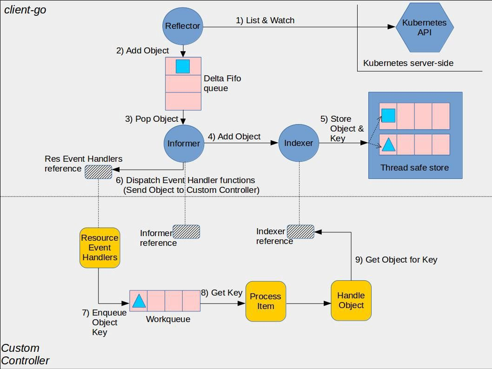

# 控制器详解

# 实验一
步骤如下:
1. 使用minikube创建集群
```sh
minikube start      #开启集群，默认只有一个控制节点
minikube node add   #创建工作节点
```
实验中使用两个工作节点，一个控制节点,可以使用`minikube status`来查看

```sh
❯ minikube status
minikube
type: Control Plane
host: Running
kubelet: Running
apiserver: Running
kubeconfig: Configured

minikube-m02
type: Worker
host: Running
kubelet: Running

minikube-m03
type: Worker
host: Running
kubelet: Running
```

2. 使用`kubectl proxy --port 8080`命令来创建api server的代理服务器，让主机上面能够方便的访问到apiserver
接下来就可以使用浏览器或者curl来向apiserver发送请求

`curl http://localhost:8080/api/v1/namespaces/default/pods`

而此次apiserver返回的信息将以json格式返回，其中的resourceVersion是此次List操作得到的版本信息，在使用watch请求时带上该版本信息作为参数，之后apiserver就会watch将该版本之后的资源变化通知客户端
```sh
{
  "kind": "PodList",
  "apiVersion": "v1",
  "metadata": {
    "resourceVersion": "9854"
  },
  "items": [
```
3. 结合刚刚的url加上参数
`curl http://localhost:8080/api/v1/namespaces/default/pods?watch=true&resourceVersion=9854`
则可以获取之后的pods相关信息,可以另起一个终端创建新的pods来查看
`kubectl run test --image=nginx`

## 通过HTTP API获取Pod内容
这个工具是通过HTTP API来实现的watch机制

```go
package main

import (
    "fmt"
    "crypto/tls"
    "encoding/json"
    "net/http"
    "time"
)

const token = ""
const apiServer = "https://127.0.0.1:8443"

type Pod struct {
    Metadata struct {
        Name string `json:"name"`
        Nmaespace string `json:"namespace"`
        CreationTimestamp time.Time `json:"creationTimestamp"`
    } `json: "metadata"`
}

type Event struct {
    EventType string `json:"type"`
    Object Pod `json:"object"`
}
func main(){
    client := &http.Client{
        Transport: &http.Transport{
            TLSClientConfig: &tls.Config{
                InsecureSkipVerify: true,
            },
        },
    }
    req, err := http.NewRequest("GET", apiServer+"/api/v1/namespaces/default/pods?watch=true", nil)
    if err != nil{
        panic(err)
    }

    req.Header.Set("Authorization", "Bearer "+token)
    resp, err := client.Do(req)
    if err != nil {
        panic(err)
    }

    defer resp.Body.Close()


    var event Event
    decoder := json.NewDecoder(resp.Body)
    for {
        if err := decoder.Decode(&event); err != nil {
            panic(err)
        }
        fmt.Printf("%s Pod %s \n", event.EventType, event.Object.Metadata.Name)
    }

}
```

注意这里是在控制平面跑的程序，因此请求的url地址需要变更为本地apiserver暴露的端口
这个端口可以通过`kubectl cluster-info`来查看，也可以通过`cat /etc/kubernetes/manifests/kube-apiserver.yaml`里面查看
这个代码仅仅是使用`?watch=true`参数来调用apiserver 的HTTP API,并将返回输出

# 实验二
对于控制器的编写可以使用k8s官方提供的client-go,该库当中提出了informer机制
从而避免上面简单controller通过`watch=true`来不断请求资源所造成的消耗
下面就是client go的informer框架


下面列出informer架构的基础步骤
1. 首先reflector调用apiserver的list接口来获取相应资源内容，获取resourceVersion来进行接下来的判断[list and watch](https://github.com/kubernetes/client-go/blob/6df09021f998a3b005b8612d21c254b1b4d3d48b/tools/cache/reflector.go#L322)
2. reflector将获取到的内容保存到FIFO队列当中[to_fifo](https://github.com/kubernetes/client-go/blob/6df09021f998a3b005b8612d21c254b1b4d3d48b/tools/cache/reflector.go#L563)
3. informer将使用一个循环来不断从FIFO中获取内容[from_fifo](https://github.com/kubernetes/client-go/blob/6df09021f998a3b005b8612d21c254b1b4d3d48b/tools/cache/reflector.go#L742)
4. informer将取出来的内容存放在indexer当中[to_indexer](https://github.com/kubernetes/client-go/blob/012954e4d5d6e5d0923a00a5a49f76a8a3f11438/tools/cache/controller.go#L473),
该indexer是作为本地存储存在的，通过索引可以获取需要的资源
5. indexer将获取到的资源存放在本地的[`Thread safe store`](https://github.com/kubernetes/client-go/blob/012954e4d5d6e5d0923a00a5a49f76a8a3f11438/tools/cache/thread_safe_store.go#L41)当中
6. 如果资源发生变化，则通知controller使用对应逻辑进行处理[processHandler](https://github.com/kubernetes/client-go/blob/012954e4d5d6e5d0923a00a5a49f76a8a3f11438/tools/cache/controller.go#L476)
7. ResourceEventHandlers中获取到资源的改变，然后将其置入队列当中，然后在一个循环当中处理消息,但这里存放的是key,之后取出key后可以用来到`Thread safe store`中获取消息


[https://www.zhaohuabing.com/post/2023-03-09-how-to-create-a-k8s-controller/](https://www.zhaohuabing.com/post/2023-03-09-how-to-create-a-k8s-controller/)
