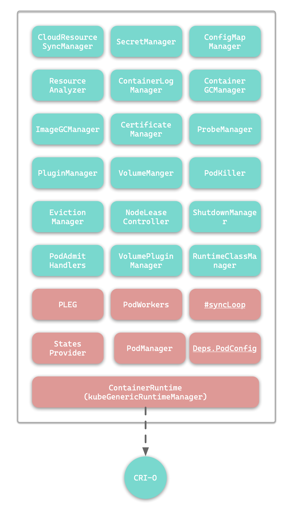
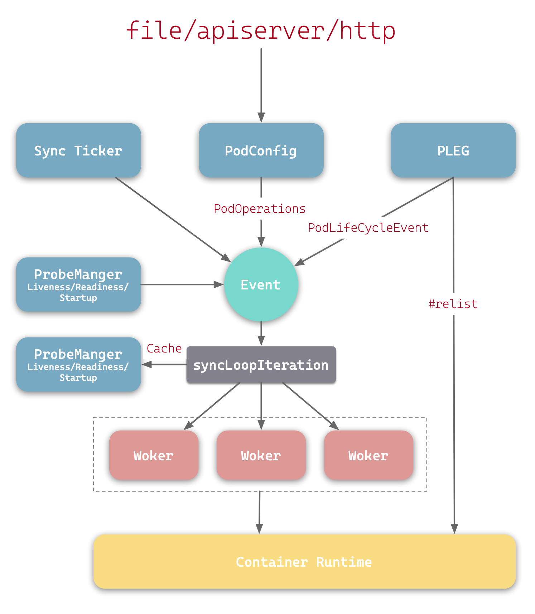

<!--toc:start-->
- [kubelet简介](#kubelet简介)
- [kubelet](#kubelet)
- [kubelet组成](#kubelet组成)
  - [PLEG](#pleg)
  - [PodWorkers](#podworkers)
  - [PodManager](#podmanager)
  - [ContainerRuntime](#containerruntime)
  - [PodConfig](#podconfig)
  - [syncLoop](#syncloop)
- [kubelet进程](#kubelet进程)
- [kubelet工作原理](#kubelet工作原理)
- [参考](#参考)
<!--toc:end-->
# kubernetes 源码目录解析
从github上面clone下来k8s
```sh
git clone https://github.com/kubernetes/kubernetes.git
```

目录结构
```sh
❯ ll
drwxr-xr-x    - peiwithhao 2025-07-23 15:33  _output
drwxr-xr-x    - peiwithhao 2025-02-18 16:12  api
drwxr-xr-x    - peiwithhao 2025-02-18 16:12 󱧼 build
drwxr-xr-x    - peiwithhao 2025-02-18 16:12  CHANGELOG
lrwxrwxrwx    - peiwithhao 2025-02-18 16:12  CHANGELOG.md -> CHANGELOG/README.md
drwxr-xr-x    - peiwithhao 2025-02-18 16:12  cluster
drwxr-xr-x    - peiwithhao 2025-02-18 16:12  cmd
.rw-r--r--  148 peiwithhao 2025-02-18 16:12  code-of-conduct.md
.rw-r--r--  525 peiwithhao 2025-02-18 16:12  CONTRIBUTING.md
drwxr-xr-x    - peiwithhao 2025-02-18 16:12  docs
.rw-r--r--  12k peiwithhao 2025-02-18 16:12  go.mod
.rw-r--r--  64k peiwithhao 2025-02-18 16:12  go.sum
.rw-r--r-- 1.2k peiwithhao 2025-02-18 16:12  go.work
.rw-r--r--  16k peiwithhao 2025-02-18 16:12  go.work.sum
drwxr-xr-x    - peiwithhao 2025-02-18 16:12  hack
.rw-r--r--  11k peiwithhao 2025-02-18 16:12  LICENSE
drwxr-xr-x    - peiwithhao 2025-02-18 16:12  LICENSES
drwxr-xr-x    - peiwithhao 2025-02-18 16:12  logo
lrwxrwxrwx    - peiwithhao 2025-02-18 16:12  Makefile -> build/root/Makefile
.rw-r--r--  846 peiwithhao 2025-02-18 16:12 󰡯 OWNERS
.rw-r--r--  12k peiwithhao 2025-02-18 16:12 󰡯 OWNERS_ALIASES
drwxr-xr-x    - peiwithhao 2025-02-18 16:12  pkg
drwxr-xr-x    - peiwithhao 2025-02-18 16:12  plugin
.rw-r--r-- 4.4k peiwithhao 2025-02-18 16:12 󰂺 README.md
.rw-r--r--  665 peiwithhao 2025-02-18 16:12 󰡯 SECURITY_CONTACTS
drwxr-xr-x    - peiwithhao 2025-02-18 16:12  staging
.rw-r--r-- 1.1k peiwithhao 2025-02-18 16:12  SUPPORT.md
drwxr-xr-x    - peiwithhao 2025-02-18 16:12  test
drwxr-xr-x    - peiwithhao 2025-02-18 16:12  third_party
drwxr-xr-x    - peiwithhao 2025-02-18 16:12  vendor
```
由于kuberntes是使用cobra进行搭建，因此我们所需要看的不同组件的代码位于`cmd/`目录下
该目录包含一些重要的组件，例如耳熟能详的`kube-apiserver, kubelet, kubectl`等等
```sh
❯ ll
...
drwxr-xr-x   - peiwithhao 2025-02-18 16:12  kube-apiserver
drwxr-xr-x   - peiwithhao 2025-02-18 16:12  kube-controller-manager
drwxr-xr-x   - peiwithhao 2025-02-18 16:12  kube-proxy
drwxr-xr-x   - peiwithhao 2025-02-18 16:12  kube-scheduler
drwxr-xr-x   - peiwithhao 2025-02-18 16:12  kubeadm
drwxr-xr-x   - peiwithhao 2025-02-18 16:12  kubectl
drwxr-xr-x   - peiwithhao 2025-02-18 16:12  kubectl-convert
drwxr-xr-x   - peiwithhao 2025-02-18 16:12  kubelet
...
```

## 符号解析
在我们逆向go的时候可能会碰到很长的一串符号名称，例如`k8s.io/apiserver/pkg/endpoints/handlers/responsewriters.(*deferredResponseWriter).Write`
符号真的长无语，这里我们可能需要结合源代码进行分析，所以了解整个k8s的项目布局十分重要，因为该符号同时也给我们指明了一定的目录地址

首先`k8s.io`这里是kubernetes官方维护的Go模块的顶级import path 前缀，用于模块化整个项目


|Go Import Path|说明|对应代码库|
|--|--|--|
|k8s.io/apiserver|API server 公共模块|[github.com/kubernetes/apiserver](github.com/kubernetes/apiserver) |
|k8s.io/kubelet|kubelet独立模块|[github.com/kubernetes/kubelet](github.com/kubernetes/kubelet) |
|k8s.io/kubernetes|主仓库，聚焦所有组件|[github.com/kubernetes/kubernetes](github.com/kubernetes/kubernetes) |


如果说符号名称是`k8s.io/kubernetes`开头，那很有可能源代码目录位于clone的主仓库的主目录下，例如
`k8s.io/kubernetes/pkg/kubelet.(*runtimeState).setRuntimeSync`,他就位于`kubernetes/pkg/kubelet`
如果说是其他的模块，例如上面的`k8s.io/apiserver`,那么他们将会位于`kubernetes/staging/src/k8s.io/apiserver`目录下,其他模块同理

# kubelet简介
他最底层实际上是集群中每个node节点(包括work node 和 control node)所拥有的一个服务进程,
其主要职责是接收api server对于节点中pod的管控,还有对集群内部pod状况的检查并且将报告呈现给api server

# kubelet
其基于PodSpec来工作，PodSpec是使用YAML或者JSON对象来描述Pod的。kubelet主要是通过接受api server发来的PodSpec来对该集群内部的pod进行管控

除开api server提供的PodSpec,还可以通过以下方式提供:
+ 文件
+ HTTP 端点
+ HTTP 服务器

# kubelet组成
kubelet由以下内容组成


根据参考文章内容，这里也写下对于某些组件的个人理解
## PLEG
全名`Pod Lifecycle Event Generator`, Pod生命周期事件生成器
这些事件包括`ContainerStarted、ContainerDied、ContainerRemoved、 ContainerChanged`
其定期通过`ContainerRuntime`获取Pod信息，与缓存中的信息比较

## PodWorkers
处理事件中Pod的同步。核心方法`managePodLoop()`间接调用`kubelet.syncPod()`完成Pod的同步

## PodManager
存储Pod的期望状态

## ContainerRuntime
与遵循CRI规范的高级容器运行时进行交互

## PodConfig
将各种Pod配置源合并成一个单一的一致结构，然后按照顺序向监听器传递增量变更通知


## #syncLoop
接受来自PodConfig的Pod变更通知、定时人物、PLEG事件以及ProbeManager的事件


# kubelet进程
可以通过grep和systemctl来进行查看


# kubelet工作原理


kubelet源码结构
```sh
❯ lt
 .
├──  app
│   ├──  auth.go
│   ├──  init_others.go
│   ├──  init_windows.go
│   ├──  init_windows_test.go
│   ├──  options
│   │   ├──  container_runtime.go
│   │   ├──  globalflags.go
│   │   ├──  globalflags_linux.go
│   │   ├──  globalflags_other.go
│   │   ├──  options.go
│   │   ├──  options_test.go
│   │   ├──  osflags_others.go │   │   └──  osflags_windows.go
│   ├── 󰡯 OWNERS
│   ├──  plugins.go
│   ├──  plugins_providers.go
│   ├──  server.go
│   ├──  server_bootstrap_test.go
│   ├──  server_linux.go
│   ├──  server_others.go
│   ├──  server_test.go
│   ├──  server_unsupported.go
│   └──  server_windows.go
├──  kubelet.go
└── 󰡯 OWNERS
```

其中main函数位于`kubelet.go`当中
```go
func main() {
	command := app.NewKubeletCommand()
	code := cli.Run(command)
	os.Exit(code)
}
```
创建了一个`NewKubeletCommand`然后运行

```go

func NewKubeletCommand() *cobra.Command {
	cleanFlagSet := pflag.NewFlagSet(server.ComponentKubelet, pflag.ContinueOnError)
	cleanFlagSet.SetNormalizeFunc(cliflag.WordSepNormalizeFunc)
	kubeletFlags := options.NewKubeletFlags()

	kubeletConfig, err := options.NewKubeletConfiguration()
	// programmer error
	if err != nil {
		klog.ErrorS(err, "Failed to create a new kubelet configuration")
		os.Exit(1)
	}

	cmd := &cobra.Command{
		Use: server.ComponentKubelet,
		Long: `The kubelet is the primary "node agent" that runs on each...
		DisableFlagParsing: true,
		SilenceUsage:       true,
		RunE: func(cmd *cobra.Command, args []string) error {
            ...
			return Run(ctx, kubeletServer, kubeletDeps, utilfeature.DefaultFeatureGate)
        },
    }
    ...

	return cmd
}
```
NewKubeletCommand 则是创建了一个 `cobra.Commnad`对象然后返回

其中RunE创建了kubeletServer, 这里封装了启动kubelet所需要的所有参数
```go

			// construct a KubeletServer from kubeletFlags and kubeletConfig
			kubeletServer := &options.KubeletServer{
				KubeletFlags:         *kubeletFlags,
				KubeletConfiguration: *kubeletConfig,
			}
```

kubeletDeps是用于存放Kubelet所需物品的容器， 使用kubeletServer来构造默认的KubeletDeps
```go

			kubeletDeps, err := UnsecuredDependencies(kubeletServer, utilfeature.DefaultFeatureGate)
```

这里对于RunE的赋值，最后的Run函数如下,运行指定的KubeletServer
```go

func Run(ctx context.Context, s *options.KubeletServer, kubeDeps *kubelet.Dependencies, featureGate featuregate.FeatureGate) error {
	// To help debugging, immediately log version
	klog.InfoS("Kubelet version", "kubeletVersion", version.Get())

	klog.InfoS("Golang settings", "GOGC", os.Getenv("GOGC"), "GOMAXPROCS", os.Getenv("GOMAXPROCS"), "GOTRACEBACK", os.Getenv("GOTRACEBACK"))

	if err := initForOS(s.KubeletFlags.WindowsService, s.KubeletFlags.WindowsPriorityClass); err != nil {
		return fmt.Errorf("failed OS init: %w", err)
	}
	if err := run(ctx, s, kubeDeps, featureGate); err != nil {
		return fmt.Errorf("failed to run Kubelet: %w", err)
	}
	return nil
}
```

在这里的run函数里面，将初始化KubeDeps.KubeClient, 创建两个独立的客户端，kubeDeps.EventClient 用于事件，
kubeDeps.HeartbeatClient用于心跳
```go

	case kubeDeps.KubeClient == nil, kubeDeps.EventClient == nil, kubeDeps.HeartbeatClient == nil:
        ...
		kubeDeps.KubeClient, err = clientset.NewForConfig(clientConfig)
		if err != nil {
			return fmt.Errorf("failed to initialize kubelet client: %w", err)
		}

		// make a separate client for events
		eventClientConfig := *clientConfig
        ...
		heartbeatClientConfig := *clientConfig
        ...
```

之后启动healthz服务, 如果指定了healthzPort, 则启动healthz服务， healthz是本地主机healthz的端口，0表示禁用

```go

	if s.HealthzPort > 0 {
		mux := http.NewServeMux()
		healthz.InstallHandler(mux)
		go wait.Until(func() {
			err := http.ListenAndServe(net.JoinHostPort(s.HealthzBindAddress, strconv.Itoa(int(s.HealthzPort))), mux)
			if err != nil {
				klog.ErrorS(err, "Failed to start healthz server")
			}
		}, 5*time.Second, wait.NeverStop)
	}
```


启动kubelet则通过`RunKubelet`来设置和运行
```go

	if err := RunKubelet(ctx, s, kubeDeps); err != nil {
```


在Runkubelet中将调用`startKubelet`

```go

func startKubelet(k kubelet.Bootstrap, podCfg *config.PodConfig, kubeCfg *kubeletconfiginternal.KubeletConfiguration, kubeDeps *kubelet.Dependencies, enableServer bool) {
	// start the kubelet
	go k.Run(podCfg.Updates())

	// start the kubelet server
	if enableServer {
		go k.ListenAndServe(kubeCfg, kubeDeps.TLSOptions, kubeDeps.Auth, kubeDeps.TracerProvider)
	}
	if kubeCfg.ReadOnlyPort > 0 {
		go k.ListenAndServeReadOnly(netutils.ParseIPSloppy(kubeCfg.Address), uint(kubeCfg.ReadOnlyPort), kubeDeps.TracerProvider)
	}
	go k.ListenAndServePodResources()
}
```
其中`k.Run`启动kubelet来响应配置更新，他会运行`kubernetes/pkg/kubelet`模块中的代码


# 参考
[https://xie.infoq.cn/article/15f32abba2f2c86b50e004cb5](https://xie.infoq.cn/article/15f32abba2f2c86b50e004cb5)
[https://isekiro.com/kubernetes%E6%BA%90%E7%A0%81-kubelet-%E5%8E%9F%E7%90%86%E5%92%8C%E6%BA%90%E7%A0%81%E5%88%86%E6%9E%90%E4%B8%80/](https://isekiro.com/kubernetes%E6%BA%90%E7%A0%81-kubelet-%E5%8E%9F%E7%90%86%E5%92%8C%E6%BA%90%E7%A0%81%E5%88%86%E6%9E%90%E4%B8%80/)
[https://able8.medium.com/kubernetes-source-code-overview-kubelet-7783234a0e4a](https://able8.medium.com/kubernetes-source-code-overview-kubelet-7783234a0e4a) 


