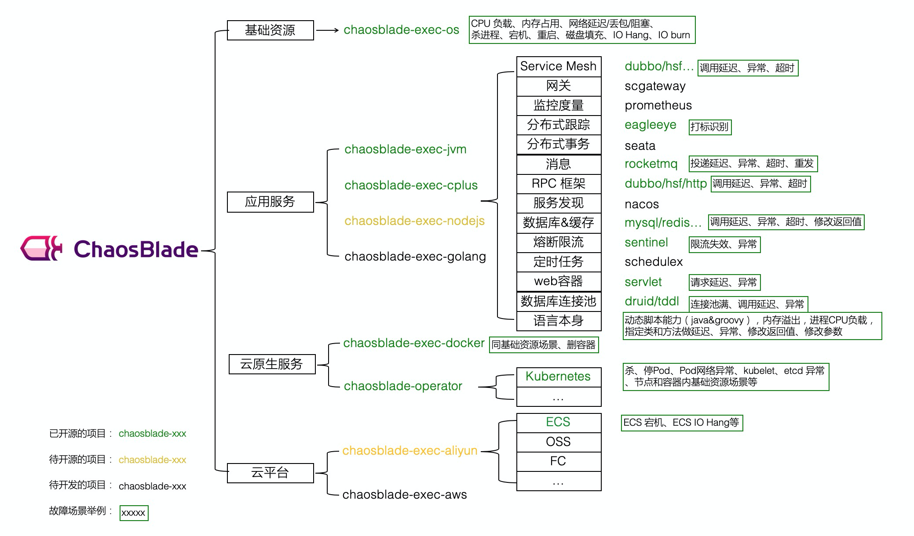

# 混沌工程/故障注入工具调研

## 混沌工程工具全景概览
| 工具 | 开源/商业 | 主要目标环境 | 控制/编排方式 | 可靠性侧重点 |
| --- | --- | --- | --- | --- |
| Chaos Monkey | 开源 | 云主机/Auto Scaling | Spinnaker 定时随机终止实例 | 验证自愈与扩缩容能力 |
| Chaos Toolkit | 开源 | 任意平台（By driver） | JSON/YAML 实验文件 + CLI | 探针驱动的稳态假设验证 |
| LitmusChaos | 开源 | Kubernetes | CRD（ChaosEngine/Experiment/Result） | GitOps 化实验编排与可视化 Portal |
| ChaosBlade | 开源 | OS/容器/中间件 | CLI/HTTP + 多执行器 | 场景覆盖面广，支持 JVM/C++ 注入 |
| Gremlin | 商业 | 裸机/VM/Kubernetes | SaaS 控制面 + Agent | 企业级 RBAC、审计与 GameDay 编排 |
| AWS FIS | 商业/SaaS | AWS 原生服务 | Experiment Template + CloudWatch Stop Condition | 云账号级安全护栏与 API 审计 |
| Chaos Mesh | 开源 | Kubernetes | 多 CRD + Dashboard + Daemon | GUI 场景编排、内核级故障类型丰富 |

### 选型提示
- 若主要运行在 Kubernetes，LitmusChaos、Chaos Mesh 具有最佳的 CRD 原生能力；偏轻量快速演练可选 kube-monkey、Pumba。
- 需要覆盖多语言应用或底层主机时，ChaosBlade 的多执行器/Agent 体系更灵活。
- 希望接入企业级权限治理、审计日志与 SaaS 控制台，可考虑 Gremlin 或 AWS FIS。

## 缺陷检测能力对比
1. **稳态假设与探针复检**：Chaos Toolkit、LitmusChaos、Chaos Mesh 在实验前后执行同一套探针（HTTP、PromQL、日志匹配）并对比指标偏差，一旦成功率/延迟越界即标记缺陷。
2. **监控联动护栏**：Chaos Monkey 借助 Atlas/Prometheus 阈值，Gremlin 与 AWS FIS 通过 CloudWatch/Datadog 告警触发 Stop Condition，确保 SLA 下降时立即停机并生成报告。
3. **CRD/状态机判定**：LitmusChaos 的 `ChaosResult`、Chaos Mesh 的 CR Status 字段记录 Verdict 与失败原因；kube-monkey 通过执行日志+Kubernetes Event 追踪重建过程，定位调度或探针配置问题。
4. **事件时间线与审计**：ChaosBlade UID、Gremlin Attack Timeline、AWS FIS Experiment Log 可回放完整步骤，结合监控/日志同步定位故障根因与恢复耗时。
5. **资源与自愈验证**：Chaos Monkey、kube-monkey 重点观察 Auto Scaling/ReplicaSet 补副本速度；Pumba/PowerfulSeal 结合 `docker stats`、Prometheus 监控资源耗尽或网络指标，揭示容量与 QoS 漏洞。
6. **内核级指标采集**：eBPF 控制面的方案能直接记录 syscall/网络 hook 的错误码、延迟直方图，并与 BPF Map 数据结合探针结果，实现“注入—观测—自动回滚”的闭环。

## 各工具缺陷检测方法详解
- **Chaos Monkey**：依靠 Atlas 指标与 Auto Scaling 事件比对，监控请求成功率/延迟是否越界，并统计实例重建耗时；通过 PagerDuty 值班记录确认 Runbook 能否在 SLA 内闭环。
- **Chaos Toolkit**：在 `steady_state_hypothesis` 与 `method` 中插入多层探针（HTTP 200 比例、PromQL 查询、数据库健康检查、日志正则）；实验结果由 `experiment.json` 输出的 `steady_states` 对比判定，配合 CLI 日志与扩展返回值定位失败步骤。
- **LitmusChaos**：依赖 Probe + `ChaosResult` 的判决链，Probe 可调用 HTTP、CMD、Prometheus、自定义脚本；`ChaosResult.status.history` 记录探针失败时间及失败信息，Portal 将指标与事件展示在同一时间线。
- **ChaosBlade**：每次实验生成 UID，`chaosblade status get` 返回执行阶段、错误码；结合 `chaosblade-exec-*` 日志与外部监控（ARMS/Prometheus）观察资源/服务指标，一旦 `status=Failed` 即输出失败执行器及参数，便于定位 OS 层或中间件层问题。
- **Gremlin**：通过 Attack 过程中配置的 Health Check（HTTP/GQL/自定义脚本）实时评估；与 Datadog/CloudWatch 集成的 Stop Condition 检测 SLA 越界即自动终止，并在 Attack Timeline 中标记触发点；Portal 报表对比实验前后关键 KPI。
- **AWS FIS**：Stop Condition 绑定 CloudWatch Alarm，当 CPU、错误率、可用实例低于阈值自动停止；FIS Experiment Dashboard 聚合 CloudWatch Logs、X-Ray Trace、AWS Config 事件，提供失败步骤与 API 调用日志。
- **Chaos Mesh**：每个 Chaos CR 均可附加 Probe（HTTP/GQL/Script）；`ChaosStatus`、`ExperimentStatus` 记录 `failedMessage` 与 `desiredPhase` 差异；DashBoard 叠加 Prometheus/Grafana 指标，支持一键导出诊断报告。
- **ChaosBlade Operator / Chaos Mesh**（补充 eBPF 场景）：利用 Node Exporter/cAdvisor + 内核级 trace 指标（延迟直方图、错误码计数）判断资源/系统调用层异常。
- **Pumba**：CLI 支持 `--monitoring` 输出延迟/丢包参数；结合 `docker stats`、cAdvisor、Prometheus 记录容器 CPU、网络、重传率，在注入和恢复期间对比；若容器未按预期重启或指标未回落，则认定脚本或自愈策略缺陷。
- **PowerfulSeal**：Policy 中定义 `verify` 块，可调用 Prometheus 查询、HTTP 检查或执行脚本；Autonomous 模式会将每次 Action/Verify 的结果写入日志，若 verify 失败则暂停策略并输出失败资源 ID；支持将结果推送到 ELK 进行 Root Cause 分析。
- **kube-monkey**：核心为 Event + HPA 指标，删除 Pod 后观察 ReplicaSet/StatefulSet 是否在 `gracePeriod` 内补副本；若 `kill-result` 日志显示 `failure` 或 Pod 重建超时，则暴露就绪探针/调度策略问题；可配合 Prometheus `kube_pod_container_status_ready` 指标判断健康。
- **Chaos Mesh/ LitmusChaos 网络类插件**：通过 `NetworkChaos`/`PodNetworkLatency` + Istio/Envoy 指标比对服务延迟，若 95/99 分位超出 SLO 则记录在 `ChaosResult`。
- **eBPF 级联平台**（自研思路）：借助 BPF Map 统计 hook 命中与错误码，Perf Event 输出耗时，结合外部探针形成“内核指标 + 业务指标”双证据。

## 1. Chaos Monkey

Chaos Monkey 是由 Netflix 开发的混沌工程工具，主要用于在生产环境中自动和随机地终止虚拟机实例，以测试系统的弹性和容错能力。其核心思想是通过制造不可预期的故障，确保系统能够自动恢复并保持高可用性。
当前版本的 Chaos Monkey 已完全集成到 Spinnaker 中，这是 Netflix 使用的持续交付平台。
Spinnaker是一个由 Netflix 创建并开源的、功能强大的多云持续交付（Continuous Delivery）平台,负责将软件从代码仓库安全、快速、可靠地发布到生产
  环境中。

### 工作原理

支持三类注入:
1. app:Chaos Monkey 每天将终止每个应用程序最多一个实例，无论这些实例如何组织成集群。
2. stack:Chaos Monkey 每天将终止每个堆栈最多一个实例。例如，如果某个应用定义了三个堆栈，那么 Chaos Monkey 每天最多会终止该应用中的三个实例。
3. cluster:Chaos Monkey 将每天终止每个集群最多一个实例。

Chaos Monkey 通过以下步骤进行工作：
1. 选择目标实例：Chaos Monkey 随机选择一个或多个虚拟机实例（或容器）作为目标，这些目标来源于在 Spinnaker 中预配置的 Auto Scaling 组、集群或部署构建池。
2. 停止实例：它会通过 Spinnaker 调用底层云平台（如 AWS EC2、GCP Compute Engine）的 API 立即停止目标实例，模拟硬件故障、实例宕机或操作系统崩溃。
3. 监控系统反应：Chaos Monkey 会观察监控系统和告警平台如何应对实例停止的情况，并记录系统的反应。
4. 验证恢复能力：系统的自我修复能力、故障转移机制、容错能力等将被检验。如果系统能够恢复并保持正常运行，Chaos Monkey 认为实验成功；否则，团队会根据结果进行问题分析和修复。

### 支持的故障类型

- **实例级终止**：在 Auto Scaling 环境中终止单个虚拟机或容器实例，是 Chaos Monkey 最核心的故障类型。
- **多实例终止策略**：依赖 Spinnaker 的部署策略，可在不同集群或堆栈维度上配置每日最大终止数量，模拟局部容量衰减。
- **计划窗口**：通过限定业务允许的实验窗口，模拟非高峰时段的实例不可用场景。

### 缺陷检测机制
- **稳态指标门限**：利用 Atlas/Prometheus 监控请求成功率、延迟、可用实例数等，一旦跌破阈值即判定存在恢复链路缺陷。
- **弹性自愈追踪**：通过 Auto Scaling 事件与 Spinnaker 审计日志比对实例重建时间，如超过预期 RTO（恢复时间目标）即判定扩缩容策略不足。
- **告警闭环**：结合 PagerDuty/SRE 值班告警反馈恢复流程，若告警未在 SLA 内归位，则指向流程或 Runbook 问题。
- **复盘清单**：维持 GameDay 复盘模板，记录“失败探针→应急动作→恢复耗时”，从而量化缺陷等级。

### 工作目标
Chaos Monkey 旨在通过以下几个方面帮助企业和开发团队提高系统的可靠性：

1. 增强系统韧性：模拟真实故障，帮助团队发现和解决潜在的系统弱点。特别是在生产环境中，分布式系统由于多个组件和服务的相互依赖，容易受到故障的影响，Chaos Monkey 通过频繁的故障注入测试系统的强健性。
2. 验证容错机制：确保系统的容错机制有效，服务能够在出现单点故障时自动恢复，减少系统中断的时间和影响。
3. 降低故障恢复时间：通过反复模拟故障情况，团队能够提前发现系统的恢复瓶颈，减少系统在故障情况下的恢复时间。
4. 提高运维团队的应急响应能力：让团队成员在面对故障时能够更熟练地处理和恢复系统，提升团队的应急响应能力

### 工作流程

Chaos Monkey 的工作流程可以分为以下几个阶段：

1. **实验前规划**：团队先在配置文件中设定目标服务、保护阈值（如最少可用实例数）与实验窗口，确保关键业务被列入黑名单。
2. ** randomized Kill 循环 **：在预设时间窗口内，Chaos Monkey 守护进程定期扫描符合规则的实例池，并随机挑选实例调用云 API/编排器 API 执行终止操作。
3. **稳态探测**：依赖 Netflix 内部健康检查、外部监控（Atlas/Prometheus 等）持续追踪请求成功率、延迟、可用实例数是否跌破阈值。
4. **自动回滚**：若监控报警触发或达到每日注入上限，会立即停止进一步注入；依赖 ASG/ReplicaSet 自动拉起新实例。
5. **复盘分析**：收集故障时间线、重建耗时、监控指标波动，并在 GameDay 会议上复盘恢复流程与 SOP。

### 设计思想与缺陷检测流程
- **面向恢复能力**：通过“随机、持续”的杀实例策略逼迫系统演练自愈链路，重点检验负载均衡、自动扩缩容和故障切换机制。
- **监控驱动的防护栏**：以监控阈值作为“保险丝”，一旦稳态被破坏即停止实验，避免级联故障。
- **缺陷定位路径**：实例被杀→健康检查失败→流量切换/重建→若发生响应超时或容量下降，即暴露重试、降级或扩容策略的薄弱点。

### 典型收获
- 揪出未配置自动扩缩容或冷备的服务。
- 暴露跨可用区拓扑与服务发现同步延迟。
- 验证发布回滚与灰度策略在突发失实例情况下的有效性。

### 安全与权限
- 通过 IAM Roles、配置文件黑白名单限定可操作的实例分组。
- 仅在 GameDay 或低峰期启用；可接入 CI/CD pipeline 做上线前演练。

## 2. Chaos Toolkit

### 工作目标

由两个简单的微服务组成，通过HTTPS相互通信

### 工作流程
 

它的核心功能是帮助编写和执行混沌工程实验，以测试系统在面对混乱和预期外故障时的弹性和恢复能力
  。它旨在让所有工程师都能实践混沌工程。

  其工作方式是通过一个声明式的实验文件（通常是 JSON 或 YAML 格式），您可以在其中定义：
      1. 稳态假设（Steady-State Hypothesis）: 系统的正常状态是怎样的。
      2. 探测（Probes）: 在实验之前、之中和之后运行，用于验证系统是否处于稳态。
      3. 行动（Actions）: 注入到系统中的具体故障或事件，例如关闭一个服务、增加网络延迟等。
      4. 回滚（Rollbacks）: 在实验结束后，用于撤销“行动”所做更改，使系统恢复原状的补偿操作。

具体的执行流程如下：

 1. 发现与验证 (Discovery & Validation)
       * 发现: 工具首先会查找并加载所有已安装的扩展（extensions），以了解当前环境所有可用的“行动”（Actions）和“探测”（Probes）。
       * 验证: 接着，它会读取并解析您的实验文件（JSON/YAML），检查其语法是否正确，并确认实验中声明要使用的所有“行动”和“探测”是否在已发现的扩展中都存在。如果语
         法错误或找不到对应的功能，流程会在此处失败并退出。

   2. 稳态假设检验 (Steady-State Hypothesis)
       * 工具会执行“稳态假设” (steady_state_hypothesis) 区块中定义的所有“探测”（Probes）。
       * 目的: 验证系统在实验开始前是否处于“健康”或“正常”的预期状态。
       * 如果任何一个探测失败，意味着系统在实验开始前就已经不正常了。默认情况下，实验会立即停止，以防止在不健康的系统上注入更多混乱。

   3. 执行方法 (Method)
       * 只有当稳态假设检验通过后，工具才会开始执行 method 区块。这是注入混沌的核心步骤。
       * method 区块包含一个或多个“行动”（Actions），它们会按顺序执行，对系统施加干扰（例如，关闭一台服务器）。
       * 在 method 区块中，您也可以穿插一些“探测”（Probes），用于在注入故障期间持续观察系统的状态。

   4. 再次检验稳态假设 (Post-Chaos Check)
       * 在 method 区块执行完毕后，工具会再一次执行“稳态假设” (steady_state_hypothesis) 区块中的所有探测。
       * 目的: 检验在经历了“行动”的干扰后，您的系统是否仍然保持（或恢复到）“健康”状态。
       * 实验结果: 如果此时所有探测都通过，意味着您的系统成功地抵御了这次混沌事件，实验被认为是成功的。如果任何一个探测失败，则证明系统未能保持稳定，实验失败。

   5. 执行回滚 (Rollbacks)
       * 无论实验成功与否，工具最后都会执行 rollbacks 区块中定义的操作。
       * 目的: 
         清理和撤销“行动”对系统所做的更改，使其恢复到实验开始前的状态（例如，重启之前被关闭的服务器）。这是一个“清理”步骤，旨在确保实验环境的可重复使用性。

### 设计思想

Chaos Toolkit 的工作流程体现了其深刻的设计思想，这些思想源于科学实验的方法论。

   1. 声明式与开放性 (Declarative & Open)
       * 实验是用简单的 JSON 或 YAML 文件声明的，而不是用复杂的代码编写。这使得非开发人员也能读懂、编写和审查实验，降低了混沌工程的门槛。
       * 它是一个开放的平台，不绑定任何特定的技术或云厂商。通过可插拔的扩展模型，它可以适应任何系统。

   2. 可验证与可证伪性 (Verifiable & Falsifiable)
       * 设计的核心是稳态假设。您不是在随机地破坏系统，而是在验证一个明确的假设：“即使我这样做，系统也应该保持正常”。
       * 通过在实验前后运行两次相同的探测，工具严格地验证了这个假设是否成立。这种方法让混沌工程从“破坏东西”变成了严谨的、可度量的科学实验。

   3. 安全与可控 (Safe & Controlled)
       * 事前检查: 如果系统在实验前就不稳定，实验不会运行。
       * 事后清理: rollbacks 机制确保实验环境可以被清理和恢复，最大限度地减少实验的意外影响。
       * 整个流程是透明且可预测的，用户清楚地知道每一步会发生什么。

### 所支持的故障类型

 chaostoolkit 本身是一个核心框架和实验运行器，其强大之处在于它的可扩展性。它本身不包含一个固定的 、内置的“故障类型”列表。 相反，具体的“故障类型”（即“行动”和“探测”）是通过驱动扩展（Driver Extensions）来提供的。您可以根据目标平台（如 Kubernetes, AWS, Azure,  或者本地进程）安装相应的扩展，从而获得在该平台上执行混沌实验的能力。

  这意味着它几乎可以支持任何类型的故障，只要能通过 Python 代码实现它。例如：

   * 应用层故障: 模拟应用崩溃、增加 CPU 或内存负载、引入延迟。
   * 网络层故障: 模拟网络中断、丢包、DNS 查询失败。
   * 基础设施层故障: 终止云主机实例 (VMs)、关闭容器 (Pods)、移除存储卷。
   * 平台层故障: 模拟 API 限流、认证失败。

### 支持的故障类型
- **云平台与基础设施**：依赖 `chaostoolkit-aws`、`chaostoolkit-azure` 等驱动，可终止云主机、调整 Auto Scaling、模拟 API 限流。
- **容器与 Kubernetes**：结合 `chaostoolkit-kubernetes`，可删除 Pod、增加网络延迟、注入 CPU/内存压力、强制节点排空。
- **应用与服务**：借助自定义 Python 驱动或 HTTP、gRPC 探针，可模拟接口超时、异常返回、下游依赖不可用。
- **网络与协议**：通过 Istio、Service Mesh 或底层 tc/netem 集成，注入丢包、抖动、网络分区、DNS 故障。

### 故障检测与缺陷定位流程
- **探针主导的稳态验证**：每个实验前后执行相同探针（HTTP 检查、PromQL 查询、日志匹配、合成交易等），通过对比差异揭示延迟、错误率、吞吐等关键指标的异常波动。
- **分层探针组合**：在 Method 中插入针对应用、依赖、基础设施的探针，形成“业务指标 → 服务健康 → 平台资源”的分层链路，定位到底是业务退化、依赖超时还是资源瓶颈。
- **执行日志与事件流**：Chaos Toolkit 按步骤记录执行日志与探针结果，可导出为实验报告；结合 Git/CI 历史比对不同版本的韧性差异。
- **失败场景归档**：若后置探针失败，工具会输出失败 stage、具体 Action/Probe、返回值或异常堆栈，方便溯源到触发条件和防护缺口。

### 错误检测机制
- **稳态探针基线**：在实验前/后执行相同的 HTTP、PromQL、日志正则探针，将返回值与预期阈值对比，失败即终止并标记实验失败。
- **过程探针插桩**：在 `method` 中穿插探针，持续采集成功率、耗时、资源指标，一旦出现偏差立即触发回滚或停止后续动作。
- **扩展驱动校验**：对接自定义驱动（如数据库健康检查、消息队列 lag）并记录扩展返回值，辅助定位具体依赖链路的异常。
- **实验报告佐证**：通过 CLI 日志与实验报告中的 `steady_states` 对比字段，形成可审计的缺陷证据链。

## 3. LitmusChaos

### 基本介绍

石蕊是一组用于云原生混沌工程的工具。石蕊为运维人员提供了人工控制混沌的工具，用以在所部署的环境中找到软件设计的缺陷。运维人员可以使用石蕊在暂存区乃至生产环境里通过混沌实验来找出逻辑错误和软件漏洞。通过修复这些软件的缺陷，可以提升系统的整体抗打击能力。

石蕊以云原生的方法来创建，管理和监控混沌事件，通过以下的KubernetesCRD对象来实现对混沌事件的编排：

- **ChaosEngine**: 通过这个对象来关联一个Kubernnetes的应用或是Kubernetes节点。石蕊的Chaos-Operator会watch这个对象并触发混沌事件。
- **ChaosExperiment**: 这个对象包含了一组混沌事件的配置。当ChaoseEngine触发混沌事件的时候，operator就会创建ChaoseExpeiment对象。
- **ChaosResult**: 这个对象会保留混沌事件的结果。这个对象是ChaosEngine触发混沌事件时由operator创建的。

### 注意事项

- 网络混沌测试目前不支持除Docker以外的容器运行时，如containerd和CRIO
- 石蕊混沌控制器以及混沌测试对象以Kubernetes资源的形式运行于Kubernetes集群中。在airgap环境需要在把镜像以及CR定义预先加载到机器上。
- 对于特定公有云平台(如AWS，GCP)，账号信息是通过Kubernetes secret的方式传入的。别的传入方式尚需进一步测试及实现。
- 一些混沌测试需要从pod里调用Docker API所以需要挂载Docker socket。需要自行判断是否要给开发者/运维权限来运行这些测试。
- 在一些(少数)情况下混沌测试需要privileged container权限

### 工作流

故障执行在创建 ChaosEngine 资源时触发。ChaosEngine 资源与 Chaos Runner 交互，后者由 Chaos Operator  创建。Chaos Runner 创建故障作业来执行故障业务逻辑。通常，这些 ChaosEngine 嵌入在 Litmus  混沌实验的“步骤”中。但是，也可以手动创建和应用 Chaos Engine，然后由 Chaos Operator  协调此资源并触发故障执行。Chaos 故障分为以下几类：

- Kubernetes Faults
  - Pod-Level Chaos：模拟 Pod Kill、Pod Delete、Container Kill 等，验证控制器扩缩与探针能力。
  - Node-Level Chaos：模拟节点宕机、驱逐、磁盘 IO 异常、kubelet 停止等，验证调度与容灾。
- Application Chaos：通过 Fault Template 向服务或依赖注入延迟、错误码、异常响应，验证熔断、重试、降级策略。
- Cloud Infrastructure：调用 AWS/GCP 等云厂商 API 模拟实例重启、可用区切换、负载均衡配置变更、数据库故障转移等。

### 设计思想与缺陷检测流程
- **CRD 驱动的声明式编排**：ChaosEngine 绑定目标、ChaosExperiment 描述故障、ChaosResult 记录判定，形成“定义→执行→反馈”的事件流，方便在 GitOps 中版本化管理。
- **Probe + ChaosResult 判定链**：每次实验前后由 Probe 读取 Service、Prometheus、CLI、HTTP 等探针结论写入 ChaosResult，若 `Verdict` 由 `Awaited` 变为 `Fail` 即自动标记实验失败。
- **事件与 Telemetry 联动**：Chaos Operator 将关键状态写入 Kubernetes Event，配合 Litmus Portal/Grafana Dashboard 展现场景进度、SLO 偏差。
- **缺陷定位路径**：`ChaosEngine` 触发 → `ChaosRunner` 执行动作 → Probe 侦测错误 → ChaosResult 判定 `Fail` → 通过 Portal Drill-down 查看 Pod/节点事件、Prometheus 指标与日志，锁定容错薄弱点。
- **回滚与自愈校验**：完成后自动执行 `recovery` 步骤（如删除 tc 规则、恢复 Pod），并再次执行 Probe，验证恢复路径是否覆盖到目标。

### 错误检测机制
- **Probe Verdict 判定**：`ChaosResult.status` 中的 `verdict` 字段从 `Awaited`、`Pass`、`Fail` 显式表征稳态状态，Probe 失败自动促发 `Fail` 与 `failStep` 字段记录。
- **Kubernetes Event 对账**：Litmus Operator 将执行状态写入 Event，配合 `kubectl describe` 可定位失败节点、Pod 与原因。
- **Portal 指标联动**：Litmus Portal 把 Prometheus 指标、Probe 返回值、ChaosResult 事件绘制在同一时间线，异常点一目了然。
- **实验报告归档**：`litmusctl chaos-report` 输出 JSON/HTML 报告，包含 Probe 详情、Verdict、失效资源，便于纳入 GameDay 复盘。

#### 故障注入步骤

1. 混乱故障执行由故障作业触发
2. 获取故障可调参数和低级执行细节
3. ChaosResult 被初始化并且其判决被更新为“Awaited”以表明故障当前正在运行
4. 验证相应故障的稳态条件。如果发现条件无效，则停止故障执行，并将 ChaosResult 更新为“失败”
5. 一旦验证了稳态条件，就会创建故障资源以促进混沌注入
6. 对目标资源执行混沌注入，持续指定的混沌持续时间
7. 混沌注入被恢复
8. 进行混沌后状态检查以确保稳定状态仍然保持
9. 如果检查无效，ChaosEngine 和 ChaosResult 判定将更新为“失败”，否则将更新为“通过”
10. Fault execution ends. 故障执行结束

## 4. ChaosBlade
### 基本介绍

ChaosBlade 是阿里巴巴开源的一款遵循混沌工程原理和混沌实验模型的实验注入工具，帮助企业提升分布式系统的容错能力，并且在企业上云或往云原生系统迁移过程中业务连续性保障。
Chaosblade 是内部 MonkeyKing 对外开源的项目，其建立在阿里巴巴近十年故障测试和演练实践基础上，结合了集团各业务的最佳创意和实践。

ChaosBlade支持丰富的实验场景，场景包括：
+ 基础资源：比如 CPU、内存、网络、磁盘、进程等实验场景；
+ Java 应用：比如数据库、缓存、消息、JVM 本身、微服务等，还可以指定任意类方法注入各种复杂的实验场景；
+ C++ 应用：比如指定任意方法或某行代码注入延迟、变量和返回值篡改等实验场景；
+ Docker 容器：比如杀容器、容器内 CPU、内存、网络、磁盘、进程等实验场景；
+ 云原生平台：比如 Kubernetes 平台节点上 CPU、内存、网络、磁盘、进程实验场景，Pod 网络和 Pod 本身实验场景如杀 Pod，容器的实验场景如上述的 Docker 容器实验场景；

### 工作原理
1. 通过 `chaosblade` CLI 或 HTTP API 提交实验指令，CLI 解析场景参数并选择对应的执行器（executor）。
2. CLI 调用各类执行模块（如 `chaosblade-exec-os`、`chaosblade-exec-docker`、`chaosblade-exec-jvm`），这些模块内部借助 Linux cgroups、tc/netem、stress-ng、LD_PRELOAD/Java Agent、GDB 等技术对目标系统施加干扰。
3. 在 Kubernetes 集群中，`chaosblade-operator` 监听 `ChaosBlade` CRD；检测到新实验时，它会启动内置 `chaosblade` CLI 的 Job/DaemonSet，面向目标 Pod 或节点执行注入与回滚。
4. 实验执行过程中记录状态并输出 UID，便于查询、停止或回滚实验，所有状态同步到 CLI 结果或 CRD 的 `Status` 字段。

### 支持的故障类型
- **操作系统资源**：CPU 占用、内存消耗、磁盘读写延迟/填充、进程 kill/暂停、线程饥饿等。
- **网络相关**：延迟、丢包、包损坏、带宽限制、端口阻断、DNS 解析失败、网络分区。
- **容器与云原生**：Docker 容器 kill、容器资源压力、Kubernetes Pod/Container kill、Pod 网络故障、节点污点/驱逐。
- **中间件与数据存储**：MySQL、Redis、RocketMQ、Kafka 等组件的连接中断、响应延迟、异常返回。
- **JVM/C++ 应用**：通过 Java Agent 或 GDB 注入方法延迟、异常抛出、返回值篡改、系统调用篡改。
- **云基础设施**：结合阿里云 ECS、SLB、RDS 等 API 模拟实例重启、磁盘挂载异常、网络隔离等事件。

### 设计思想与缺陷检测流程
- **流水线式执行架构**：CLI/HTTP 控制面解析场景参数→匹配 `chaosblade-exec-*` 执行器→输出唯一 UID，便于在分布式环境中追踪一次实验的完整生命周期。
- **实时状态回传**：每个实验都会维护 `Status`（Running/Success/Failed）与 `Error` 字段，配合 `status get` 查询或 Operator 事件，快速定位执行阶段与失败原因。
- **多层校验护栏**：支持 `prepare` 与 `destroy` 步骤对实验前置条件与回滚结果做幂等检查，避免重复注入或残留干扰；结合 ARMS、Prometheus 等监控设定阈值触发自动停止。
- **缺陷定位闭环**：UID 映射到具体节点/容器的执行日志，结合探针指标与业务告警，可回答“哪个执行器失败”“异常发生在宿主层还是应用层”，便于沉淀 SOP。

### 错误检测机制
- **UID 状态查询**：`chaosblade status get <UID>` 返回阶段、错误码、失败原因，一旦状态非 Success 即可定位执行器与节点。
- **Operator CR 状态**：在 Kubernetes 中查看 `ChaosBlade` CR `status.phase` 与 `status.conditions`，捕获 Pod/节点侧执行失败与回滚异常。
- **外部监控联动**：结合 ARMS、Prometheus、Grafana Dashboard 对 CPU/内存/延迟等指标设定阈值，异常即触发告警并记录于 `status get` 输出。
- **日志与审计**：`chaosblade-exec-*` 模块及 Operator 日志包含执行命令、返回码、异常堆栈，可与探针指标交叉验证缺陷来源。

### 相关工具

将场景按领域实现封装成一个个单独的项目，不仅可以使领域内场景标准化实现，而且非常方便场景水平和垂直扩展，通过遵循混沌实验模型，实现 chaosblade cli 统一调用。目前包含的项目如下：
+ chaosblade：混沌实验管理工具，包含创建实验、销毁实验、查询实验、实验环境准备、实验环境撤销等命令，是混沌实验的执行工具，执行方式包含 CLI 和 HTTP 两种。提供完善的命令、实验场景、场景参数说明，操作简洁清晰。
+ chaosblade-spec-go: 混沌实验模型 Golang 语言定义，便于使用 Golang 语言实现的场景都基于此规范便捷实现。
+ chaosblade-exec-os: 基础资源实验场景实现。
+ chaosblade-exec-docker: Docker 容器实验场景实现，通过调用 Docker API 标准化实现。
+ chaosblade-exec-cri: 容器实验场景实现，通过调用 CRI 标准化实现。
+ chaosblade-operator: Kubernetes 平台实验场景实现，将混沌实验通过 Kubernetes 标准的 CRD 方式定义，很方便的使用 Kubernetes 资源操作的方式来创建、更新、删除实验场景，包括使用 kubectl、client-go 等方式执行，而且还可以使用上述的 chaosblade cli 工具执行。
+ chaosblade-exec-jvm: Java 应用实验场景实现，使用 Java Agent 技术动态挂载，无需任何接入，零成本使用，而且支持卸载，完全回收 Agent 创建的各种资源。
+ chaosblade-exec-cplus: C++ 应用实验场景实现，使用 GDB 技术实现方法、代码行级别的实验场景注入。

### 云原生
chaosblade-operator 项目是针对云原生平台所实现的混沌实验注入工具，遵循混沌实验模型规范化实验场景，把实验定义为 Kubernetes CRD 资源，将实验模型映射为 Kubernetes 资源属性，很友好地将混沌实验模型与 Kubernetes 声明式设计结合在一起，在依靠混沌实验模型便捷开发场景的同时，又可以很好的结合 Kubernetes 设计理念，通过 kubectl 或者编写代码直接调用 Kubernetes API 来创建、更新、删除混沌实验，而且资源状态可以非常清晰地表示实验的执行状态，标准化实现 Kubernetes 故障注入。除了使用上述方式执行实验外，还可以使用 chaosblade cli 方式非常方便的执行 kubernetes 实验场景，查询实验状态等

## 5. Gremlin
Gremlin 是一家提供混沌工程 SaaS 平台的商业公司。其核心原理是在受控环境中部署 Gremlin Agent（支持裸机、VM、Kubernetes DaemonSet 等形态），由 Gremlin 控制平面通过 TLS 安全连接调度 Agent，按预定义的“攻击（Attack）”脚本对目标实例注入故障。

### 工作原理
1. 在目标主机或 Kubernetes 节点部署 Gremlin Agent，并与 SaaS 控制平面建立安全连接。
2. 在 Gremlin Web 控制台或 API 中定义“攻击”或“场景（Scenario）”，指定目标、持续时间、并发度、故障参数及安全防护（安全阈值、最小可用实例数等）。
3. 控制平面下发指令，Agent 调用操作系统内核接口、容器运行时或网络工具执行故障注入。
4. 通过 Gremlin 健康检查（Health Check）与外部监控（Prometheus、Datadog、CloudWatch 等）联动，实时判断是否需要终止实验。

### 支持的故障类型
- **Resource 类**：CPU/内存/IO 压力、磁盘填充、线程饥饿等。
- **State 类**：进程 Kill、重启、时钟偏移、Shutdown 模拟等。
- **Network 类**：延迟、丢包、抖动、带宽限制、DNS 故障。
- **Application 类**：通过自定义脚本触发业务接口异常、依赖服务返回错误等。

### 设计思想与缺陷检测流程
- **SaaS 控制面+Agent 架构**：借助中心化控制面与分布式 Agent，使实验策略统一治理，协同 RBAC、审计日志实现权限隔离与事件追踪。
- **安全阈值护栏**：Attack 模板可绑定最小可用实例数、并发执行上限及 CloudWatch/Datadog 告警，形成“指标越界→自动 Stop Condition”闭环。
- **多层健康探针**：内置 Health Check 与外部可观测性平台联动，持续验证 API 成功率、延迟、系统资源等稳态指标。
- **缺陷定位链路**：一旦实验异常终止，Gremlin 会生成 Attack 事件时间线，叠加 Agent 日志与探针指标，可迅速判断问题出现在资源层、网络层还是业务依赖层。

### 错误检测机制
- **Health Check 评估**：Attack 配置 HTTP/TCP/脚本健康检查，若返回码或延迟异常立即判定失败。
- **Stop Condition 联动**：与 Datadog/CloudWatch Alarm 绑定阈值，指标越界时自动终止实验并记录触发点。
- **Attack Timeline 取证**：Portal 记录开始、健康检查、Stop Condition 等关键事件，可导出 JSON 报告对照监控指标。
- **Agent 日志与监控**：Agent 输出执行日志，结合 Prometheus/Grafana 观察 CPU、延迟、错误率变化，确定故障所在层级。

Gremlin 还提供“GameDay”编排、Reliability Score 量化指标、企业级 RBAC 与审计日志，适合对可靠性治理有端到端流程要求的团队。

## 6. AWS Fault Injection Simulator
AWS Fault Injection Simulator（FIS）是 AWS 官方托管的混沌工程服务，主要面向在 AWS 公有云上运行的工作负载。其原理是通过 FIS 控制平面调用 AWS Service API 与 Systems Manager（SSM）Automation，在受控条件下向 EC2、EKS、RDS、ECS、EKS、Network Load Balancer 等资源注入故障。

### 工作原理
1. 定义 Experiment Template，选择目标资源（通过 ARN、标签或 CloudFormation Stack）和故障动作。
2. 配置安全防护（Stop Condition），常见做法是关联 CloudWatch Alarm，一旦指标越界自动终止实验。
3. 启动实验时，FIS 根据 Template 调用底层服务 API，如强制 Reboot、修改 RouteTable、注入网络延迟等。
4. 通过 CloudWatch、X-Ray 等可观测性工具记录实验过程与恢复时间，支持事后审计。

### 支持的故障类型
- **计算类**：终止或重启 EC2 实例、模拟 EBS I/O 限制。
- **容器类**：针对 EKS/ECS 服务注入 Pod 逐出、节点失联、任务失败等。
- **网络类**：修改 Route、NACL、Security Group，引起网络阻断或延迟。
- **数据库与缓存**：对 RDS、Aurora、ElastiCache 施加重启、故障转移测试。

### 设计思想与缺陷检测流程
- **托管式实验治理**：基于 AWS 原生服务 API+SSM Automation，实验安全域完全落在 AWS 账号内，利用 IAM、Organizations 统一审计与权限隔离。
- **告警触发的护栏**：Stop Condition 绑定 CloudWatch Alarm，一旦指标越界即自动终止实验，避免大范围级联故障。
- **多源可观测对账**：借助 CloudWatch、X-Ray、AWS Config 事件审计，将实验时间线与日志、指标对齐，快速识别失败链路与恢复时长。
- **模板化复盘**：Experiment Template 记录参数与结果，可在 GameDay 后结合 CloudTrail 日志追溯 API 调用细节，迭代防护策略。

### 错误检测机制
- **CloudWatch Alarm 闭环**：Stop Condition 绑定错误率、可用实例数、延迟等指标，一旦告警状态进入 ALARM 即终止实验并标记触发阈值。
- **X-Ray 链路复核**：针对分布式服务启用 AWS X-Ray，比较注入前后 Trace Segment 的错误率、子段耗时，定位异常服务或依赖。
- **Experiment Log 审计**：FIS Dashboard 与 CloudTrail 记录每一步 API 调用及其失败原因，结合 Start/Stop 时间戳判定注入链路中的薄弱环节。
- **SSM/Config 证据**：通过 Systems Manager Automation 执行动作时会输出执行日志，AWS Config 捕获资源状态变化，交叉验证是否出现配置漂移或回滚失败。

FIS 适合作为原生 AWS 工作负载的混沌编排工具，能够无缝集成 IAM、CloudTrail 与 AWS Organizations 的治理体系。

## 7. Pumba
Pumba 是一款开源的 Docker/Kubernetes 故障注入工具，主要基于 Docker Engine API 与 Linux tc/netem。其原理是在容器宿主机上运行 Pumba CLI/Daemon，按照用户定义的规则对匹配的容器执行网络、进程、资源层面的干扰。

### 工作原理
1. 通过容器标签、名称或正则匹配目标容器。
2. 调用 Docker API 执行容器 kill、pause、restart 等操作，或在容器网络命名空间中注入 tc/netem 规则。
3. 定时或一次性执行故障，并可结合 cron 表达式持续运行。

### 支持的故障类型
- **容器终止与重启**：`kill`、`stop`、`rm`。
- **网络故障**：延迟、丢包、损坏、抖动、分区（借助 tc/netem）。
- **进程级干扰**：向容器内指定进程发送信号、暂停或继续。
- **资源压力**：结合 `stress-ng` 可对 CPU、内存施压。

### 设计思想与缺陷检测流程
- **轻量 CLI+Cron 架构**：通过命令行/守护进程结合 cron 表达式循环执行，鼓励在开发、预发环境以低成本验证服务自治能力。
- **命名空间级隔离**：依赖 Docker/Kubernetes Namespace 操作，避免宿主层大范围影响，实验范围可控。
- **网络+进程探针联动**：与 `docker stats`、cAdvisor、Prometheus 指标配合，在故障前后比对吞吐、延迟、包重传等指标定位瓶颈。
- **脚本化复盘**：执行命令与参数可输出到日志/CI Pipeline，中断时快速回滚 tc 规则或重启容器，沉淀复现脚本。

### 错误检测机制
- **容器健康探针**：结合 `docker healthcheck`、Kubernetes Liveness/Readiness 探针，在注入期监控返回码，若失败即判定自愈策略不足。
- **资源指标比对**：通过 `docker stats`、cAdvisor、Prometheus 采集 CPU、内存、网络带宽与重传率，对比注入前后的 P95/P99 指标确认性能退化。
- **网络抓包与 tc 日志**：启用 `tc -s qdisc`、`ss` 或抓包工具记录延迟、丢包统计，若实验结束后仍异常则提示回滚脚本/网络策略缺陷。
- **事件与日志回放**：Pumba CLI 输出命令、目标容器与退出码，可写入 CI/CD 日志；结合容器 stdout/stderr 判断业务是否命中异常路径。

Pumba 轻量易用，适合对 Docker/Kubernetes 环境做快速、脚本化的网络与进程层故障实验。

## 8. PowerfulSeal
PowerfulSeal 由 Bloomberg 开源，专注于 Kubernetes 与云基础设施的混沌实验。其核心原理是通过 Python 编写的 “策略（Policy）” 文件描述目标选择和故障操作，使用 Kubernetes API、Cloud Provider API 或 SSH 远程执行。

### 工作原理
1. 以“Interactive 模式”手动执行命令，或通过“Autonomous 模式”加载 YAML 策略自动执行。
2. 策略中定义 Selector（标签、命名空间、权重）、动作（删除 Pod、重启节点、执行远程命令）以及验证探针。
3. PowerfulSeal 使用 Kubernetes client-go、OpenStack/AWS API 或 SSH 指令对目标施加故障，并可与 Prometheus 校验稳态。

### 支持的故障类型
- **Pod/Deployment 故障**：删除 Pod、副本缩容、驱逐。
- **节点故障**：标记节点不可调度、重启云主机、关闭电源（需云厂商权限）。
- **远程命令**：通过 SSH 在主机上执行任意脚本，实现 CPU、内存、磁盘、网络干扰。

### 设计思想与缺陷检测流程
- **策略驱动的声明式注入**：通过 YAML Policy 定义 Selector、Action、验证 Probe，形成“目标筛选→故障执行→探针验证”的闭环，可纳入 GitOps 审核。
- **多通道执行器**：支持 Kubernetes API、云厂商 API 与 SSH 三类执行器，实现从 Pod 到裸机的多层注入能力。
- **安全护栏与闸门**：Policy 可设定最小可用副本数、黑白名单及 `critical` 标记；实验中若探针失败或 Prometheus 告警，即停止后续动作。
- **缺陷定位流程**：执行日志记录每个 Action/Probe 的返回，配合 Kubernetes Event、云厂商事件及 SSH 输出交叉验证，锁定异常节点或服务。

### 错误检测机制
- **Policy Verify 块**：在策略中定义 `verify` 查询（HTTP、PromQL、脚本），每次 Action 后自动执行；若 verify 返回 false，则立即暂停策略并记录失败资源 ID。
- **Prometheus 告警联动**：与 Alertmanager/Prometheus 告警整合，当 SLA 指标越界时触发暂停或终止，日志中会注明对应告警。
- **Kubernetes Event/Cloud Log**：对 Pod/节点操作会生成 Event 与云 API 审计日志，结合 PowerfulSeal 输出比对时间线，确认是否因权限、调度、网络问题导致失败。
- **Autonomous Mode 审计**：自治模式会将每个 Action、Verify 结果写入存储或 ELK，提供可检索的实验记录，便于复盘根因。

PowerfulSeal 适合对 Kubernetes 资源与底层云主机同时施压的场景，支持安全阈值、黑名单、自动暂停等防护机制。

## 9. kube-monkey
kube-monkey 借鉴 Chaos Monkey 思想，面向 Kubernetes 集群。它通过定时任务扫描集群，随机挑选符合配置的 Deployment/StatefulSet 中的 Pod 并进行删除，以验证服务的自愈能力。

### 工作原理
1. 运行在集群中的 kube-monkey 定时读取配置（包括黑名单、白名单、故障窗口、运行时长等）。
2. 根据配置计算需要终止的 Pod 列表，生成每日故障计划。
3. 在预定窗口内调用 Kubernetes API 删除目标 Pod，依赖控制器（ReplicaSet/StatefulSet）重新拉起。

### 支持的故障类型
- **Pod Kill**：删除单个或多个 Pod。
- **滚动度量**：通过设置 `kill-mode` 控制一次杀掉的副本数量，模拟容量下降。

### 设计思想与缺陷检测流程
- **Cron 调度+随机抽样**：每日扫描 Deployment/StatefulSet，依据黑白名单、最小副本阈值随机抽样，保证实验可预测且覆盖面广。
- **控制器自愈验证**：删除 Pod 后依赖 ReplicaSet/StatefulSet 重建，观察水平扩缩容、滚动更新策略是否触发异常。
- **指标+事件双重校验**：结合 Kubernetes Event、HPA 指标、Prometheus 监控，判断重建时长、请求错误率是否越界，定位调度/探针配置缺陷。
- **可视化复盘**：日志输出每日计划与执行结果，便于在 GameDay 复盘中比对不同 namespace 的恢复表现。

### 错误检测机制
- **HPA/ReplicaSet 指标**：监控 `kube_deployment_status_replicas_available`、`kube_hpa_status_condition` 等指标，若重建副本未在 `gracePeriod` 内恢复即判定扩缩容策略存在缺陷。
- **探针回归检测**：对目标服务的 Readiness/Liveness Probe、合成 HTTP 探针进行对比，一旦出现超时或失败率上升，说明 Pod 启动流程或依赖链不健壮。
- **事件审计**：解析 kube-monkey `kill-result` 日志与 Kubernetes Event，失败时记录 `STATUS=failed`、`reason`，定位预算控制、Pod 安全策略等拦截。
- **业务监控联动**：结合 Prometheus 指标（错误率、P99 延迟）和 APM/日志平台，判断 Pod 删除引发的业务退化是否超出 SLA。

kube-monkey 专注于 Pod 层的随机删除，适合快速验证服务是否具备无状态扩缩容与自动恢复能力。

## 10. Chaos Mesh

Chaos Mesh 是一个开源的云原生混沌工程平台，提供丰富的故障模拟类型，具有强大的故障场景编排能力，
方便用户在开发测试中以及生产环境中模拟现实世界中可能出现的各类异常，帮助用户发现系统潜在的问题。Chaos Mesh 提供完善的可视化操作，旨在降低用户进行混沌工程的门槛。用户可以方便地在 Web UI 界面上设计自己的混沌场景，以及监控混沌实验的运行状态。

### 架构概览
Chaos Mesh 基于 Kubernetes CRD (Custom Resource Definition) 构建，根据不同的故障类型定义多个 CRD 类型，并为不同的 CRD 对象实现单独的 Controller 以管理不同的混沌实验。Chaos Mesh 主要包含以下三个组件:

+ Chaos Dashboard: 可视化组件
+ Chaos Controller Manager: 负责混沌实验的调度与管理，包含多个 CRD Controller
+ Chaos Daemon: Chaos Mesh 的主要执行组件，以 DaemonSet 的方式运行，默认拥有特权，该组件主要通过侵入目标 Pod Namespace 的方式干扰具体网络设备、文件系统、内核等

### 基本功能
#### 故障注入
在kubernetes上有以下几类故障场景：
分为基础资源类型故障、平台类型故障、应用层故障
+ 基础资源故障: 
    + PodChaos：模拟 Pod 故障，例如 Pod 节点重启、Pod 持续不可用，以及特定 Pod 中的某些容器故障。
    + NetworkChaos：模拟网络故障，例如网络延迟、网络丢包、包乱序、各类网络分区。
    + DNSChaos：模拟 DNS 故障，例如 DNS 域名解析失败、返回错误 IP 地址。
    + HTTPChaos：模拟 HTTP 通信故障，例如 HTTP 通信延迟。
    + StressChaos：模拟 CPU 抢占或内存抢占场景。
    + IOChaos：模拟具体某个应用的文件 I/O 故障，例如 I/O 延迟、读写失败。
    + TimeChaos：模拟时间跳动异常。
    + KernelChaos：模拟内核故障，例如应用内存分配异常。(调用bpfki)
+ 平台类型故障：
    + AWSChaos：模拟 AWS 平台故障，例如 AWS 节点重启。
    + GCPChaos：模拟 GCP 平台故障，例如 GCP 节点重启。
+ 应用层故障：
    + JVMChaos：模拟 JVM 应用故障，例如函数调用延迟。

除此之外ChaosMesh还提供物理节点的故障注入：

+ 进程：对进程进行故障注入，支持进程的 kill、stop 等操作。
+ 网络：对物理机的网络进行故障注入，支持增加网络延迟、丢包、损坏包等操作。
+ 压力：对物理机的 CPU 或内存注入压力。（使用stress-ng创造压力）
+ 磁盘：对物理机的磁盘进行故障注入，支持增加读写磁盘负载、填充磁盘等操作。
+ 主机：对物理机本身进行故障注入，支持关机等操作。

#### 混沌实验场景
用户运行混沌场景，可以通过一系列的混沌实验，不断地扩大爆炸半径（包括攻击范围）和增加故障类型。运行混沌实验后，用户可以方便地检查当前的应用状态，判断是否需要进行后续混沌实验。同时用户可以不断地迭代混沌实验场景，积累混沌实验场景，以及方便地将已有的混沌实验场景复用到其他应用混沌实验中，大大降低了混沌实验的成本。

目前混沌实验场景提供的功能有：
+ 编排串行混沌实验
+ 编排并行混沌实验
+ 支持状态检查步骤
+ 支持中途暂停混沌实验
+ 支持使用 YAML 文件定义和管理混沌实验场景
+ 支持通过 Web UI 定义和管理混沌实验场景

#### 可视化操作
用户可以直接通过可视化界面来管理和监控混沌实验

#### 安全保障
Chaos Mesh 通过 Kubernetes 原生的 RBAC（基于角色的权限控制）功能对权限进行管理。
用户可以根据实际的权限需求自由地创建多种 Role，然后绑定到用户名 Service Account 上，最后生成 Service Account 对应的 Token。用户使用该 Token 登陆 Dashboard，只能在该 Service Account 允许的权限范围内进行 Chaos 实验。

### 错误检测机制
- **ChaosResult 与 Condition**：每个 Chaos 实验对应的 CR 会更新 `status.conditions` 与 `status.experimentStatus`，若 `phase=Failed` 或 `failedMessage` 非空，立即定位失败原因。
- **Probe 判决链**：为 Experiment/Workflow 配置 HTTP、PromQL、gRPC、脚本等探针，注入前后对比返回值与延迟，一旦探针失败便生成 Verdict 为 Fail。
- **Dashboard 观测**：Chaos Dashboard 与 Grafana/Prometheus 联动展示指标、探针结果与事件时间线，帮助识别指标越界点。
- **Event 与日志溯源**：Controller/Daemon 会输出注入与回滚日志，Kubernetes Event 记录 Pod/节点操作，与探针失败时间比对可确定故障链路。
- **实验报告导出**：支持导出 Workflow Run 与 Experiment 的 YAML/JSON 报告，包含探针执行细节、失败节点、回滚状态，便于 GameDay 复盘。

## eBPF 混沌工程设计建议

### 控制面与流程编排
- 在控制平面部署用户态 Orchestrator（如 Go/Rust 守护进程），通过 CLI 或 gRPC 接受实验定义，动态加载 eBPF skeleton，将程序挂载到 kprobe、tracepoint、LSM、tc 等 hook 上。
- Orchestrator 维护实验状态机（准备→注入→观测→决策→回滚），通过 BPF Map 与 Perf Event 控制目标 cgroup、PID、容器标签，支持暂停、递进式推进与一键清理。

### 场景模板与可复现性
- 使用 JSON/YAML 描述“实验步骤 + hook + 探针”，控制平面解析后生成 eBPF 程序配置与 Map 初始值，实现类似 Chaos Toolkit 的声明式但无需 CRD。
- 支持模板参数化（目标服务、阈值、持续时间），并将执行记录写入版本库或数据库，便于 GameDay 复现与对比。

### 安全隔离与审计
- 通过 eBPF verifier、cgroup-bpf、命名空间过滤限定作用范围，关键操作走 LSM 限制并设置用户态审批闸门。
- 控制平面记录审计日志：操作者、挂载点、Map 改动、卸载时间，支持与 SIEM/日志平台联动。

### 可观测性与诊断
- 将关键指标（探针结果、BPF map 计数、延迟直方图）暴露到 Prometheus/OpenTelemetry，提供实时仪表与阈值报警。
- 注入完成后导出报告，包含事件时间线、hook 触发次数、受影响 PID/文件/连接，辅助缺陷定位。

### 平台运维与集成
- Orchestrator 以 systemd 服务或容器形式部署在控制平面节点，统一管理多台工作节点上的 eBPF agent。
- 提供 SDK/CLI，便于在 CI、GameDay、自动化测试中触发实验，并支持 Web 或 TUI 面板查看状态。

### 性能与资源治理
- 为每个 hook 设定采样率、速率限制、Map 大小与最大运行时长，防止 eBPF 程序拖慢内核路径。
- 当探针检测到 SLA 下降或 Map 指标越界时，自动执行卸载流程，并重置 Map、iptables、tc 配置。

### 分层级联注入策略
- **系统调用层（kprobe/LSM）**：在 `openat`、`connect`、`sendmsg` 等关键 syscall 上挂载程序，注入错误码、延迟或条件阻断，检验业务对内核错误处理的健壮性。
- **文件资源层（LSM File Hooks）**：利用 `bpf_lsm_file_open/permission` 等 hook 拦截文件/目录访问，模拟句柄泄露、元数据损坏、磁盘慢响应，并通过 BPF Map 跟踪访问路径和失败原因。
- **网络流量层（tc/XDP/BPF SOCK OPS）**：在 tc egress/ingress 或 XDP 上注入丢包、延迟、重排，或对特定连接注入窗口缩小、RST，验证服务级容错策略。
- **级联编排示例**：先在 syscall 层对 `openat` 注入 10% 超时→捕获失败事件写入 Map→控制平面读取 Map 后触发文件层模拟 inode 损坏→当探针检测到服务降级，再触发网络层 tc 延迟，验证多层压力下的降级与恢复策略。

### 三级级联错误检测设计
1. **系统调用层检测（L1）**
   - **探针与数据源**：通过 eBPF 程序记录 `errno`、耗时直方图、目标 PID/cgroup，结合 PromQL 导出指标如 `syscall_error_rate{type="openat"}`。
   - **判定逻辑**：设置稳态阈值，若错误率、P95 延迟超过基线 30%，或连续 N 次返回特定错误码（如 `EIO`、`ETIMEDOUT`）则判定 L1 失稳。
   - **自动响应**：向控制平面发送事件，暂停后续更深层注入；必要时触发回滚脚本恢复原有拦截逻辑，并记录触发条件。
   - **取证输出**：生成包含 PID、文件描述符、调用栈摘要的事件条目，写入 BPF Map 并同步到 Elasticsearch/Prometheus，以便后续关联分析。

2. **文件与存储层检测（L2）**
   - **探针与数据源**：监测 `bpf_lsm_file_*` hook 中的返回码、文件路径、I/O 延迟；并与外部探针（如 Fio 基准、数据库慢查询日志）对齐。
   - **判定逻辑**：当 L1 标记异常后，控制平面启动 L2 注入；若 L2 期间读写成功率下降超过 20%、或出现目录元数据损坏报错（`ESTALE`、`EFAULT`），即判断文件层脆弱。
   - **链路联动**：若 L1 未恢复即进入 L2，则在报告中标记链路风险，提示需要增强节流或梯次注入策略。
   - **取证输出**：记录受影响的文件路径、I/O 大小、延迟分位数，与业务探针的错误日志合并，生成“文件层事件时间线”。

3. **网络与服务层检测（L3）**
   - **探针与数据源**：在 tc/XDP 层记录包计数、丢包率、RTT；应用层通过 HTTP 合成探针、gRPC 健康检查、Prometheus `http_request_duration_seconds` 跟踪 SLO 指标。
   - **判定逻辑**：若前两层触发后系统仍未劣化，则进入 L3 注入。若 L3 期间 P99 延迟超出 SLA 50%、错误率超过 5%，或 Envoy/Linkerd 流量镜像显示重试暴增，则判定联动故障。
   - **自动回滚**：当业务探针失败或 Stop Condition 告警触发，立即卸载网络层 eBPF 程序，恢复 tc 规则，并记录回滚耗时。
   - **整体验证**：汇总 L1-L3 三层的触发时间、判定结果与回滚动作，评估系统是否具备逐层降级、熔断与恢复能力。

4. **跨层关联与报告**
   - **事件关联图谱**：按时间轴将 L1→L2→L3 的事件、探针结果、监控指标串联，标记每层触发和恢复节点。
   - **缺陷分类**：根据触发层级与未通过的指标，将缺陷归类为“内核容错不足”“文件系统恢复慢”“网络回滚延迟”等，形成整改建议。
   - **自动评分**：为每层设置权重，结合恢复时间（MTTR）、失败率、回滚耗时计算“级联韧性得分”，供毕业设计评估改进前后的成效。

### 毕设实现路线图
1. **系统定位**：以“eBPF 驱动的级联混沌实验平台”作为课题，补齐现有工具在内核级观测、跨层闭环和自动化复盘上的不足（详见下方差距分析）。
2. **差距分析**：
   - Chaos Monkey/kube-monkey 侧重实例/Pod 层扰动，缺少对内核调用、文件 I/O、网络协议细粒度观测能力。
   - LitmusChaos/Chaos Mesh 提供 CRD + Probe 判定，但探针结果多依赖外部指标，缺乏内核态证据与自动化根因归纳。
   - ChaosBlade/Gremlin 能注入多场景，但在多层级联编排、实验复盘数字化（统一日志/指标/事件）方面仍需人工拼接。
   - 现有平台对“探针失败 → 自动施加更细颗粒干扰 → 生成诊断报告”闭环支持不足，难以对复杂联动缺陷形成系统性洞察。
3. **功能模块**：
   - 实验模板管理：YAML/JSON 描述稳态假设、探针、行动、回滚及级联触发条件，可存储在 Git 并触发 CI。
   - 注入执行层：实现 syscall、文件、网络三类 eBPF 程序，支持参数化（延迟幅度、错误码概率）。
   - 探针与监控：集成 Prometheus/Grafana，提供 HTTP 探针、PromQL 查询、日志匹配，并输出实验前后指标对比；同步采集 eBPF 指标。
   - 护栏与审批：设置最小可用实例数、黑白名单、手动审批闸门及自动 Stop Condition。
   - 报告与复盘：自动生成实验时间线、指标变化、告警触发点与恢复步骤，结合 eBPF 事件生成根因摘要，用于论文结果章节。
4. **验证场景**：
   - 单层：如数据库 I/O 慢、API 延迟注入，对比外部指标与内核 trace 差异。
   - 级联：syscall 层超时 + 文件层 inode 故障 + 网络层丢包，检验服务降级与回滚链路，量化多层压力下的恢复能力。
5. **评估指标**：统计错误率、P99 延迟、恢复时间 (MTTR)、探针命中率、eBPF 程序 CPU/内存开销、诊断报告生成时延。
6. **对比分析**：与 Chaos Mesh/LitmusChaos/ChaosBlade 等方案对比部署复杂度、粒度、权限模型、性能开销与复盘效率，突出自研平台在细粒度控制、自动复盘和跨层闭环上的优势。

# 参考
[https://github.com/chaos-mesh/chaosd?tab=readme-ov-file](https://github.com/chaos-mesh/chaosd?tab=readme-ov-file) 
[https://github.com/chaos-mesh/chaos-mesh/tree/master/controllers](https://github.com/chaos-mesh/chaos-mesh/tree/master/controllers)

[https://github.com/Netflix/chaosmonkey](https://github.com/Netflix/chaosmonkey)

[https://chaostoolkit.org/reference/tutorials/run-flow/](https://chaostoolkit.org/reference/tutorials/run-flow/)

[https://github.com/litmuschaos/litmus/blob/master/translations/README-chn.md](https://github.com/litmuschaos/litmus/blob/master/translations/README-chn.md)

[https://docs.litmuschaos.io/docs/introduction/features](https://docs.litmuschaos.io/docs/introduction/features)
