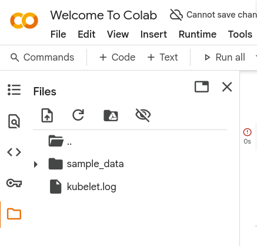
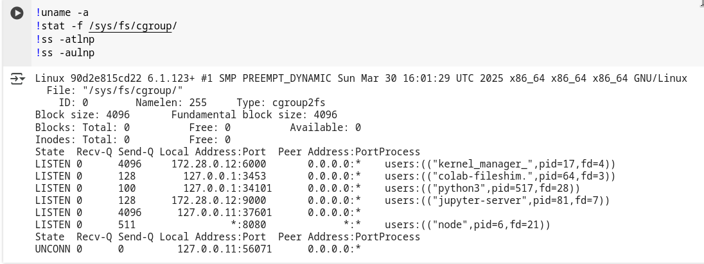
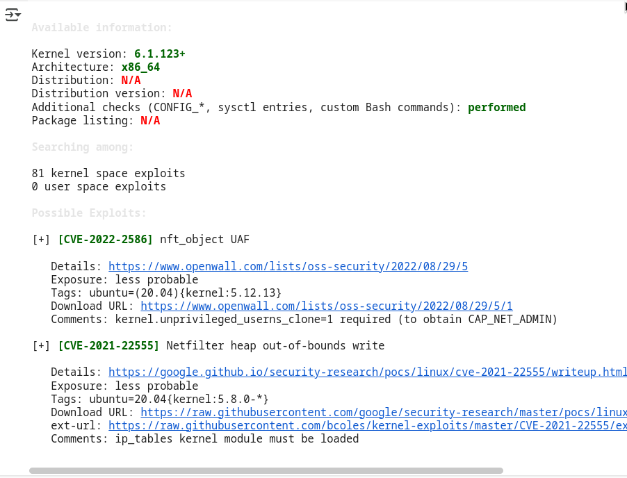
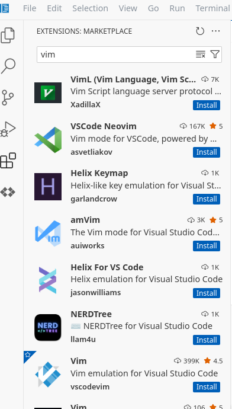

# Google Colab
## 基础知识
Colab 是一项托管式 Jupyter 笔记本服务，无需设置即可使用，并可让您免费使用包括 GPU 和 TPU 在内的计算资源。Colab 尤其适合机器学习、数据科学和教育用途。

## Colab 禁止哪些活动？
Colab 受管运行时禁止对他人造成负面影响的滥用行为以及旨在规避 Google 政策的行为。
所有 Colab 受管运行时都不允许执行下列操作：

+ 文件托管、媒体传送或提供其他与 Colab 的交互式计算无关的 Web 服务
+ 下载种子文件或进行点对点文件共享
+ 连接到远程代理
+ 加密货币挖矿
+ 运行拒绝服务攻击
+ 破解密码
+ 利用多个账号绕过访问权限或资源用量限额
+ 进行深度伪造
+ 采用容器化等技术规避反滥用政策

遗憾的是，鉴于作恶方可能会利用 Colab 提供的计算资源补贴，我们无法透露滥用检测系统的具体运作细节。

除了这些限制外，为了向全球的学生和资源不足的群体开放，Colab 会优先考虑积极使用笔记本编程的用户。如果没有可用的 Colab 计算单元，那么在免费运行的 Colab 受管运行时中不允许执行下列操作，并且这类操作可能会在没有警告的情况下随时被终止：

+ 远程控制，例如 SSH shell、远程桌面
+ 绕过笔记本界面，主要通过网页界面进行交互
+ 国际象棋训练
+ 运行分布式计算工作器

## 实际测试功能

1. notebook上传:
    + 从本机设备上传
    + 从github上传
    + 从google drive
2. notebook下载
3. 文件上传
    
4. 运行时选项:
    + Python3
    + R
    + Julia
5. 硬件加速
    + CPU
    + T4 GPU
    + v5e-1 TPU
    + v2-8 TPU

6. 可以持续运行12小时左右
7. 提供存储空间大小: 107.72GB
8. 内核版本: `Linux 90d2e815cd22 6.1.123+ #1 SMP PREEMPT_DYNAMIC Sun Mar 30 16:01:29 UTC 2025 x86_64 x86_64 x86_64 GNU/Linux`
9. cgroup版本v2
    
10. 环境变量
```sh
 SHELL=/bin/bash
NV_LIBCUBLAS_VERSION=12.5.3.2-1
NVIDIA_VISIBLE_DEVICES=all
COLAB_JUPYTER_TRANSPORT=ipc
NV_NVML_DEV_VERSION=12.5.82-1
NV_CUDNN_PACKAGE_NAME=libcudnn9-cuda-12
CGROUP_MEMORY_EVENTS=/sys/fs/cgroup/memory.events /var/colab/cgroup/jupyter-children/memory.events
NV_LIBNCCL_DEV_PACKAGE=libnccl-dev=2.22.3-1+cuda12.5
NV_LIBNCCL_DEV_PACKAGE_VERSION=2.22.3-1
VM_GCE_METADATA_HOST=169.254.169.253
HOSTNAME=90d2e815cd22
MODEL_PROXY_HOST=https://mp.kaggle.net
LANGUAGE=en_US
TBE_RUNTIME_ADDR=172.28.0.1:8011
COLAB_TPU_1VM=
GCE_METADATA_TIMEOUT=3
NVIDIA_REQUIRE_CUDA=cuda>=12.5 brand=unknown,driver>=470,driver<471 brand=grid,driver>=470,driver<471 brand=tesla,driver>=470,driver<471 brand=nvidia,driver>=470,driver<471 brand=quadro,driver>=470,driver<471 brand=quadrortx,driver>=470,driver<471 brand=nvidiartx,driver>=470,driver<471 brand=vapps,driver>=470,driver<471 brand=vpc,driver>=470,driver<471 brand=vcs,driver>=470,driver<471 brand=vws,driver>=470,driver<471 brand=cloudgaming,driver>=470,driver<471 brand=unknown,driver>=535,driver<536 brand=grid,driver>=535,driver<536 brand=tesla,driver>=535,driver<536 brand=nvidia,driver>=535,driver<536 brand=quadro,driver>=535,driver<536 brand=quadrortx,driver>=535,driver<536 brand=nvidiartx,driver>=535,driver<536 brand=vapps,driver>=535,driver<536 brand=vpc,driver>=535,driver<536 brand=vcs,driver>=535,driver<536 brand=vws,driver>=535,driver<536 brand=cloudgaming,driver>=535,driver<536 brand=unknown,driver>=550,driver<551 brand=grid,driver>=550,driver<551 brand=tesla,driver>=550,driver<551 brand=nvidia,driver>=550,driver<551 brand=quadro,driver>=550,driver<551 brand=quadrortx,driver>=550,driver<551 brand=nvidiartx,driver>=550,driver<551 brand=vapps,driver>=550,driver<551 brand=vpc,driver>=550,driver<551 brand=vcs,driver>=550,driver<551 brand=vws,driver>=550,driver<551 brand=cloudgaming,driver>=550,driver<551
NV_LIBCUBLAS_DEV_PACKAGE=libcublas-dev-12-5=12.5.3.2-1
NV_NVTX_VERSION=12.5.82-1
COLAB_JUPYTER_IP=172.28.0.12
NV_CUDA_CUDART_DEV_VERSION=12.5.82-1
NV_LIBCUSPARSE_VERSION=12.5.1.3-1
COLAB_LANGUAGE_SERVER_PROXY_ROOT_URL=http://172.28.0.1:8013/
NV_LIBNPP_VERSION=12.3.0.159-1
NCCL_VERSION=2.22.3-1
KMP_LISTEN_PORT=6000
TF_FORCE_GPU_ALLOW_GROWTH=true
ENV=/root/.bashrc
PWD=/content
COLAB_LANGUAGE_SERVER_PROXY_REQUEST_TIMEOUT=30s
TBE_EPHEM_CREDS_ADDR=172.28.0.1:8009
TBE_CREDS_ADDR=172.28.0.1:8008
NV_CUDNN_PACKAGE=libcudnn9-cuda-12=9.2.1.18-1
NVIDIA_DRIVER_CAPABILITIES=compute,utility
JPY_SESSION_NAME=/v2/external/notebooks/intro.ipynb
COLAB_JUPYTER_TOKEN=
LAST_FORCED_REBUILD=20250623
NV_NVPROF_DEV_PACKAGE=cuda-nvprof-12-5=12.5.82-1
NV_LIBNPP_PACKAGE=libnpp-12-5=12.3.0.159-1
NV_LIBNCCL_DEV_PACKAGE_NAME=libnccl-dev
TCLLIBPATH=/usr/share/tcltk/tcllib1.20
NV_LIBCUBLAS_DEV_VERSION=12.5.3.2-1
COLAB_KERNEL_MANAGER_PROXY_HOST=172.28.0.12
NVIDIA_PRODUCT_NAME=CUDA
UV_BUILD_CONSTRAINT=
NV_LIBCUBLAS_DEV_PACKAGE_NAME=libcublas-dev-12-5
USE_AUTH_EPHEM=1
NV_CUDA_CUDART_VERSION=12.5.82-1
COLAB_WARMUP_DEFAULTS=1
HOME=/root
LANG=en_US.UTF-8
CUDA_VERSION=12.5.1
CLOUDSDK_CONFIG=/content/.config
NV_LIBCUBLAS_PACKAGE=libcublas-12-5=12.5.3.2-1
NV_CUDA_NSIGHT_COMPUTE_DEV_PACKAGE=cuda-nsight-compute-12-5=12.5.1-1
UV_SYSTEM_PYTHON=true
COLAB_RELEASE_TAG=release-colab_20250902-060114_RC00
PYDEVD_USE_FRAME_EVAL=NO
KMP_TARGET_PORT=9000
CLICOLOR=1
KMP_EXTRA_ARGS=--logtostderr --listen_host=172.28.0.12 --target_host=172.28.0.12 --tunnel_background_save_url=https://colab.research.google.com/tun/m/cc48301118ce562b961b3c22d803539adc1e0c19/m-s-2yhmmtsbsht2x --tunnel_background_save_delay=10s --tunnel_periodic_background_save_frequency=30m0s --enable_output_coalescing=true --output_coalescing_required=true 
UV_INSTALL_DIR=/usr/local/bin
NV_LIBNPP_DEV_PACKAGE=libnpp-dev-12-5=12.3.0.159-1
COLAB_LANGUAGE_SERVER_PROXY_LSP_DIRS=/datalab/web/pyright/typeshed-fallback/stdlib,/usr/local/lib/python3.10/dist-packages
NV_LIBCUBLAS_PACKAGE_NAME=libcublas-12-5
COLAB_KERNEL_MANAGER_PROXY_PORT=6000
CLOUDSDK_PYTHON=python3
NV_LIBNPP_DEV_VERSION=12.3.0.159-1
ENABLE_DIRECTORYPREFETCHER=1
NO_GCE_CHECK=False
JPY_PARENT_PID=81
COLAB_NOTEBOOK_ID=/v2/external/notebooks/intro.ipynb
PYTHONPATH=/env/python
TERM=xterm-color
NV_LIBCUSPARSE_DEV_VERSION=12.5.1.3-1
GIT_PAGER=cat
LIBRARY_PATH=/usr/local/cuda/lib64/stubs
NV_CUDNN_VERSION=9.2.1.18-1
SHLVL=0
PAGER=cat
COLAB_LANGUAGE_SERVER_PROXY=/usr/colab/bin/language_service
NV_CUDA_LIB_VERSION=12.5.1-1
NVARCH=x86_64
UV_CONSTRAINT=
PYTHONUTF8=1
NV_CUDNN_PACKAGE_DEV=libcudnn9-dev-cuda-12=9.2.1.18-1
MPLBACKEND=module://matplotlib_inline.backend_inline
NV_LIBNCCL_PACKAGE=libnccl2=2.22.3-1+cuda12.5
LD_LIBRARY_PATH=/usr/local/nvidia/lib:/usr/local/nvidia/lib64
COLAB_GPU=
GCS_READ_CACHE_BLOCK_SIZE_MB=16
NV_CUDA_NSIGHT_COMPUTE_VERSION=12.5.1-1
NV_NVPROF_VERSION=12.5.82-1
LC_ALL=en_US.UTF-8
_PYVIZ_COMMS_INSTALLED=1
COLAB_FILE_HANDLER_ADDR=localhost:3453
PATH=/opt/bin:/usr/local/nvidia/bin:/usr/local/cuda/bin:/usr/local/sbin:/usr/local/bin:/usr/sbin:/usr/bin:/sbin:/bin:/tools/node/bin:/tools/google-cloud-sdk/bin
NV_LIBNCCL_PACKAGE_NAME=libnccl2
COLAB_DEBUG_ADAPTER_MUX_PATH=/usr/local/bin/dap_multiplexer
NV_LIBNCCL_PACKAGE_VERSION=2.22.3-1
PYTHONWARNINGS=ignore:::pip._internal.cli.base_command
DEBIAN_FRONTEND=noninteractive
COLAB_BACKEND_VERSION=next
OLDPWD=/
_=/usr/bin/env
```
11. 显示在容器中: 存在`.dockerenv`
12. 托管在GCE上: `VM_GCE_METADATA_HOST=169.254.169.253`
13. 环境总结:
```text
=== 环境信息总结 ===
容器标志：
  HOSTNAME: 90d2e815cd22
  /.dockerenv 是否存在: True
  /proc/1/cgroup (前200字符): 0::/


Colab 特定标志：
  COLAB_RELEASE_TAG: release-colab_20250902-060114_RC00
  PWD: /

GPU 支持标志：
  NVIDIA_VISIBLE_DEVICES: all
  CUDA_VERSION: 12.5.1

虚拟化类型: docker
```

14. ddos脚本: 
```bash
#!/bin/bash
echo "hello"
./test.sh
```

15. [git仓库](https://github.com/The-Z-Labs/linux-exploit-suggester)


16. capability: 可以搭配上述扫出来的漏洞来利用
```sh
Current: cap_chown,cap_dac_override,cap_fowner,cap_fsetid,cap_kill,cap_setgid,cap_setuid,cap_setpcap,cap_net_bind_service,cap_net_raw,cap_sys_chroot,cap_sys_ptrace,cap_sys_admin,cap_mknod,cap_audit_write,cap_setfcap=ep
Bounding set =cap_chown,cap_dac_override,cap_fowner,cap_fsetid,cap_kill,cap_setgid,cap_setuid,cap_setpcap,cap_net_bind_service,cap_net_raw,cap_sys_chroot,cap_sys_ptrace,cap_sys_admin,cap_mknod,cap_audit_write,cap_setfcap
Ambient set =
Current IAB: !cap_dac_read_search,!cap_linux_immutable,!cap_net_broadcast,!cap_net_admin,!cap_ipc_lock,!cap_ipc_owner,!cap_sys_module,!cap_sys_rawio,!cap_sys_pacct,!cap_sys_boot,!cap_sys_nice,!cap_sys_resource,!cap_sys_time,!cap_sys_tty_config,!cap_lease,!cap_audit_control,!cap_mac_override,!cap_mac_admin,!cap_syslog,!cap_wake_alarm,!cap_block_suspend,!cap_audit_read,!cap_perfmon,!cap_bpf,!cap_checkpoint_restore
Securebits: 00/0x0/1'b0
 secure-noroot: no (unlocked)
 secure-no-suid-fixup: no (unlocked)
 secure-keep-caps: no (unlocked)
 secure-no-ambient-raise: no (unlocked)
uid=0(root) euid=0(root)
gid=0(root)
groups=0(root)
Guessed mode: UNCERTAIN (0)
```

17. 查找`.h5`: AI模型权重文件
    `find / -name "*.h5" `

18. 共享资源消耗:
```python
import os
pipes = []
for i in range(10000):
    r, w = os.pipe()
    pipes.append((r, w))  # 不关闭管道
```

```python
import socket
sockets = []
for i in range(10000):
    s = socket.socket(socket.AF_INET, socket.SOCK_STREAM)
    sockets.append(s)  # 不关闭套接字
```

```python
import os
for i in range(100000):
    fd = os.open(f"/content/file_{i}.txt", os.O_CREAT | os.O_WRONLY)
    # 不关闭 FD，保持占用
```

```python
import os
for i in range(1000000):
    with open(f"/content/file_{i}.txt", "w") as f:
        f.write("data" * 1000)
```

# Cloud Shell Editor

## 实际测试功能
1. env
```shell
SHELL=/bin/bash
CLOUD_CODE_CLOUD_SHELL_AUTHENTICATION=true
COLORTERM=truecolor
TERM_PROGRAM_VERSION=1.100.3-cde
GEMINI_CLI_IDE_SERVER_PORT=42369
HISTSIZE=1000
EDITOR_IN_CLOUD_SHELL=true
GOOGLE_CLOUD_PROJECT=valiant-hangout-471107-d6
JAVA_HOME=/usr/lib/jvm/java-17-openjdk-amd64
CLOUD_SHELL=true
GOOGLE_CLOUD_QUOTA_PROJECT=valiant-hangout-471107-d6
DEVSHELL_PROJECT_ID=valiant-hangout-471107-d6
DOTNET_SKIP_FIRST_TIME_EXPERIENCE=1
ASPNETCORE_URLS=http://*:8080
PWD=/home/g2689271477
LOGNAME=g2689271477
DEVSHELL_CLIENTS_DIR=/var/run/google/devshell
VSCODE_GIT_ASKPASS_NODE=/google/devshell/editor/code-oss-for-cloud-shell/node
HOME=/home/g2689271477
LANG=en_US.UTF-8
LS_COLORS=rs=0:di=01;34:ln=01;36:mh=00:pi=40;33:so=01;35:do=01;35:bd=40;33;01:cd=40;33;01:or=40;31;01:mi=00:su=37;41:sg=30;43:ca=00:tw=30;42:ow=34;42:st=37;44:ex=01;32:*.tar=01;31:*.tgz=01;31:*.arc=01;31:*.arj=01;31:*.taz=01;31:*.lha=01;31:*.lz4=01;31:*.lzh=01;31:*.lzma=01;31:*.tlz=01;31:*.txz=01;31:*.tzo=01;31:*.t7z=01;31:*.zip=01;31:*.z=01;31:*.dz=01;31:*.gz=01;31:*.lrz=01;31:*.lz=01;31:*.lzo=01;31:*.xz=01;31:*.zst=01;31:*.tzst=01;31:*.bz2=01;31:*.bz=01;31:*.tbz=01;31:*.tbz2=01;31:*.tz=01;31:*.deb=01;31:*.rpm=01;31:*.jar=01;31:*.war=01;31:*.ear=01;31:*.sar=01;31:*.rar=01;31:*.alz=01;31:*.ace=01;31:*.zoo=01;31:*.cpio=01;31:*.7z=01;31:*.rz=01;31:*.cab=01;31:*.wim=01;31:*.swm=01;31:*.dwm=01;31:*.esd=01;31:*.avif=01;35:*.jpg=01;35:*.jpeg=01;35:*.mjpg=01;35:*.mjpeg=01;35:*.gif=01;35:*.bmp=01;35:*.pbm=01;35:*.pgm=01;35:*.ppm=01;35:*.tga=01;35:*.xbm=01;35:*.xpm=01;35:*.tif=01;35:*.tiff=01;35:*.png=01;35:*.svg=01;35:*.svgz=01;35:*.mng=01;35:*.pcx=01;35:*.mov=01;35:*.mpg=01;35:*.mpeg=01;35:*.m2v=01;35:*.mkv=01;35:*.webm=01;35:*.webp=01;35:*.ogm=01;35:*.mp4=01;35:*.m4v=01;35:*.mp4v=01;35:*.vob=01;35:*.qt=01;35:*.nuv=01;35:*.wmv=01;35:*.asf=01;35:*.rm=01;35:*.rmvb=01;35:*.flc=01;35:*.avi=01;35:*.fli=01;35:*.flv=01;35:*.gl=01;35:*.dl=01;35:*.xcf=01;35:*.xwd=01;35:*.yuv=01;35:*.cgm=01;35:*.emf=01;35:*.ogv=01;35:*.ogx=01;35:*.aac=00;36:*.au=00;36:*.flac=00;36:*.m4a=00;36:*.mid=00;36:*.midi=00;36:*.mka=00;36:*.mp3=00;36:*.mpc=00;36:*.ogg=00;36:*.ra=00;36:*.wav=00;36:*.oga=00;36:*.opus=00;36:*.spx=00;36:*.xspf=00;36:*~=00;90:*#=00;90:*.bak=00;90:*.crdownload=00;90:*.dpkg-dist=00;90:*.dpkg-new=00;90:*.dpkg-old=00;90:*.dpkg-tmp=00;90:*.old=00;90:*.orig=00;90:*.part=00;90:*.rej=00;90:*.rpmnew=00;90:*.rpmorig=00;90:*.rpmsave=00;90:*.swp=00;90:*.tmp=00;90:*.ucf-dist=00;90:*.ucf-new=00;90:*.ucf-old=00;90:
CLOUDSDK_CONFIG=/tmp/tmp.fcCtWQpU68
MINIKUBE_FORCE_SYSTEMD=true
GIT_ASKPASS=/google/devshell/editor/code-oss-for-cloud-shell/extensions/git/dist/askpass.sh
PROMPT_COMMAND=history -a;enableHistoryAppend &> /dev/null;update_devshell_project_id &> /dev/null ; update_devshell_project_id &> /dev/null
USE_PARTITIONED_COOKIES=true
DOTNET_BUNDLE_EXTRACT_BASE_DIR=/home/g2689271477/.cache/dotnet_bundle_extract
GEMINI_DEFAULT_PROJECT=
VSCODE_GIT_ASKPASS_EXTRA_ARGS=
GEM_PATH=/home/g2689271477/.gems:/usr/local/lib/ruby/gems/3.2.0/
GEM_HOME=/home/g2689271477/.gems
LESSCLOSE=/usr/bin/lesspipe %s %s
CLOUDSHELL_OPEN_DIR=cloudshell_open
GEMINI_CLI_IDE_WORKSPACE_PATH=/home/g2689271477
TERM=xterm-256color
CLOUDSDK_DIAGNOSTICS_HIDDEN_PROPERTY_ALLOWLIST=compute/gce_metadata_read_timeout_sec
LESSOPEN=| /usr/bin/lesspipe %s
USER=g2689271477
VSCODE_GIT_IPC_HANDLE=/tmp/vscode-git-9881219cb2.sock
BASHRC_PATH=/home/g2689271477/.bashrc
CLOUDSDK_DIAGNOSTICS_HIDDEN_PROPERTY_WHITELIST=compute/gce_metadata_read_timeout_sec
SHLVL=3
__TMP_CLOUDSDK_CONFIG=/tmp/tmp.fcCtWQpU68
CONSOLIDATE_GCA_SPARKS=true
USER_EMAIL=2689271477@qq.com
BASHRC_GOOGLE_PATH=/google/devshell/bashrc.google
PS1=\[\]\[\e]0;${DEVSHELL_PROJECT_ID:-Cloud Shell}\a\]\u@cloudshell:\[\033[1;34m\]\w$([[ -n $DEVSHELL_PROJECT_ID ]] && printf " \[\033[1;33m\](%s)" ${DEVSHELL_PROJECT_ID} )\[\033[00m\]$ \[\]
MINIKUBE_HOME=/google/minikube
DEBUGINFOD_URLS=https://debuginfod.ubuntu.com 
DOCKER_HOST=unix:///var/run/docker.sock
VSCODE_GIT_ASKPASS_MAIN=/google/devshell/editor/code-oss-for-cloud-shell/extensions/git/dist/askpass-main.js
V2V_GCP_V2V_IMAGE=projects/v2v-community/global/images/family/v2v-stable
BROWSER=echo
PATH=/opt/gradle/bin:/opt/maven/bin:/usr/local/sbin:/usr/local/bin:/usr/sbin:/usr/bin:/sbin:/bin:/usr/local/go/bin:/usr/local/node_packages/node_modules/.bin:/usr/local/rvm/bin:/home/g2689271477/.gems/bin:/usr/local/rvm/bin:/home/g2689271477/gopath/bin:/google/gopath/bin:/google/flutter/bin:/usr/local/nvm/versions/node/v22.18.0/bin
HISTFILESIZE=1000
CLOUD_SHELL_FRAME_ANCESTORS=https://*.corp.google.com:* https://*.sandbox.google.com:* https://console.cloud.google.com https://ide.cloud.google.com https://shell.cloud.google.com https://ssh.cloud.google.com
NEW_GCA_AUTH_FLOW=true
DEVSHELL_GCLOUD_CONFIG=cloudshell-15784
USE_GKE_GCLOUD_AUTH_PLUGIN=True
OLDPWD=/home/g2689271477
MINIKUBE_WANTUPDATENOTIFICATION=false
GOPATH=/home/g2689271477/gopath:/google/gopath
CREDENTIALS_SERVICE_PORT=8998
TERM_PROGRAM=vscode
VSCODE_IPC_HOOK_CLI=/tmp/vscode-ipc-ea5b4e01-0578-41fc-bcd1-f7d635f6b494.sock
_=/usr/bin/env
```

2. 内核版本: `Linux cs-387188618231-default 6.6.97+ #1 SMP PREEMPT_DYNAMIC Sun Aug 17 10:05:35 UTC 2025 x86_64 x86_64 x86_64 GNU/Linux`
3. ip地址: 
```sh
g2689271477@cloudshell:~ (valiant-hangout-471107-d6)$ ip address
1: lo: <LOOPBACK,UP,LOWER_UP> mtu 65536 qdisc noqueue state UNKNOWN group default qlen 1000
    link/loopback 00:00:00:00:00:00 brd 00:00:00:00:00:00
    inet 127.0.0.1/8 scope host lo
       valid_lft forever preferred_lft forever
2: eth0@if8: <BROADCAST,MULTICAST,UP,LOWER_UP> mtu 1460 qdisc noqueue state UP group default qlen 1000
    link/ether 76:d4:db:2f:11:05 brd ff:ff:ff:ff:ff:ff link-netnsid 0
    inet 10.88.0.4/16 brd 10.88.255.255 scope global eth0
       valid_lft forever preferred_lft forever
3: docker0: <NO-CARRIER,BROADCAST,MULTICAST,UP> mtu 1460 qdisc noqueue state DOWN group default 
    link/ether 2e:c0:c2:27:78:a9 brd ff:ff:ff:ff:ff:ff
    inet 172.17.0.1/16 brd 172.17.255.255 scope global docker0
       valid_lft forever preferred_lft forever
```
4. cgroup版本V2
5. capability: 
```sh
g2689271477@cloudshell:~ (valiant-hangout-471107-d6)$ capsh --print
Current: =
Bounding set =cap_chown,cap_dac_override,cap_dac_read_search,cap_fowner,cap_fsetid,cap_kill,cap_setgid,cap_setuid,cap_setpcap,cap_linux_immutable,cap_net_bind_service,cap_net_broadcast,cap_net_admin,cap_net_raw,cap_ipc_lock,cap_ipc_owner,cap_sys_module,cap_sys_rawio,cap_sys_chroot,cap_sys_ptrace,cap_sys_pacct,cap_sys_admin,cap_sys_boot,cap_sys_nice,cap_sys_resource,cap_sys_time,cap_sys_tty_config,cap_mknod,cap_lease,cap_audit_write,cap_audit_control,cap_setfcap,cap_mac_override,cap_mac_admin,cap_syslog,cap_wake_alarm,cap_block_suspend,cap_audit_read,cap_perfmon,cap_bpf,cap_checkpoint_restore
Ambient set =
Current IAB: 
Securebits: 00/0x0/1'b0 (no-new-privs=0)
 secure-noroot: no (unlocked)
 secure-no-suid-fixup: no (unlocked)
 secure-keep-caps: no (unlocked)
 secure-no-ambient-raise: no (unlocked)
uid=1000(g2689271477) euid=1000(g2689271477)
gid=1000(g2689271477)
groups=4(adm),27(sudo),996(docker),1000(g2689271477)
Guessed mode: HYBRID (4)
```

6. 寻找exp

```exp

g2689271477@cloudshell:~/linux-exploit-suggester (valiant-hangout-471107-d6)$ ./linux-exploit-suggester.sh 

Available information:

Kernel version: 6.6.97+
Architecture: x86_64
Distribution: N/A
Distribution version: N/A
Additional checks (CONFIG_*, sysctl entries, custom Bash commands): performed
Package listing: N/A

Searching among:

81 kernel space exploits
0 user space exploits

Possible Exploits:

[+] [CVE-2022-2586] nft_object UAF

   Details: https://www.openwall.com/lists/oss-security/2022/08/29/5
   Exposure: less probable
   Tags: ubuntu=(20.04){kernel:5.12.13}
   Download URL: https://www.openwall.com/lists/oss-security/2022/08/29/5/1
   Comments: kernel.unprivileged_userns_clone=1 required (to obtain CAP_NET_ADMIN)

[+] [CVE-2021-22555] Netfilter heap out-of-bounds write

   Details: https://google.github.io/security-research/pocs/linux/cve-2021-22555/writeup.html
   Exposure: less probable
   Tags: ubuntu=20.04{kernel:5.8.0-*}
   Download URL: https://raw.githubusercontent.com/google/security-research/master/pocs/linux/cve-2021-22555/exploit.c
   ext-url: https://raw.githubusercontent.com/bcoles/kernel-exploits/master/CVE-2021-22555/exploit.c
   Comments: ip_tables kernel module must be loaded
```
7. 端口开放情况， tcp/udp
```sh
g2689271477@cloudshell:~/linux-exploit-suggester (valiant-hangout-471107-d6)$ ss -atlnp
State          Recv-Q         Send-Q                 Local Address:Port                  Peer Address:Port         Process                                  
LISTEN         0              5                          127.0.0.1:8998                       0.0.0.0:*                                                     
LISTEN         0              128                          0.0.0.0:22                         0.0.0.0:*                                                     
LISTEN         0              5                            0.0.0.0:900                        0.0.0.0:*                                                     
LISTEN         0              511                          0.0.0.0:3000                       0.0.0.0:*             users:(("node",pid=486,fd=18))          
LISTEN         0              511                                *:42369                            *:*             users:(("node",pid=1232,fd=36))         
LISTEN         0              511                                *:46193                            *:*             users:(("node",pid=1739,fd=18))         
LISTEN         0              128                             [::]:22                            [::]:*                                                     
LISTEN         0              4096                               *:922                              *:*                                                     
LISTEN         0              4096                               *:981                              *:*                                                     
LISTEN         0              4096                               *:980                              *:*                                                     
LISTEN         0              4096                               *:970                              *:*                                                     
g2689271477@cloudshell:~/linux-exploit-suggester (valiant-hangout-471107-d6)$ ss -aulnp
State            Recv-Q            Send-Q                        Local Address:Port                         Peer Address:Port            Process     
```

8. 加载外部自定义插件


9. 文件上传

10. 共享资源消耗:
```python
import os
pipes = []
for i in range(10000):
    r, w = os.pipe()
    pipes.append((r, w))  # 不关闭管道
```

```python
import socket
sockets = []
for i in range(10000):
    s = socket.socket(socket.AF_INET, socket.SOCK_STREAM)
    sockets.append(s)  # 不关闭套接字
```

```python
import os
for i in range(100000):
    fd = os.open(f"/content/file_{i}.txt", os.O_CREAT | os.O_WRONLY)
    # 不关闭 FD，保持占用
```

```python
import os
for i in range(1000000):
    with open(f"/content/file_{i}.txt", "w") as f:
        f.write("data" * 1000)
```

11. 安全选项:
```sh
g2689271477@cloudshell:~/linux-exploit-suggester (valiant-hangout-471107-d6)$ ./linux-exploit-suggester.sh --checksec

Mainline kernel protection mechanisms:

 [ Enabled  ] Kernel Page Table Isolation (PTI) support 
              https://github.com/mzet-/les-res/blob/master/features/pti.md

 [ Enabled  ] GCC stack protector support (CONFIG_HAVE_STACKPROTECTOR)
              https://github.com/mzet-/les-res/blob/master/features/stackprotector-regular.md

 [ Enabled  ] GCC stack protector STRONG support (CONFIG_STACKPROTECTOR_STRONG)
              https://github.com/mzet-/les-res/blob/master/features/stackprotector-strong.md

 [ Enabled  ] Low address space to protect from user allocation (CONFIG_DEFAULT_MMAP_MIN_ADDR)
              https://github.com/mzet-/les-res/blob/master/features/mmap_min_addr.md

 [ Enabled  ] Prevent users from using ptrace to examine the memory and state of their processes (CONFIG_SECURITY_YAMA)
              https://github.com/mzet-/les-res/blob/master/features/yama_ptrace_scope.md

 [ Enabled  ] Restrict unprivileged access to kernel syslog (CONFIG_SECURITY_DMESG_RESTRICT)
              https://github.com/mzet-/les-res/blob/master/features/dmesg_restrict.md

 [ Enabled  ] Randomize the address of the kernel image (KASLR) (CONFIG_RANDOMIZE_BASE)
              https://github.com/mzet-/les-res/blob/master/features/kaslr.md

 [ Enabled  ] Hardened user copy support (CONFIG_HARDENED_USERCOPY)
              https://github.com/mzet-/les-res/blob/master/features/hardened_usercopy.md

 [ Enabled  ] Make kernel text and rodata read-only (CONFIG_STRICT_KERNEL_RWX)
              https://github.com/mzet-/les-res/blob/master/features/strict_kernel_rwx.md

 [ Enabled  ] Set loadable kernel module data as NX and text as RO (CONFIG_STRICT_MODULE_RWX)
              https://github.com/mzet-/les-res/blob/master/features/strict_module_rwx.md

 [ Enabled  ] BUG() conditions reporting (CONFIG_BUG)
              https://github.com/mzet-/les-res/blob/master/features/bug.md

 [ Disabled ] Additional 'cred' struct checks (CONFIG_DEBUG_CREDENTIALS)
              https://github.com/mzet-/les-res/blob/master/features/debug_credentials.md

 [ Enabled  ] Sanity checks for notifier call chains (CONFIG_DEBUG_NOTIFIERS)
              https://github.com/mzet-/les-res/blob/master/features/debug_notifiers.md

 [ Enabled  ] Extended checks for linked-lists walking (CONFIG_DEBUG_LIST)
              https://github.com/mzet-/les-res/blob/master/features/debug_list.md

 [ Disabled ] Checks on scatter-gather tables (CONFIG_DEBUG_SG)
              https://github.com/mzet-/les-res/blob/master/features/debug_sg.md

 [ Enabled  ] Checks for data structure corruptions (CONFIG_BUG_ON_DATA_CORRUPTION)
              https://github.com/mzet-/les-res/blob/master/features/bug_on_data_corruption.md

 [ Disabled ] Checks for a stack overrun on calls to 'schedule' (CONFIG_SCHED_STACK_END_CHECK)
              https://github.com/mzet-/les-res/blob/master/features/sched_stack_end_check.md

 [ Enabled  ] Freelist order randomization on new pages creation (CONFIG_SLAB_FREELIST_RANDOM)
              https://github.com/mzet-/les-res/blob/master/features/slab_freelist_random.md

 [ Enabled  ] Freelist metadata hardening (CONFIG_SLAB_FREELIST_HARDENED)
              https://github.com/mzet-/les-res/blob/master/features/slab_freelist_hardened.md

 [ Disabled ] Allocator validation checking (CONFIG_SLUB_DEBUG_ON)
              https://github.com/mzet-/les-res/blob/master/features/slub_debug.md

 [ Enabled  ] Virtually-mapped kernel stacks with guard pages (CONFIG_VMAP_STACK)
              https://github.com/mzet-/les-res/blob/master/features/vmap_stack.md

 [ Disabled ] Pages poisoning after free_pages() call (CONFIG_PAGE_POISONING)
              https://github.com/mzet-/les-res/blob/master/features/page_poisoning.md

 [ Disabled ] Using 'refcount_t' instead of 'atomic_t' (CONFIG_REFCOUNT_FULL)
              https://github.com/mzet-/les-res/blob/master/features/refcount_full.md

 [ Disabled ] Hardening common str/mem functions against buffer overflows (CONFIG_FORTIFY_SOURCE)
              https://github.com/mzet-/les-res/blob/master/features/fortify_source.md

 [ Disabled ] Restrict /dev/mem access (CONFIG_STRICT_DEVMEM)
              https://github.com/mzet-/les-res/blob/master/features/strict_devmem.md

 [ Disabled ] Restrict I/O access to /dev/mem (CONFIG_IO_STRICT_DEVMEM)
              https://github.com/mzet-/les-res/blob/master/features/io_strict_devmem.md


Hardware-based protection features:

 [ Enabled  ] Supervisor Mode Execution Protection (SMEP) support 
              https://github.com/mzet-/les-res/blob/master/features/smep.md

 [ Enabled  ] Supervisor Mode Access Prevention (SMAP) support 
              https://github.com/mzet-/les-res/blob/master/features/smap.md


3rd party kernel protection mechanisms:

 [   N/A    ] Grsecurity (CONFIG_GRKERNSEC)

 [   N/A    ] PaX (CONFIG_PAX)

 [   N/A    ] Linux Kernel Runtime Guard (LKRG) kernel module 
              https://github.com/mzet-/les-res/blob/master/features/lkrg.md


Attack Surface:

 [ Locked   ] User namespaces for unprivileged accounts (CONFIG_USER_NS)
              https://github.com/mzet-/les-res/blob/master/features/user_ns.md

 [ Locked   ] Unprivileged access to bpf() system call (CONFIG_BPF_SYSCALL)
              https://github.com/mzet-/les-res/blob/master/features/bpf_syscall.md

 [ Set to 0 ] Syscalls filtering (CONFIG_SECCOMP)
              https://github.com/mzet-/les-res/blob/master/features/bpf_syscall.md

 [ Locked   ] Support for /dev/mem access (CONFIG_DEVMEM)
              https://github.com/mzet-/les-res/blob/master/features/devmem.md

 [ Locked   ] Support for /dev/kmem access (CONFIG_DEVKMEM)
              https://github.com/mzet-/les-res/blob/master/features/devkmem.md
```
