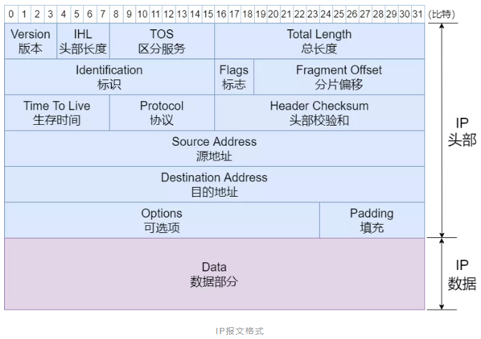

以下信息均来源于`bpftool`所生成的本机的`vmlinux.h`
# IP 头部字段信息
```c
struct iphdr {
        __u8 ihl: 4;
        __u8 version: 4;
        __u8 tos;
        __be16 tot_len;
        __be16 id;
        __be16 frag_off;
        __u8 ttl;
        __u8 protocol;
        __sum16 check;
        union {
                struct {
                        __be32 saddr;
                        __be32 daddr;
                };
                struct {
                        __be32 saddr;
                        __be32 daddr;
                } addrs;
        };
};
```

这里的tos代表`type of service`
该字段被定义为

              ┌────────────────┬───────┐
              │ DSCP(6)        │ ECN(2)│
              └────────────────┴───────┘

+ DSCP: 定义服务等级, 网络设备可以根据DSCP值对流量进行QoS（服务质量）调度
 
+ ECN: 用于[拥塞控制](https://blog.csdn.net/hithj_cainiao/article/details/117293176),表示是否发生拥塞, 占2bit
    + 00: 非ECN能力的传输
    + 10: ECN Capable Transport (ECT(0)), 表示该包支持ECN(0)模式
    + 01: ECN Capable Transport (ECT(1)), 表示该包支持ECN(1)模式
    + 11: Congestion Experience(CE),表示该包遇到了网络拥塞, 接收方收到后会在TCP的ACK里携带ECE表示告诉发送端， 发送段收到后会触发拥塞控制算法


# TCP头部字段信息

在btf中tcp sock的结构体如下：
```c
struct bpf_tcp_sock {
        __u32 snd_cwnd;
        __u32 srtt_us;
        __u32 rtt_min;
        __u32 snd_ssthresh;
        __u32 rcv_nxt;
        __u32 snd_nxt;
        __u32 snd_una;
        __u32 mss_cache;
        __u32 ecn_flags;
        __u32 rate_delivered;
        __u32 rate_interval_us;
        __u32 packets_out;
        __u32 retrans_out;
        __u32 total_retrans;
        __u32 segs_in;
        __u32 data_segs_in;
        __u32 segs_out;
        __u32 data_segs_out;
        __u32 lost_out;
        __u32 sacked_out;
        __u64 bytes_received;
        __u64 bytes_acked;
        __u32 dsack_dups;
        __u32 delivered;
        __u32 delivered_ce;
        __u32 icsk_retransmits;
};
```
可以通过`bpf_tcp_scok(sk)`这个帮助函数获取,这里的sk则是通过以下链条获取
```
struct __sk_buff *skb
    sk = skb->sk
        sk = bpf_sk_fullsock(sk)
```


# BPF程序编写注意事项
1. `bpf_spin_lock() && struct bpf_spin_lock`: 一旦bpf程序持有锁，不允许其调用其他helper, 由bpf verifier裁定


# 令牌桶实现
此限流程序通过以下方式实现：
1. 用户态程序使用eBPF map来控制流速，设置上限，每秒限制最大字节数
2. 内核态程序维护一个cgroup对应的map,里面存放有当前cgroup的credit数量
3. 当流量包经过的时候，credit加上上一个流量包到此流量包发出的时间差，然后计算增量credit
4. credit减去当前流量包的长度，之后判断credit是否在丢包范围或标记范围内，如果丢包则需要将credit还原
5. 更新统计数据
